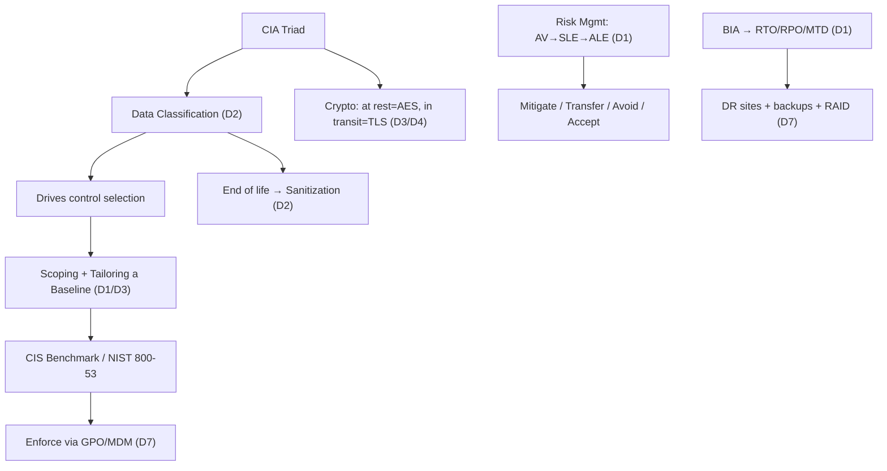

# CISSP Study Guide & Practice

A complete, self-built study system for the **(ISC)² CISSP** exam — eight-domain notes with inline Mermaid diagrams, spaced-repetition flashcards, and interactive drag-and-drop drills. Written while preparing for (and passing) the exam, and kept as open educational material.

---

## The 8 domains

Each domain folder opens with a `00 Domain …` overview (its topic checklist); click through to the topic notes.

| # | Domain | Weight |
|---|--------|--------|
| 1 | [Security and Risk Management](domains/01-security-and-risk-management/00%20Domain%201%20-%20Security%20and%20Risk%20Management.md) | 16% |
| 2 | [Asset Security](domains/02-asset-security/00%20Domain%202%20-%20Asset%20Security.md) | 10% |
| 3 | [Security Architecture and Engineering](domains/03-security-architecture-and-engineering/00%20Domain%203%20-%20Security%20Architecture%20and%20Engineering.md) | 13% |
| 4 | [Communication and Network Security](domains/04-communication-and-network-security/00%20Domain%204%20-%20Communication%20and%20Network%20Security.md) | 13% |
| 5 | [Identity and Access Management (IAM)](domains/05-identity-and-access-management/00%20Domain%205%20-%20Identity%20and%20Access%20Management.md) | 13% |
| 6 | [Security Assessment and Testing](domains/06-security-assessment-and-testing/00%20Domain%206%20-%20Security%20Assessment%20and%20Testing.md) | 12% |
| 7 | [Security Operations](domains/07-security-operations/00%20Domain%207%20-%20Security%20Operations.md) | 13% |
| 8 | [Software Development Security](domains/08-software-development-security/00%20Domain%208%20-%20Software%20Development%20Security.md) | 10% |

## Cross-domain concepts

Foundational ideas that span multiple domains (they live in Domain 1):

- [Defense in Depth](domains/01-security-and-risk-management/Defense%20in%20Depth.md) — layered controls (D1, 3, 4, 7)
- [Least Privilege](domains/01-security-and-risk-management/Least%20Privilege.md) — minimum necessary access (D1, 5, 7)
- [Separation of Duties](domains/01-security-and-risk-management/Separation%20of%20Duties.md) — dividing critical tasks (D1, 5, 7)
- [Risk Management](domains/01-security-and-risk-management/Risk%20Management.md) — identifying and treating risk (D1, 2, 6)
- [Cryptography](domains/03-security-architecture-and-engineering/Cryptography.md) — encryption fundamentals (D3, 4, 8)
- [Incident Response](domains/07-security-operations/Incident%20Response.md) — handling security events (D6, 7)
- [Security Governance](domains/01-security-and-risk-management/Security%20Governance.md) — policies and frameworks (D1, 2, 6)

## How it all connects

**Takeaway:** it all flows from CIA → classification → controls → enforcement; risk and BIA drive treatment and recovery.

---

## Practice — flashcards & drills

Self-contained HTML apps — open in any browser, no server or build needed:

- **[Flashcards](practice/anki/flashcards.html)** — ~1,900 cards in three decks: **Concepts** (apply it), **Glossary** (recall), **Drill** (answer-selection technique). Filter by domain and deck; progress saves in the browser. Regenerate with `python3 build_flashcards.py` inside `practice/anki/` after editing a deck.
- **[Order & Match drills](practice/drills/order-match-drills.html)** — drag-and-drop sequencing and matching (the CAT-style item types). Mastering the order is what powers FIRST / NEXT / LAST questions.
- **[Categorize drills](practice/drills/categorize-drills.html)** — sort items into the correct buckets.

> **▶ Live site:** [**mchlstr.github.io/CISSP-Study-notes**](https://mchlstr.github.io/CISSP-Study-notes/) — the flashcards and drills run right in your browser.

## Repository structure

| Path | What's inside |
|------|---------------|
| [`domains/`](domains/) | The eight domains (`01`–`08`); one note per topic, each folder led by its `00 Domain …` overview. Mermaid diagrams are embedded inline (look for a `## Diagrams` section). |
| [`practice/anki/`](practice/anki/) | Flashcard decks (`Question :: Answer`) + `build_flashcards.py` → `flashcards.html` |
| [`practice/drills/`](practice/drills/) | The drag-and-drop drill apps |
| [`practice/sheets/`](practice/sheets/) | Cram sheet, reading-pattern technique, and memory hooks |
| [`index.html`](index.html) | Landing page for the GitHub Pages site |

## Study tips

- The CISSP is "a mile wide and an inch deep" — focus on understanding concepts, not memorizing minutiae.
- Think like a **manager / risk advisor**, not a technician.
- Consider the **business impact** first.
- When in doubt, choose the answer that **reduces risk** or **protects human life**.
- Domains 1 and 7 carry the most weight combined — prioritize them.
