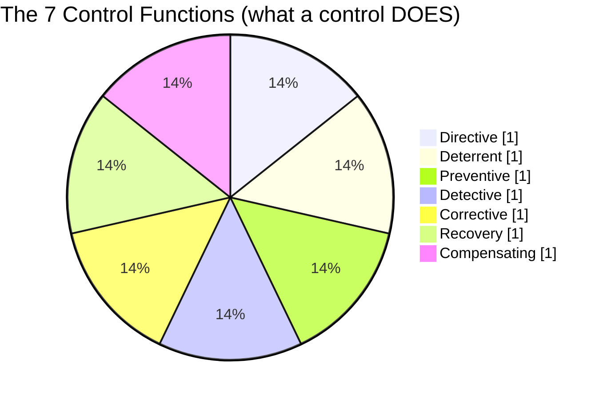
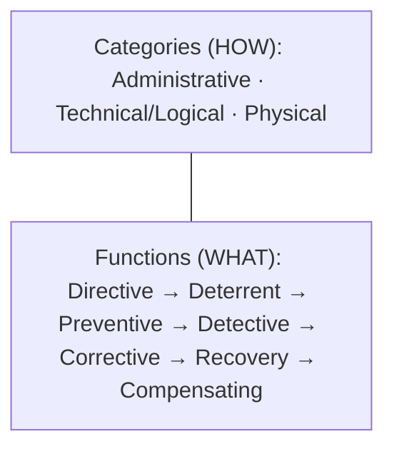

# Access Control Categories and Types

## Overview

Two orthogonal classifications. Every control has both a **category** (how it's implemented) and a **type** (what it does). Many controls fit multiple types.

## The Three Categories (Implementation)

| Category | Also called | Examples |
|----------|-------------|----------|
| **Administrative** | Directive | Policies, procedures, laws, training, hiring/firing |
| **Technical** | Logical | Firewalls, routers, encryption, passwords, MFA, biometrics |
| **Physical** | — | Locks, fences, guards, dogs, bollards, mantraps, cameras, alarms |

## The Seven Types (Function)

| Type | What it does | Examples |
|------|--------------|----------|
| **Preventive** | Prevents incidents | Least privilege, firewalls, encryption, IPS, drug tests |
| **Detective** | Detects during or after | IDS, logs, CCTV, audits |
| **Corrective** | Stops / fixes an attack | Antivirus, IPS, patches |
| **Recovery** | Restores after incident | Backups, DR site, hot/warm/cold sites |
| **Deterrent** | Discourages but doesn't stop | Fences, guards, dogs, "beware of dog" signs, lighting |
| **Compensating** | Alternative when primary control isn't feasible | Supervision when segregation isn't possible |
| **Directive** | Directs/guides behavior | Policies, AUP, signage |

## One Control, Multiple Types

A **security guard** can be:
- Deterrent (presence discourages attackers)
- Detective (spots intruders on camera or in person)
- Compensating (covers a gap in another control)

A **fence** could be deterrent (short) or preventive (tall + barbed wire).

Read exam questions carefully. If your first answer type isn't in the options, check whether another type fits.

## Layered Defense Example

Getting to a specific server physically:
1. Fence + dogs + guard (deterrent + preventive)
2. Locked door + card swipe (preventive + detective via logs)
3. Mantrap (preventive)
4. Locked data center cabinet (preventive)
5. KVM login (preventive)

Individually weak; combined strong. That's defense in depth.

**War story:** One employee "just opened the back fire-exit door for 2 minutes" to step out for a smoke — assumed the alarm wouldn't trigger. That was a gap in awareness/training (administrative), not in the physical controls. People bypass whatever's inconvenient.

## Exam Language Watch

Expect synonyms. "Stop," "block," "avert" = preventive. "Spot," "alert," "notice" = detective. Read like a lawyer; answer the actual question, not the one you expect.

**Patching** is primarily **corrective** (fixes a known bug). If corrective isn't an option, pick preventive.

## Exam Tips

- Know both axes (category + type)
- Many controls fit multiple types — pick the most relevant to the scenario
- Administrative controls (policies/training) often the correct answer when "ethics" or "accountability" is involved
- Physical always beats logical if someone gets physical access
- Deterrents don't stop anyone — they just make it less attractive

## Diagrams

### Control Functions — Pie (illustrative)

Pie just illustrates the 7 control *functions* as one set (proportions are illustrative, not data).

**Takeaway:** Functions = **Directive, Deterrent, Preventive, Detective, Corrective, Recovery, Compensating** — applied via 3 categories (Administrative, Technical, Physical).

### Control Types — Categories × Functions

| Function | Does what | Example |
|---|---|---|
| Directive | Mandate behavior | Policy, signage |
| Deterrent | Discourage | Warning banner, visible camera |
| Preventive | Stop before | Lock, firewall |
| Detective | Find after | IDS, logs, CCTV |
| Corrective | Fix/reverse | Patch, AV removal |
| Recovery | Restore ops | Backups, DR site |
| Compensating | Alternative | Encryption when data can't be removed |

**Takeaway:** Every control = a category (how it's implemented) × a function (what it does).

## Related Topics

- [IAAA](IAAA.md)
- [Access Control Models](../05-identity-and-access-management/Access%20Control%20Models.md)
- [Defense in Depth](../01-security-and-risk-management/Defense%20in%20Depth.md)
- [Least Privilege](../01-security-and-risk-management/Least%20Privilege.md)
- [Risk Management](Risk%20Management.md)
