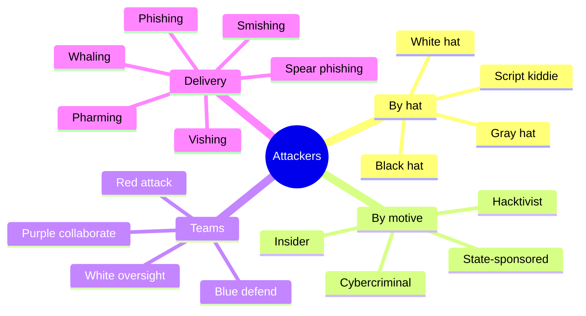
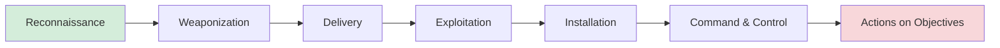

# Attackers and Attack Types

## Overview

Understanding who attacks and how they attack. Origin of "hacker" was someone using something in unintended ways (e.g., AT&T phone phreakers using a 2600 Hz tone to open long-distance lines) — now the term is used more broadly for attackers.

## Hacker Categories

| Hat color | Who | What they do |
|-----------|-----|--------------|
| **White hat** | Ethical hackers, pen testers, red/blue teams | Find flaws with permission so they can be fixed |
| **Black hat** | Malicious attackers | Find flaws and exploit them for harm or profit |
| **Gray hat** | Mixed motives | Find flaws without permission but may responsibly disclose; sometimes public-release if ignored |
| **Script kiddie** | Low-skill attackers | Use downloadable tools with GUIs; no real knowledge but can still cause serious damage |

Most skilled security people move fluidly across the spectrum depending on role and context.

## Red / Blue / Purple Teams

- **Red** — simulate attackers (pen testing, phishing, social engineering)
- **Blue** — defenders (monitoring, IR, controls)
- **Purple** — collaborative — red and blue together, to improve both
- **White** — oversight / referees

## Attack Source Statistics

Rough distribution of incident sources:
- External: 48-62%
- Internal: 38-52% (including vendors, who may be counted either way)

Breakdown you may see:
- ~6% improper disposal (shred tapes, disks, paper — don't leave 10K backup tapes under the raised floor)
- ~8% internal theft
- ~24% employee mistakes / unintentional actions
- Vendors — can be any of the above
- ~17% external theft
- ~31% phishing, hacking, malware

Training + awareness addresses the biggest slice (employee mistakes). Defense in depth addresses the rest.

## Hacktivists

Highly skilled + politically motivated. Examples:
- Anonymous DDoS vs Mastercard/Visa/PayPal after WikiLeaks cutoff
- Google/Twitter "SayNow" workaround during Egypt 2011 Arab Spring internet blackout

Depending on your viewpoint, hacktivists are freedom fighters or criminals.

## State-Sponsored Attackers

Over 120 countries have offensive cyber capability. Think of it as a digital arms race. Examples you should know:
- **Stuxnet** (US + Israel → Iranian centrifuges) — pure integrity attack
- **Sony Pictures hack** (North Korea)
- **US OPM breach** (China)
- Russian interference in US elections

Critical infrastructure (power, water, fuel, internet) is a primary target — shutting down utilities can bring a country to its knees quickly.

## Botnets

Networks of compromised machines (bots / zombies) controlled remotely by an attacker.

- Hierarchical: attacker → tiers of jump-boxes → bot-herders → bots
- Hundreds of thousands of bots in large networks
- Command & Control over IRC, HTTP, HTTPS
- Used for: DDoS, spam, credential stuffing, further attacks
- Jump-boxes protect attacker anonymity

Bot gets installed often as a **Trojan** hidden in another app the user installs (workstation admin rights = bad idea).

## Phishing Variants

| Variant | Targeting | Delivery |
|---------|-----------|----------|
| **Phishing** | Mass — millions of emails | Email |
| **Spear phishing** | Targeted at an individual | Email, with pre-research |
| **Whaling** | Senior executives (biggest fish) | Email, heavily researched, often legal-looking |
| **Vishing** | Bulk or targeted | Voice / phone |
| **Smishing** | Bulk or targeted | SMS |
| **Pharming** | Redirect traffic to fake sites | DNS poisoning / hosts file edit |

**Michigan state treasurer example:** wired $1.2M ($1.1M public funds + $72K personal) to Nigeria chasing a $300M "hold" email. One reply to a bulk phishing campaign justifies the entire send volume for the attacker.

**Whaling danger:** executives are busy, often less tech-savvy, and have decision-making power. A well-crafted legal-looking email with a "sign by Friday or be sued" attachment can compromise a high-value machine.

## Cyber Kill Chain (Lockheed Martin)

A model of the stages an attacker moves through to reach their goal. The value for a defender is that breaking *any one link* stops the chain — you don't have to catch everything, just interrupt the sequence early. The seven stages:

1. **Reconnaissance** — research the target (OSINT, scanning, harvesting emails)
2. **Weaponization** — pair an exploit with a payload (e.g., a malicious PDF)
3. **Delivery** — send it (phishing email, USB drop, watering-hole site)
4. **Exploitation** — the payload runs and triggers the vulnerability
5. **Installation** — malware plants itself for persistence
6. **Command & Control (C2)** — the implant calls home; attacker gets remote control
7. **Actions on Objectives** — the actual goal (exfiltrate data, encrypt for ransom, destroy)

The earlier you detect and break the chain, the cheaper the defense. Catching recon or delivery beats fighting an attacker who already has C2.

## Defenses

- **Training + awareness** — highest ROI; addresses the biggest risk category (people)
- Email filtering / quarantine
- MFA everywhere
- Least privilege on workstations (no local admin for standard users)
- Network egress controls / DNS filtering
- Defense in depth at every layer

## Exam Tips

- Know hat colors and red/blue/purple
- Phishing is the #1 starting point for major breaches
- Stuxnet = integrity attack (pure case)
- Script kiddies have no skill but can still do real damage with downloadable tools
- Users are often the weakest link — training + awareness is defensive priority #1
- Cyber Kill Chain (Lockheed Martin) = 7 stages: Recon → Weaponization → Delivery → Exploitation → Installation → C2 → Actions on Objectives. Breaking any one link stops the attack

## Diagrams

### Attacker Landscape
A taxonomy of who attacks, grouped by motive and skill.

### Cyber Kill Chain (Lockheed Martin)
Breaking any one link stops the attack — the earlier, the cheaper.

## Related Topics

- [Threat Modeling](Threat%20Modeling.md)
- [Access Control Attacks](../05-identity-and-access-management/Access%20Control%20Attacks.md)
- [Network Attacks](../04-communication-and-network-security/Network%20Attacks.md)
- [Security Operations Concepts](../07-security-operations/Security%20Operations%20Concepts.md)
- [Security Policies and Standards](Security%20Policies%20and%20Standards.md) — awareness program
