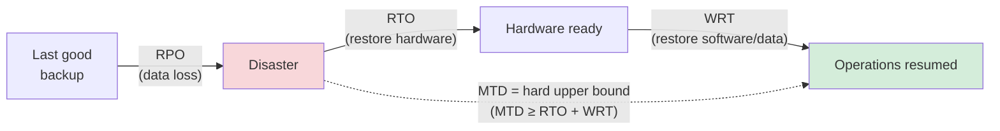

# Business Impact Analysis (BIA)

## Overview

The BIA identifies the org's critical systems and functions, and quantifies the impact of their disruption. It's the analytical foundation of the BCP.

> **Know this cold.** Expect scenario questions where you must recognize which metric (MTD, RTO, WRT, RPO) applies.

## Prioritizing with Tiers

Most orgs use a tier system for systems/activities:

| Tier | MTD (example) | Type of system |
|------|---------------|----------------|
| 0 | 0-5 min | Mission-critical (patient records, trading platform) |
| 1 | 30 min | Critical business apps |
| 2 | 3 hours | Important but not critical |
| 3 | 1 day | Supporting systems |
| 4 | 1 week | Nice-to-have |

Your MTD targets drive architecture decisions (hot/warm/cold sites, redundancy spend).

## Core Metrics

| Metric | Full name | What it means |
|--------|-----------|---------------|
| **RPO** | Recovery Point Objective | Max acceptable data loss (time between last good backup and disaster) |
| **RTO** | Recovery Time Objective | Time to restore **hardware/infrastructure** |
| **WRT** | Work Recovery Time | Time to restore **software, configs, data** onto that hardware |
| **MTD** | Maximum Tolerable Downtime | Absolute upper bound on total downtime |
| **MTBF** | Mean Time Between Failures | Average time between component failures |
| **MTTR** | Mean Time To Repair | Average time to fix a failed component |
| **MOR** | Minimum Operating Requirements | Lowest spec to run in degraded mode |

### Aliases for MTD
Also called MAD (Maximum Allowable Downtime), MTO (Maximum Tolerable Outage), MAO (Maximum Acceptable Outage), MTPD (Maximum Tolerable Period of Disruption). All the same concept.

## The Golden Equation

```
MTD ≥ RTO + WRT
```

If it isn't, your plan doesn't work. Options:
- Pre-stage hardware (cuts RTO)
- Keep hot/warm DR site (cuts RTO dramatically)
- Simpler restore procedure (cuts WRT)
- Better backups (cuts WRT and RPO)

## Worked Example

- MTD = 3 hours
- RTO = 2h (rack + configure new server)
- WRT = 2h (restore OS, apps, data)
- 2 + 2 = 4h > 3h → **fails**
- Keep pre-built standby: RTO → 30 min. 0.5 + 2 = 2.5h < 3h ✓

## MTBF, MTTR, MOR in Practice

**MTBF:** Hard drives with 3-year MTBF. If you have 100 drives in production, plan for ~33 failures/year. Stock accordingly. When supply chains are disrupted (COVID), stock more.

**MTTR:** Mean matters, but **worst case** matters more. If MTD is 2 hours and MTTR is 2h average but 5% take 4h, you will miss your window 5% of the time. That's not acceptable for Tier 0.

**MOR:** What's the lowest spec that keeps you running? Useful for DR site sizing — you don't need full-prod specs at the DR site for a few days. Build for MOR + scale.

## BIA Outputs

- Prioritized list of critical functions / systems
- MTD/RTO/WRT/RPO targets per system
- Dependency map (upstream and downstream)
- Business owners and technical owners
- Input into recovery strategy (hot/warm/cold/cloud)

## Measuring Impact: Quantitative vs. Qualitative

The BIA measures impact two ways:

| Measure | What it is | Examples |
|---------|-----------|----------|
| **Quantitative** | Dollar / numeric values | Lost revenue, replacement/repair cost, regulatory fines |
| **Qualitative** | Intangible, hard-to-number impacts | Loss of customer confidence, reputation damage, loss of goodwill, drop in employee morale |

> **Memory hook:** Quantit**ative** = **numbers / $**. Qualit**ative** = **quality / intangible.**
> **"Loss of customer confidence"** is the classic **qualitative** example — if a question offers it among dollar figures, it's the qualitative one.

### Tangible vs. Intangible (assets & losses only)
**Tangible vs. intangible** applies to **assets** and **losses** — **not** to threats or vulnerabilities.
- **Tangible:** hardware, buildings, equipment (and the measurable losses tied to them)
- **Intangible:** reputation, intellectual property, goodwill (and the soft losses tied to them)

> **Exam trap:** If asked whether a *threat* or *vulnerability* is "tangible/intangible," the framing is wrong — those terms describe assets and losses, not threats or vulnerabilities.

### Exam pairing — greatest REPUTATIONAL impact to data at rest

**EXAM Q:** "Which information security risk to data at rest would result in the **GREATEST REPUTATIONAL impact**?" (improper classification / **data breach** / decryption / intentional insider threat) → **DATA BREACH.**

- A **data breach PUBLICLY EXPOSES** sensitive data — it becomes known to **customers, regulators, and the media**. That **public disclosure** is what destroys reputation and **customer confidence** — the classic **qualitative / intangible** impact (above). Reputational damage flows from the **public exposure of the data**, which is the breach itself.

**Distractor reasoning — why the others are weaker:**
- **Improper classification** = an internal **control weakness**. It may *lead to* a breach, but it isn't publicly visible on its own — no public, reputation-damaging event.
- **Decryption** = a **technical** concern; only reputationally relevant **if** it results in exposure (i.e., causes a breach).
- **Intentional insider threat** = a **cause / threat actor**, not the **outcome**. The reputational damage comes from the **BREACH it produces**, not the actor — the classic **threat-vs-impact** distinction.
- Of the options, **only the data breach is the public, reputation-damaging OUTCOME**.

> **Connection:** Reputational / customer-confidence loss = **qualitative impact** (from the BIA). A **data breach** is the event that triggers it most directly — pick the **public OUTCOME** (breach), not a **cause** (insider threat / improper classification) or a **technical** issue (decryption).

## Common Pitfalls

- Asking senior leadership "How long can X be down?" — default answer is "never." Translate to cost: "Never = $40M. What about 30 min for $5M?"
- Systems that silently depend on other systems (e.g., auth server for everything else)
- Intangibles often missed — reputation, customer churn, regulatory fines
- 43% of orgs with major data loss never reopen. BIA is not optional for mature security.

## Exam Tips

- Know MTD, RTO, WRT, RPO, MTBF, MTTR, MOR
- MTD ≥ RTO + WRT is the test
- RPO is DATA loss; RTO is DOWNTIME (hardware); WRT is software restore
- BIA is **part of BCP** and is the analytical step
- Business function prioritization comes from BIA, not guesswork
- Questions often give a scenario and ask which metric applies
- **Quantitative** = numbers/$ (lost revenue, fines, replacement cost); **Qualitative** = intangible (loss of customer confidence, reputation, goodwill, morale)
- "Loss of customer confidence" = classic **qualitative** answer
- **Tangible/intangible** describes **assets and losses only** — never threats or vulnerabilities

## Diagrams

### The Recovery Timeline
RPO measures data loss before the event; RTO + WRT must fit inside the MTD after it.



## Related Topics

- [Business Continuity Planning](Business%20Continuity%20Planning.md)
- [Disaster Recovery](../07-security-operations/Disaster%20Recovery.md)
- [External Dependencies in BIA](External%20Dependencies%20in%20BIA.md)
- [Risk Management](Risk%20Management.md)
