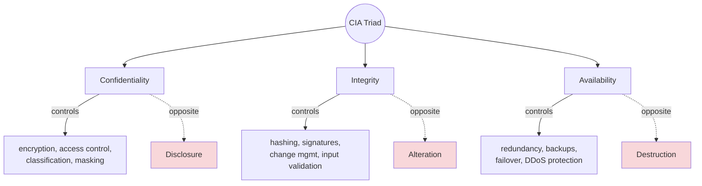

# CIA Triad

## Overview

The three core principles of information security. Every security control exists to protect one or more of these. The right mix of CIA depends on what you're protecting - an e-commerce site weights availability + integrity heavily; a payment platform weights confidentiality + integrity.

> **Mental model:** The CIA triad is the "foundation of the foundation." Everything you learn in the other domains ties back here. Too much of any one leg degrades the others (too much confidentiality hurts availability; too much availability hurts confidentiality/integrity). The goal is **exactly enough** — no more, no less — based on cost-benefit analysis.

## Key Concepts

### Confidentiality
- Preventing unauthorized disclosure of information
- Controls: encryption, access controls, data classification, masking
- Opposite threat: **disclosure** (data breaches, eavesdropping)

### Integrity
- Ensuring data is accurate, complete, and unaltered
- Controls: hashing, digital signatures, change management, input validation
- Opposite threat: **alteration** (tampering, man-in-the-middle)

### Availability
- Ensuring systems and data are accessible when needed
- Controls: redundancy, backups, failover, capacity planning, DDoS protection
- Opposite threat: **destruction/disruption** (DoS, ransomware, hardware failure)

### Additional Concepts (DAD Triad - the opposites)
- **Disclosure** - opposite of Confidentiality
- **Alteration** - opposite of Integrity
- **Destruction** - opposite of Availability (data destroyed OR rendered inaccessible — e.g. DDoS)

### Protecting the Three Data States

| State | What it is | How we protect it |
|-------|-----------|-------------------|
| **Data at rest** | Sitting on disk, not in use | Encryption (AES-256 full-disk), stronger encryption for more sensitive data |
| **Data in motion** | Traversing the network | End-to-end encryption (TLS), secure transport protocols |
| **Data in use** | Actively being processed | Can't encrypt while using — rely on clean desk policy, screen privacy filters, auto-lock PCs, shoulder-surfing policies, MFA, masking, access controls, need-to-know / least privilege |

> **Real-world example (Stuxnet):** US/Israeli worm targeting Iranian nuclear centrifuges. The attackers didn't care about confidentiality — they knew everything about the centrifuges already. The attack compromised **integrity only**, making centrifuges spin 1-2% faster (imperceptible) so they broke at a much higher rate. Spread via USB into air-gapped systems. Demonstrates a pure integrity attack.

### Beyond CIA
- **Authenticity** - proving identity/origin is genuine
- **Non-repudiation** - preventing denial of actions (digital signatures, audit logs)
- **Privacy** - appropriate use and handling of personal information

## Common Exam Mappings (scenario → C/I/A)

General rule of thumb:
- **Confidentiality** = unauthorized **DISCLOSURE**
- **Integrity** = unauthorized **MODIFICATION**
- **Availability** = **DISRUPTION** of access

| Scenario | Maps to | Why |
|----------|---------|-----|
| **Keylogger** | Confidentiality | Captures & discloses keystrokes/passwords |
| **Packet sniffing (Wireshark) / eavesdropping / interception** | Confidentiality | Unauthorized disclosure of data in transit. Defense = encryption (TLS/VPN/SSH) |
| ...captured packets also **modified / re-injected** | + Integrity | Disclosure plus tampering with the data |
| **Multiple servers behind a load balancer / redundancy / failover / clustering / RAID** | Availability | Keeps systems accessible despite failure |
| **Data classification** (to limit likelihood of disclosure) | Confidentiality | Controls who can see what |
| **Website defacement / unauthorized modification** | Integrity | Data altered without authorization |

Availability comes from redundancy at every layer:
- **Servers** - multiple servers in separate data centers, load balancing
- **Power** - multiple power supplies per server, multiple UPSs, generators
- **Network** - multiple NICs → multiple switches → multiple routers → multiple ISPs
- **Storage** - RAID (mirroring or striping) with hot-swappable drives
- **Patching** - Equifax lost 150M SSNs two months after a patch was available. Test patches first, but don't sit on them.

> **War story (the RPE):** A data center had two UPSs on each side. One side was loaded at 120% of a single UPS, the other at 60%. Someone shut off one UPS on the heavy side — the remaining UPS saw 120% load and shut itself off to save itself, taking 2/3 of the data center dark. "RPE" = Resume-Producing Event. Redundancy only works if it's actually redundant.

## The $10,000 Heuristic

If you have $10,000 to protect, you don't spend $100,000 protecting it. When senior management says "I want 100% uptime," translate that into numbers: 100% might cost $1M; 99.999% might cost $50K. Your job is translating business wants into economically viable security decisions. **Exactly enough, no more, no less.**

## Exam Tips

- If a question asks "what is the PRIMARY concern," map it to C, I, or A
- Encryption = Confidentiality (not integrity, unless combined with hashing)
- Hashing = Integrity
- Redundancy/backups = Availability
- Digital signatures = Integrity + Non-repudiation + Authenticity
- Questions won't be definition-style. Expect scenarios: "We encrypt and digitally sign. What do we have?" → confidentiality + authentication + non-repudiation + integrity

## Diagrams

### CIA vs DAD — Each Leg, Its Control and Its Opposite
Every leg is protected by specific controls and broken by its DAD opposite.

## Related Topics

- [Risk Management](Risk%20Management.md) - risks are threats to CIA
- [Security Policies and Standards](Security%20Policies%20and%20Standards.md) - policies enforce CIA
- [Cryptography](../03-security-architecture-and-engineering/Cryptography.md) - primary tool for confidentiality and integrity
- [Domain 3 - Security Architecture and Engineering](../03-security-architecture-and-engineering/00%20Domain%203%20-%20Security%20Architecture%20and%20Engineering.md) - designing for CIA
