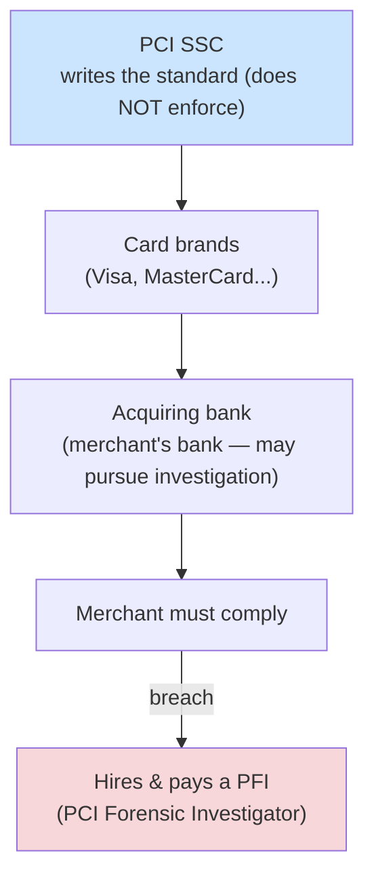

# Compliance and Legal Issues

## Overview

Understanding the legal landscape that governs how organizations handle data, privacy, and security.

## Key Concepts

### Types of Law
- **Criminal Law** - crimes against society; penalties include fines and imprisonment
- **Civil Law** - disputes between parties; penalties are financial damages
- **Administrative/Regulatory Law** - government agency regulations
- **Common Law** - based on judicial precedent (US, UK)
- **Civil (Code) Law** - based on written codes/statutes (most of Europe)
- **Religious Law** - based on religious doctrine
- **Customary Law** - based on regional customs

### Intellectual Property
| Type | Protects | Duration |
|------|----------|----------|
| **Patent** | Inventions, processes | 20 years |
| **Copyright** | Creative/literary works, software code | Life + 70 years |
| **Trademark** | Brand names, logos, symbols | Renewable indefinitely |
| **Trade Secret** | Proprietary business info | As long as kept secret |

### Computer Crime Laws
- **CFAA** (Computer Fraud and Abuse Act) - US federal computer crime law
- **ECPA** (Electronic Communications Privacy Act) - wiretapping and electronic surveillance
- **Convention on Cybercrime** (Budapest Convention) - a Council of Europe treaty (not an EU instrument; the US is a party) for international cooperation

### PCI DSS (contractual standard, NOT law)

- **PCI DSS** is a **contractual** standard, **not a law**. The **PCI SSC** (Security Standards Council) **writes** the standard but does **not enforce** it.
- Enforced through the **card brands** → flows down to the **acquiring bank** (the merchant's bank).
- "Who **may choose to pursue an investigation** under PCI DSS?" → the **bank** — it holds discretionary contractual authority.
- A merchant that is breached must hire and pay a **PFI** (**PCI Forensic Investigator**).
- Compensating control for stored card data that **can't be removed** = **encryption**.
  - Note: **insurance = transference** (risk treatment), **not** a compensating control.

### SOX (Sarbanes-Oxley, 2002)

- US **law** for **publicly traded** companies.
- Mandates **internal controls over financial reporting**.
- **CEO and CFO personally certify** the financial reports.
- Don't confuse **SOX** with **SOC**: **SOX = law** for public companies; **SOC = audit report** on a vendor.
  - Mnemonic: **SOX is a law, SOC is a report.**

## Exam Tips

- **PCI DSS** is contractual, not a law — the **bank** (not the PCI SSC) may pursue an investigation
- **SOX** = law for public companies; **SOC** = report on a vendor (don't confuse them)
- Copyright protects **expression**, not ideas - and is automatic upon creation
- Patents protect **inventions and processes** - must be applied for
- Trade secrets lose protection once disclosed
- Know the difference between criminal (imprisonment) and civil (money damages) law

## Diagrams

### PCI DSS Enforcement Chain
PCI DSS is contractual: the SSC writes it, but the card brands and the acquiring bank enforce it.

## Related Topics

- [Laws and Regulations](Laws%20and%20Regulations.md)
- [Security Governance](Security%20Governance.md)
- [Professional Ethics](Professional%20Ethics.md)
- [Domain 2 - Asset Security](../02-asset-security/00%20Domain%202%20-%20Asset%20Security.md) - data privacy requirements
