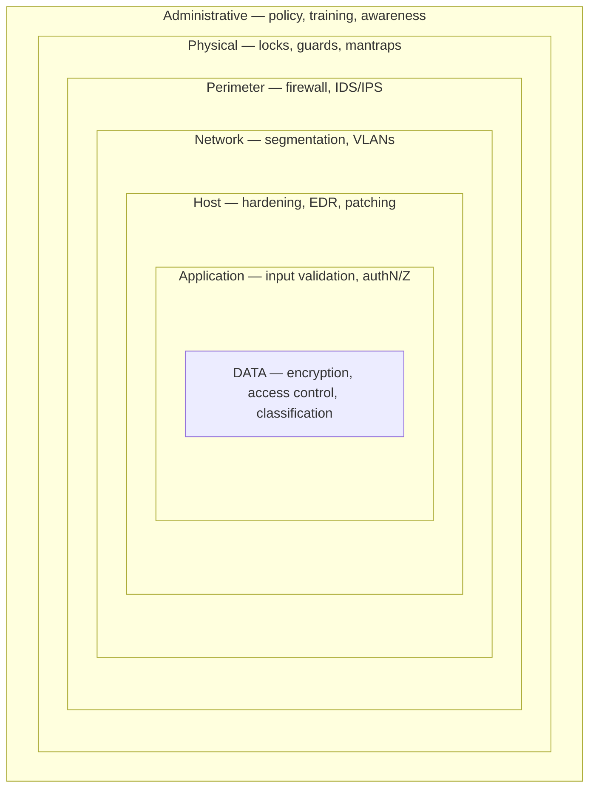

# Defense in Depth

## Overview

Defense in depth is the practice of stacking multiple, independent controls between an attacker and what you're protecting, so no single failure is fatal. The idea borrows from castle design: a moat, then walls, then a locked keep — each layer the attacker must defeat costs them time and raises the odds they're detected before they reach the crown jewels. It matters because every control eventually fails — a firewall is misconfigured, a user clicks the link, a patch is late — and a single-layer defense turns one small failure into a total breach. Layering converts "one mistake = compromise" into "an attacker must beat several different defenses in a row."

## Layers
1. **Policies and procedures** (administrative)
2. **Physical security** (fences, locks, guards)
3. **Network security** (firewalls, IDS, segmentation)
4. **Host security** (OS hardening, EDR, patching)
5. **Application security** (secure coding, WAF)
6. **Data security** (encryption, DLP, classification)

## Key Principle

No single control is sufficient. Combine administrative, technical, and physical controls across multiple layers so that the failure of one does not compromise the entire system. Strong layering also uses **diversity of defense** — different vendors/technologies at different layers — so one zero-day or one vendor flaw can't unlock every layer at once.

## Exam Tips

- Defense in depth = **multiple layers**; the value is that one failed control doesn't expose the asset.
- **Diversity of defense** is a refinement: vary the technology/vendor between layers so a single exploit doesn't cascade.
- **Common trap:** two firewalls from the **same vendor**, stacked back-to-back, is *not* true defense in depth — same flaw breaks both. Different control *types* across layers (administrative + physical + technical) is the stronger answer.
- Defense in depth supports **all** of CIA, not just one leg.

## Diagrams

### Defense in Depth — Layered Controls

> Concentric layers: an attacker must defeat every ring to reach the data.

**Takeaway:** No single control is enough — **layer administrative + physical + technical** controls so one failure isn't fatal. Data sits at the protected core.

## Related Topics

- [Secure Design Principles](../03-security-architecture-and-engineering/Secure%20Design%20Principles.md) - architectural foundation
- [Physical Security](../03-security-architecture-and-engineering/Physical%20Security.md) - physical layers
- [Network Devices and Components](../04-communication-and-network-security/Network%20Devices%20and%20Components.md) - network layers
- [Security Operations Concepts](../07-security-operations/Security%20Operations%20Concepts.md) - operational layers
