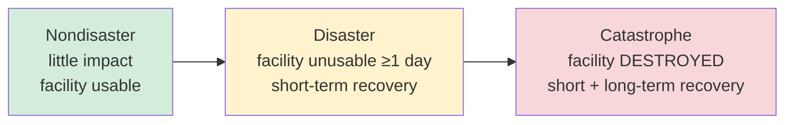

# Disaster Classifications

## Overview

Maymí/Harris CISSP terminology for severity classification of disruptive events. Tested as precise definitional distinction — easily confused between Disaster and Catastrophe.

## The Three Levels

### Nondisaster
- Service disruption with little impact
- Recovery is straightforward; existing facility remains usable
- **Examples:** brief power outage, individual server failure, localized network issue

### Disaster
- **Entire facility unusable for a day or more**
- Significant disruption but the original facility itself is intact
- Recovery is short-term; the facility can eventually be returned to use
- **Examples:** extended power loss, building flood (recoverable), localized fire

### Catastrophe
- **Destroys the original facility entirely**
- Requires **both short-term AND long-term recovery planning**
- The original facility cannot be restored — recovery means rebuilding or relocating permanently
- **Examples:** total facility destruction by fire/earthquake/tornado, building condemnation

## CISSP Trigger Mapping

| Question phrase | Answer |
|---|---|
| "Service disruption, little impact" | Nondisaster |
| "Facility unusable for a day or more, short-term recovery" | Disaster |
| "Destroys original facility + short AND long-term recovery" | **Catastrophe** |

## Common Trap

A typical exam question asks: "Which threat cripples a business, destroys the original facility, and requires short- and long-term recovery planning?"

- The phrase "**destroys the original facility**" is the discriminator — only Catastrophe meets this
- "Requires short- AND long-term recovery" is the second discriminator — Disaster only requires short-term
- **Correct answer:** Catastrophe (D)
- Common wrong answer: Disaster (sounds severe enough but doesn't match "destroys facility")

## Memorization

Severity ranking: **Nondisaster < Disaster < Catastrophe**

The "destroys" verb is reserved for Catastrophe. Disasters disrupt; catastrophes destroy.

## Diagrams

### Severity Escalation
The discriminators: facility usable? and does recovery need a long-term plan?

## Related Topics

- [Business Continuity Planning](Business%20Continuity%20Planning.md)
- [Business Impact Analysis](Business%20Impact%20Analysis.md)
- [Disaster Recovery](../07-security-operations/Disaster%20Recovery.md) (D7)
- [CRAM-SHEET](../../practice/sheets/CRAM-SHEET.md)
