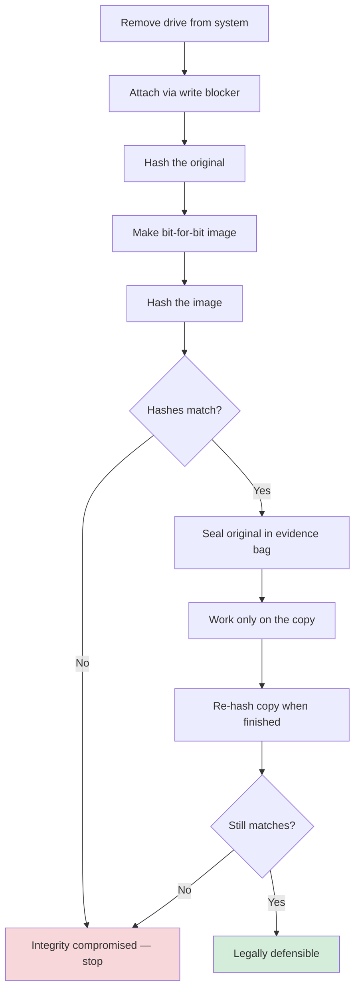

# Evidence Handling

## Overview

Collecting, preserving, and presenting evidence in a legally defensible way. Great evidence is useless if obtained illegally or with a broken chain of custody.

## Types of Evidence

| Type | Description |
|------|-------------|
| **Real** | Physical, tangible — hard drives, USB sticks, servers (not the data itself) |
| **Direct** | Experienced via one of the five senses |
| **Circumstantial** | On its own, not conclusive, but supports other facts (green paint on a bumper matches a green car) |
| **Corroborative** | Multiple circumstantial items pointing to the same conclusion |
| **Hearsay** | Not firsthand; normally inadmissible. **Exception:** computer-generated logs, if made at/near the time of the attack with an unaltered chain of custody |
| **Best Evidence** | The original, preferred in court |
| **Secondary Evidence** | Copies; used when originals aren't available. Most computer-crime evidence is secondary. |

## Best Evidence Rule

Evidence should be:
- Accurate
- Complete
- Relevant
- Authentic
- Convincing

## Chain of Custody

Documented log of:
- Who handled it
- When
- What they did with it
- Where

A broken chain = likely inadmissible. Only trained personnel handle evidence.

## Forensic Workflow (preserve integrity)

1. Remove drive from affected system
2. Connect via **write blocker** (hardware/software; prevents modification)
3. **Hash the original** (MD5/SHA)
4. **Make a bit-for-bit image**
5. **Hash the image** — must match the original
6. Seal the original in an evidence bag
7. Work only on the copy
8. When finished, re-hash the copy — must still match

If hashes don't match at any point, integrity is compromised.

## Legal Context (US-leaning)

### Fourth Amendment / Reasonable Searches
Protects citizens from unreasonable government searches and seizures. Law enforcement generally needs a warrant. **Exigent circumstances exception:** immediate threat to life or destruction of evidence allows government actors (including those acting under color of law) to intervene — courts decide after whether the action was lawful.

### Monitoring Employees
Employees must be **clearly notified** that company equipment is monitored. Without that notice, the monitoring may be illegal and the evidence unusable. Privacy laws (especially in the EU) are strengthening rapidly.

### Entrapment vs. Enticement
- **Entrapment** — illegal and unethical. Inducing someone to commit a crime they hadn't planned. ("You should hack this server, you could make $100K.")
- **Enticement** — legal and ethical. They already planned the crime; you made it slightly more attractive. **Honeypots and honeynets = enticement.**

Gray zones exist — juries decide. Always get sign-off from senior management, HR, and legal before deploying a honeypot.

## Exam Tips

- Computer logs are hearsay but admissible if properly preserved
- Best evidence = the original
- Write blocker + hash = integrity proof
- Honeypot = enticement = legal
- Chain of custody must be unbroken

## Diagrams

### Forensic Imaging Workflow
Preserve integrity by working only on a verified copy of the original.

## Related Topics

- [Investigations and Evidence](../07-security-operations/Investigations%20and%20Evidence.md) — Domain 7 operational forensics
- [Digital Forensics](../07-security-operations/Digital%20Forensics.md)
- [Laws and Regulations](Laws%20and%20Regulations.md)
- [Compliance and Legal Issues](Compliance%20and%20Legal%20Issues.md)
