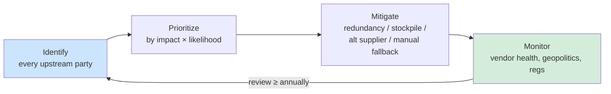

# External Dependencies in BIA

## Overview

Your BIA can't stop at the org's walls. Third-party services, suppliers, and other external dependencies can disrupt critical functions just as easily as internal failures.

## Why They Matter

- Direct impact — provider outage stops your operations (payment processor down → no sales)
- Indirect impact — reputation damage, legal exposure, contractual penalties
- Compliance complexity — if they handle your data, their compliance posture is part of yours

## Identifying External Dependencies

Map every external party that's upstream of a critical function:
- Cloud providers (IaaS, PaaS, SaaS)
- Payment processors
- Single-source suppliers of materials/components
- SaaS apps embedded in daily workflow
- Communication providers (ISP, telco)
- Managed security service providers

For each: what breaks if they fail?

## Prioritizing Dependencies

Same logic as internal BIA — weight by impact and likelihood:
- How critical is this dependency?
- What's the direct revenue/ops impact of failure?
- What's the indirect (reputation, legal)?
- What's the likelihood of disruption (financial health, geography, geopolitics)?

## Mitigation Strategies

| Strategy | Example |
|----------|---------|
| **Redundancy** | Multiple payment processors (PayPal + Stripe + Apple Pay) |
| **Stockpiling** | Keep 30+ days of critical raw materials |
| **Alternate suppliers** | Pre-existing relationships you already buy 5-10% from |
| **Manual workarounds** | Paper-based fallback process |
| **Contractual SLAs** | Penalties compensate impact but don't prevent it |

**Payment processor example:** If you run an e-commerce site, accepting only one processor is a single point of failure. Offering PayPal, credit card, Venmo, Apple Pay etc. means a single processor outage doesn't stop sales. This also widens your reachable customer base.

**Sand supplier example:** If you use 1,000 lb/day and finding a new supplier takes 3-4 weeks, keep >30 days on hand OR pre-qualify a second vendor and buy 10% from them ongoing.

## Service Level Agreements (SLAs)

Contract that defines:
- Uptime guarantees
- Response times
- Security requirements
- Data protection obligations
- Penalties for breach

SLAs are **risk transference** — the impact still hits you, but you get compensation. Not prevention.

## Compliance Considerations

Every provider that touches your regulated data inherits your regulatory scope. HIPAA-covered? Your cloud provider must support HIPAA. GDPR? Same. This needs to show up in your BIA dependency map.

## Dynamic Monitoring

External dependencies shift constantly:
- Vendor financial health — are they going under?
- Geopolitical events — export restrictions, sanctions
- Regulatory changes — laws affecting them affect you
- Your own operational changes — new products may create new dependencies

Review the dependency map at least annually, more often if things are volatile.

## Collaboration with Vendors

Strong vendor relationships enable:
- Joint risk identification
- Coordinated contingency plans
- Real-time communication during incidents
- Honest disclosure of limitations (vs. sales-pitch denial)

Verify vendor claims independently — talk to existing customers, check support responsiveness, review SOC 2 Type II reports.

## Exam Tips

- External dependencies belong IN the BIA, not outside it
- SLA = transference, not prevention
- Multiple providers > one provider (for critical functions)
- Cloud/SaaS providers inherit your compliance scope
- Single points of failure in the supply chain are BIA gaps

## Diagrams

### Managing External Dependencies
Identify, prioritize, mitigate, then keep monitoring — the map is never frozen.

## Related Topics

- [Business Impact Analysis](Business%20Impact%20Analysis.md)
- [Supply Chain Risk Management](Supply%20Chain%20Risk%20Management.md)
- [Third Party Acquisitions and Divestiture](Third%20Party%20Acquisitions%20and%20Divestiture.md)
- [Business Continuity Planning](Business%20Continuity%20Planning.md)
- [Risk Management](Risk%20Management.md)
