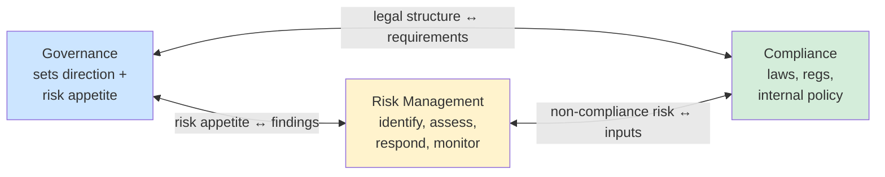

# GRC - Governance, Risk, and Compliance

## Overview

GRC is the integrated approach to managing an organization's governance, risk, and compliance. Each piece reinforces the others.

## The Three Pillars

### Governance

Strategic alignment between IT/security and the business. Ensures:
- **Strategic alignment** — security goals support business goals
- **Resource management** — enough people, money, tech for the security program
- **Performance monitoring** — via KPIs / KRIs
- **Value delivery** — optimized security investment
- **Policy + ethics integration** — all activities align with policies and regulations

### Risk Management

Identify, assess, respond to, and monitor risks. Four phases (see [Risk Management](Risk%20Management.md)):
1. Identification
2. Assessment (qualitative → quantitative)
3. Response (mitigate, transfer, accept, avoid — never reject)
4. Monitoring / Reporting

### Compliance

Meeting stated requirements — laws, regulations, and internal policies.
- External: GDPR, HIPAA, SOX, PCI DSS, etc.
- Internal: your policies, standards, procedures
- Audits (internal and external)
- Continuous monitoring
- Ethics and privacy programs

## How the Pieces Interact

**Governance ↔ Risk:**
- Governance sets **risk appetite**; risk management works within it
- Risk findings inform governance decisions

**Governance ↔ Compliance:**
- Governance establishes the ethical/legal structure
- Compliance requirements shape policies under the governance program

**Risk ↔ Compliance:**
- Risk management surfaces non-compliance threats
- Compliance requirements feed risk assessment inputs

## Why You Need All Three

- Without **governance** — security isn't aligned to the business; no direction
- Without **risk management** — you protect the wrong things or leave gaps open
- Without **compliance** — legal penalties, reputational damage, liability

Together they create a more resilient, holistic security program.

## Exam Tips

- Governance sets direction; risk management guides resource use; compliance keeps you legal/ethical
- GRC is **integrated**, not three separate functions
- Risk appetite lives in governance, gets executed in risk management
- Compliance ≠ security (but you can't ignore either)

## Diagrams

### How the Three Pillars Reinforce Each Other
GRC is integrated — each pillar feeds the other two.

## Related Topics

- [Security Governance](Security%20Governance.md)
- [Risk Management](Risk%20Management.md)
- [Compliance and Legal Issues](Compliance%20and%20Legal%20Issues.md)
- [Laws and Regulations](Laws%20and%20Regulations.md)
- [Security Policies and Standards](Security%20Policies%20and%20Standards.md)
- [KPIs KRIs and KGIs](KPIs%20KRIs%20and%20KGIs.md)
