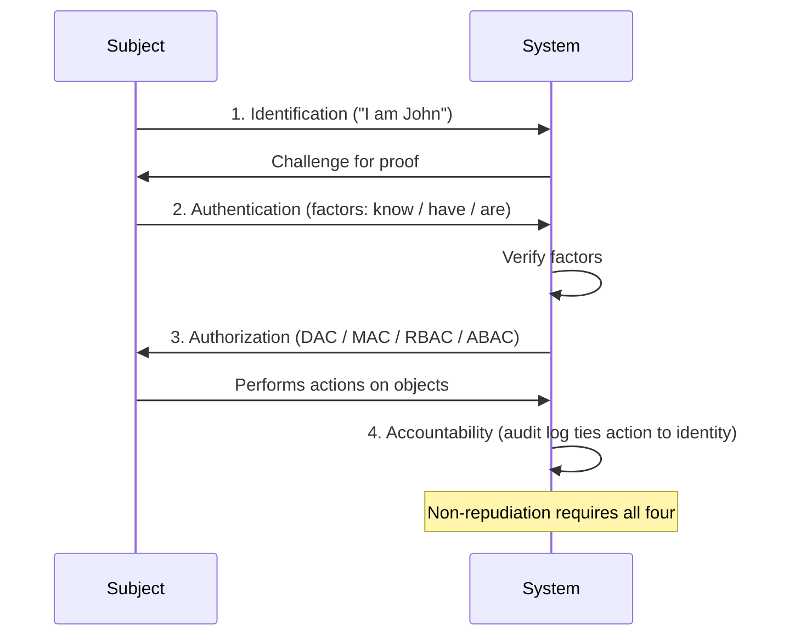

# IAAA - Identification, Authentication, Authorization, Accountability

## Overview

The four-stage model of access control. Sometimes called AAA (omitting Identification). Include Identification — you need to know **who** you're authenticating, granting access to, and holding accountable.

## The Four Stages

### 1. Identification
Claiming an identity. Something that uniquely identifies you: username, employee ID, email, SSN. This is me saying "I am Thor." No proof yet — just the claim.

### 2. Authentication
Proving the identity claim. Ideally **multi-factor** (MFA) — two or more **different types** of factors.

| Type | Category | Examples |
|------|----------|----------|
| **Type 1** | Something you **know** (knowledge) | Password, passphrase, PIN |
| **Type 2** | Something you **have** (possession) | Smart card, token, phone, cookie, one-time pad |
| **Type 3** | Something you **are** (biometric) | Fingerprint, iris, face/ear/hand geometry |
| Type 4 | Somewhere you **are** | GPS, IP geolocation |
| Type 5 | Something you **do** | Typing cadence, gait, signature |

**Two passwords = NOT MFA** (same factor type). Password + SMS code = MFA (Type 1 + Type 2). ATM = card (Type 2) + PIN (Type 1).

**Type 3 caveat:** biometrics can't be reissued. Once compromised, compromised forever. Your fingerprint at age 30 is your fingerprint at age 40.

### 3. Authorization
What this authenticated subject is allowed to do. Implemented via access control models:
- **DAC** (Discretionary) — owner grants access (Windows NTFS, Unix permissions)
- **MAC** (Mandatory) — system enforces labels/clearances (military, intelligence)
- **RBAC** (Role-Based) — permissions tied to job role (most common in enterprise)
- **ABAC** (Attribute-Based) — decisions based on attributes (user, resource, environment)

### 4. Accountability (Auditing)
Tying actions back to identities. If I log in from my workstation, with my credentials, during my hours, and alter data — I can't really refute it. That's non-repudiation in practice.

Requires: Identification + Authentication + Audit logging.

## Need-to-Know vs. Least Privilege

- **Need-to-Know** — you may hold broad access rights but are only authorized to access the specific data your current task justifies (e.g., a doctor can technically reach all patient records but may only open the ones they're treating).
- **Least Privilege** — you are granted only the bare minimum access required for your role; anything extra requires an explicit grant.
- *Note:* both principles apply across all access-control models (DAC, MAC, RBAC, ABAC) — don't treat "need-to-know = DAC" or "least privilege = MAC" as a fixed mapping; that's a loose study aid, not doctrine.

**Example (Nadya Suleman case):** 15 Kaiser employees accessed her records without a need-to-know basis. All 15 were fired/reprimanded based on audit logs (accountability). This is exactly what need-to-know + accountability is designed to catch.

## Subjects and Objects
- **Subject** = active (user, process). Manipulates objects.
- **Object** = passive (data, file, record).
- A program can be both — not at the same time. It's a subject when it reads a spreadsheet; an object when you launch it.

## Subjects, Objects, and Access Control Principles
- **Principals** = the subjects we grant access to (users, services)
- No shared logins. No group passwords. Accountability breaks if you can't tie an action to one person.

## Exam Tips

- Two passwords ≠ MFA (same factor)
- Smart card + PIN = MFA (possession + knowledge)
- Type 3 compromise is permanent
- Accountability requires Identification — you can't audit a mystery user
- Answer like an IT security **manager / risk advisor / lawyer** — not a techie
- Read each question like a lawyer. Find the true distractors, eliminate, then pick most correct

## Diagrams

### The Four Stages as an Exchange
The subject and system move through Identification → Authentication → Authorization → Accountability in order.

## Related Topics

- [Access Control Categories and Types](Access%20Control%20Categories%20and%20Types.md)
- [Access Control Models](../05-identity-and-access-management/Access%20Control%20Models.md)
- [Authentication Methods](../05-identity-and-access-management/Authentication%20Methods.md)
- [Authorization and Accountability](../05-identity-and-access-management/Authorization%20and%20Accountability.md)
- [Least Privilege](../01-security-and-risk-management/Least%20Privilege.md)
- [Separation of Duties](../01-security-and-risk-management/Separation%20of%20Duties.md)
