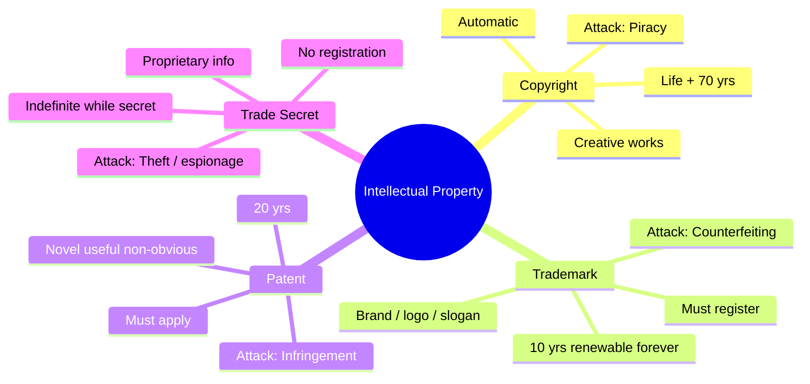

# Intellectual Property

## Overview

Not a huge topic on the exam but easy points if you know the four categories and their durations.

## The Four IP Types

| Type | Protects | Duration | Registration |
|------|----------|----------|--------------|
| **Copyright** | Creative works (books, art, music, software code, courses) | Life + 70 years (individual); 95 years from creation (corporation) | Automatic on creation |
| **Trademark** | Brand names, logos, slogans | 10 years, renewable indefinitely | Must register + pay fee |
| **Patent** | Inventions, processes, novel useful non-obvious | 20 years | Must apply; strict requirements |
| **Trade Secret** | Proprietary info (e.g., Coca-Cola formula) | Indefinite — while kept secret | None; no legal recourse if disclosed |

**Mickey Mouse fact:** Copyright was bumped from 50 to 70 years (and 75 to 95 for corporations) in large part through Disney lobbying just before Mickey entered the public domain.

**Nike example:** "Nike" is trademarked (brand), the Swoosh is trademarked (logo), "Just Do It" is trademarked (slogan). Different trademarks, same company.

**Patent timing:** Many pharmaceutical patents are filed at discovery, but clinical trials eat 10-11 years. Effective commercial life may be only ~10 years.

**Trade secrets:** If leaked, there's no IP protection. The info is just gone. Competitors can legally use it. But how they obtained it (corporate espionage) may be a separate crime.

## Attacks on IP

| Attack | Targets | Example |
|--------|---------|---------|
| **Piracy** | Copyright | Illegal copies of software, movies, music |
| **Counterfeiting** | Trademark | Fake Rolexes, fake Nikes |
| **Patent Infringement** | Patent | Using a patented invention without license |
| **Trade Secret Theft** | Trade Secret | Corporate espionage |

## Cyber Squatting vs. Typo Squatting

- **Cyber Squatting** — registering a domain you know someone else will want. Legal gray zone. Illegal if used for extortion/bad faith (US anti-cybersquatting law).
- **Typo Squatting** — domains that look like another's (gooogle.com). Legal if you don't impersonate; illegal if you do. Big companies defensively buy typo-variants of their own domains.

## Exam Tips

- Copyright is automatic on creation — no application needed
- Patent requires novel + useful + non-obvious
- Trade secret has no legal protection once revealed
- Trademarks can be renewed forever
- Counterfeit = trademark issue; piracy = copyright issue
- **Symbols:** **®** = registered trademark (officially approved by USPTO). **™** = unregistered/claimed trademark (used *before* USPTO approval). **©** = copyright. (So a plain ™ means the mark is claimed but not yet registered — not "fake," just not formally granted.)

## Diagrams

### Four IP Types and Their Attacks
Each protection type maps to a duration and a matching attack.

## Related Topics

- [Laws and Regulations](Laws%20and%20Regulations.md)
- [Compliance and Legal Issues](Compliance%20and%20Legal%20Issues.md)
- [Cryptography](../03-security-architecture-and-engineering/Cryptography.md) — algorithms can be patented
