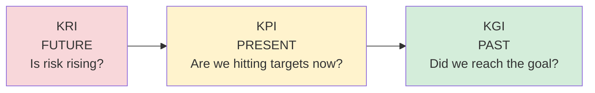

# KPIs, KRIs, and KGIs

## Overview

Three classes of metrics you use to communicate with leadership and measure the security program.

## KGIs — Key Goal Indicators

Did we reach the goal? Measured **after the fact**.

- Look-back measurement — "How did we do vs. the plan?"
- Used in lessons learned post-project
- Not for blame — for process improvement
- Example: Did we complete the data center migration on time and under budget?

## KPIs — Key Performance Indicators

How well are we performing a given task? Measured **ongoing**.

- Direct correlation to a goal
- More specific and granular than KGIs
- Examples: average length of stay in a hospital, sales calls per hour, MTTR, patch coverage %, user training completion rate

## KRIs — Key Risk Indicators

What risks do we face, and how risky is the current state?

- Early warning system — spot emerging threats
- Measure adherence to the org's **risk appetite**
- Used by leadership to know when to act
- Examples: number of critical unpatched systems, failed login attempts/day, phishing click rate, percentage of users with expired training

## How They Relate

| Metric | Question it answers | When you check it |
|--------|---------------------|-------------------|
| KGI | Did we hit the goal? | After |
| KPI | How well are we executing? | Ongoing |
| KRI | What risks are we running? | Ongoing |

Combine them: KRIs tell you where to focus, KPIs track whether your mitigations are working, KGIs confirm you hit the strategic target.

**Time orientation:** KPI = present ("are we hitting targets *now*?"), KGI = outcome ("did we *reach* the goal?"), KRI = forward/predictive ("is risk *rising*?").

## Metric vs KPI

A **metric** is a raw measurement (e.g., "92% of staff completed training"). A **KPI** is a metric **tied to a defined target**. When a measurement has a stated goal/aim (e.g., a 95% training-completion target), it's a **KPI**, not just a metric. Trigger: measurement + defined target → KPI.

## Exam Tips

- KRI = Risk Indicator (emerging / current risk)
- KPI = Performance Indicator (how we're doing)
- KGI = Goal Indicator (did we arrive?)
- KRIs let you demonstrate risk appetite adherence to leadership
- All three feed the risk management lifecycle (especially Monitoring & Reporting)

## Diagrams

### Time Orientation of Each Metric
KRIs look forward, KPIs measure the present, KGIs confirm the past.

## Related Topics

- [Risk Management](Risk%20Management.md)
- [GRC - Governance Risk Compliance](GRC%20-%20Governance%20Risk%20Compliance.md)
- [Security Governance](Security%20Governance.md)
- [Values Vision Mission and Plans](Values%20Vision%20Mission%20and%20Plans.md)
