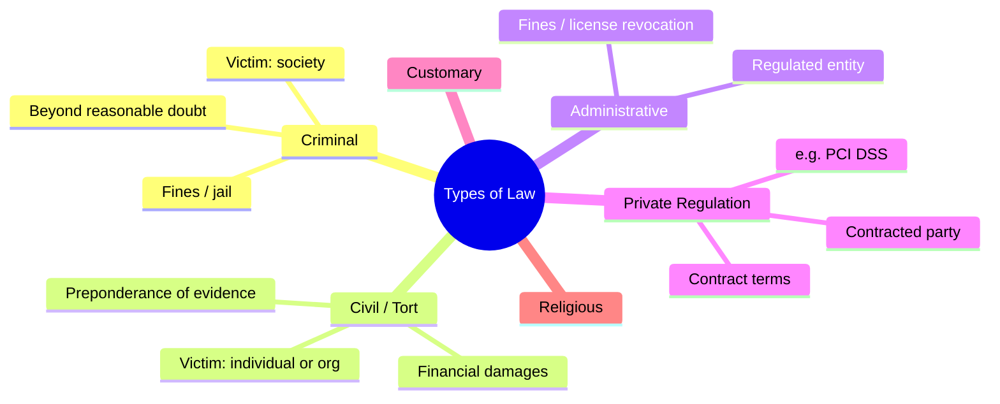
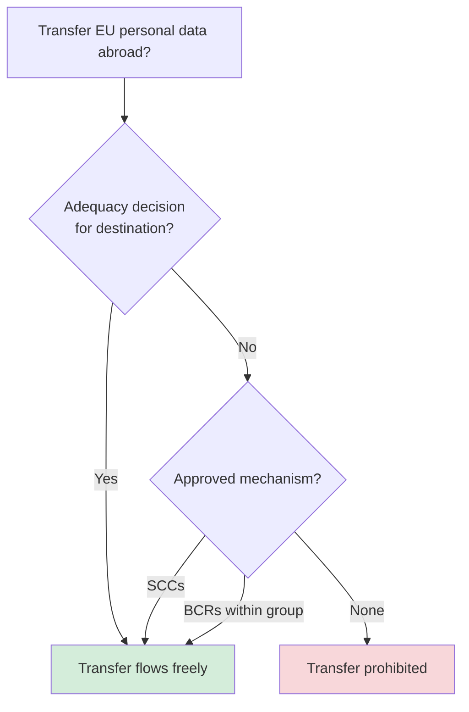

# Laws and Regulations

## Overview

Key laws and regulations that CISSP candidates must know. These drive security requirements across industries.

> The CISSP is international but started in the US, so expect a US lean. Also understand the **concepts behind** each law more than the letter of it. For your job, know whatever applies in your jurisdiction.

## Types of Law (testable)

| Type | Victim | Standard of proof | Penalty | Sentencing purpose |
|------|--------|-------------------|---------|---------------------|
| **Criminal** | Society | Beyond a reasonable doubt | Fines, jail, death penalty | Punish + deter |
| **Civil / Tort** | Individual, group, org | Preponderance of evidence (majority) | Financial damages | Compensate victim |
| **Administrative / Regulatory** | Regulated entity | Varies | Fines, license revocation | Enforce regulation |
| **Private Regulation** | Contracted party | Contract terms | Loss of privileges (e.g. right to process cards) | Enforce standards (PCI DSS) |
| **Customary Law** | Community | Tradition | Varies | Preserve custom |
| **Religious Law** | Faith community | Religious doctrine | Varies | Moral/religious |

## Key Concepts

### Privacy Laws
| Law | Scope | Key Points |
|-----|-------|------------|
| **GDPR** (EU) | Personal data of EU residents | Consent-based, right to be forgotten, 72-hour breach notification, heavy fines (4% revenue) |
| **HIPAA** (US) | Healthcare information (PHI) | Privacy Rule, Security Rule, Breach Notification Rule |
| **HITECH** (US, 2009) | Strengthens HIPAA | Breach Notification Rule, extends liability to business associates, bigger penalties, promotes EHR |
| **GLBA** (US) | Financial institutions | Safeguards Rule, privacy notices, opt-out of sharing |
| **SOX** (US) | Public companies | Financial reporting integrity, internal controls |
| **FERPA** (US) | Student education records | Privacy of student records; rights held by parents, transfer to student at 18 / college |
| **COPPA** (US) | Children under 13 online | Verifiable parental consent required before collecting data |
| **CCPA/CPRA** (US-CA) | California residents | Right to know, delete, opt-out of data sales; teen opt-in (13-16) to sell |
| **Privacy Act** (US, 1974) | US federal agency records | Governs how federal government agencies handle PII |
| **PIPEDA** (Canada) | Personal data in commerce | Consent, limiting collection/use |
| **POPIA** (South Africa, ~2021) | Comprehensive privacy | "South Africa's GDPR" |
| **PIPL** (China, 2021) | Comprehensive privacy | "China's GDPR"; strict cross-border transfer rules (≠ PIPEDA) |

### Privacy Laws — Exam Detail

**GLBA** — applies to **financial institutions**. Must give customers **privacy notices**, allow **opt-out** of information sharing, and safeguard customer financial data.
- Trigger: "financial institution + privacy notice" → **GLBA**.

**FERPA** — privacy of **student education records** at schools receiving federal funds.
- Rights belong to **parents**, then **transfer to the student** at age **18** or when entering college. Key age 18 = the **transfer** point, not a cutoff.

**COPPA** — protects children **under 13** online; requires **verifiable parental consent** before collecting data (commercial websites/apps). Key age 13 = the **cutoff**.
- Mnemonic: **PG-13 = COPPA (13), 18 = FERPA**.

**HIPAA** — PHI privacy & security via the **Privacy Rule** + **Security Rule**.
- Applies to **3 covered entities**: (1) healthcare **providers**, (2) health **plans**, (3) healthcare **clearinghouses** — plus their **business associates**.
- A **healthcare clearinghouse** = a middleman that translates/reformats health data between nonstandard and standard formats (billing/claims).
- Gap: a health & fitness **app is NOT automatically covered** by HIPAA — a common privacy gap.

**HITECH** (2009) — **strengthens HIPAA**. Added the **Breach Notification Rule**, extended liability **directly to business associates**, increased penalties, and promoted **EHR adoption**.
- HIPAA = the original rules; HITECH = tech + breach notification + bigger teeth.

**Privacy Act of 1974** — governs how **US federal government agencies** handle **PII** in their records.

**POPIA** (South Africa, ~July 2021) — comprehensive privacy law; "South Africa's GDPR."

**PIPL** (China, Nov 2021) — Personal Information Protection Law; "China's GDPR"; strict cross-border transfer rules. Do **not** confuse with **PIPEDA** (Canada).

**CCPA/CPRA** (California) — for minors **13–16**, businesses need **teen opt-in** consent to sell their data — the closest US thing to a "PG-16."
- Note the **13–18 federal gap**: teens are largely unprotected federally (COPPA stops at 13). COPPA 2.0 proposals aim to raise the age.

### Industry Standards
| Standard | Scope |
|----------|-------|
| **PCI DSS** | Credit card data (not a law, but contractually enforced) |
| **NIST 800-53** | US federal systems security controls |
| **ISO 27001** | International ISMS standard |
| **FISMA** | US federal agency security requirements |

### US Federal Security Mandates (FISMA, FedRAMP)

Two US-government programs that turn NIST guidance into actual requirements:

- **FISMA** (Federal Information Security Management/Modernization Act) — a **US law requiring federal agencies to secure their information systems**. It's the legal hook that makes the **NIST Risk Management Framework (RMF)** and the 800-53 control catalog mandatory for agencies. Trigger: "federal agency *must* secure its systems / by law" → FISMA.
- **FedRAMP** (Federal Risk and Authorization Management Program) — a **standardized security authorization for cloud services** the US government uses. Instead of every agency separately vetting a cloud provider, FedRAMP does it once ("authorize once, use many times") at Low/Moderate/High impact tiers. Trigger: "cloud service approved for federal/government use" → FedRAMP.

Relationship: FISMA is the law; NIST RMF/800-53 is the method; FedRAMP applies that method specifically to cloud providers.

### GDPR Key Principles
1. Lawfulness, fairness, transparency
2. Purpose limitation
3. Data minimization
4. Accuracy
5. Storage limitation
6. Integrity and confidentiality
7. Accountability

### Key GDPR Roles
- **Data Controller** - determines the **purposes and means** of processing (the WHY and HOW). Example: an EU org that collects data and decides why/how it's used.
- **Data Processor** - processes data **on behalf of** the controller, following its instructions. Example: a 3rd-party analytics firm the org sends data to so it can analyze it and return insights → **processor**.
- **Data Subject** - the individual whose data is being processed.
- **DPO** (Data Protection Officer) - oversees compliance.

> **Exam tell:** "send to a 3rd party to process/analyze **on your behalf**" → **processor**; "decides **why & how**" → **controller**.
> **"Owner" is NOT a GDPR term.** GDPR uses **controller / processor / data subject**. "Owner" (data/business/system owner) is a **data-governance** role from another framework — don't conflate the two vocabularies.

### Trans-Border Data Flow

The core idea: **when data crosses a border, it falls under the destination country's laws too** — not just your own. GDPR forbids sending EU personal data to a country with weaker protection unless you use an approved transfer mechanism. The three main GDPR mechanisms:

- **Adequacy decision** — the EU formally rules that a country's privacy laws are "essentially equivalent," so transfers there flow freely (e.g., the EU-US **Data Privacy Framework**, which replaced Privacy Shield).
- **Standard Contractual Clauses (SCCs)** — pre-approved contract terms that bind the receiving party to GDPR-level protection. Used when there's no adequacy decision.
- **Binding Corporate Rules (BCRs)** — internal, regulator-approved rules for transfers **within a single multinational group**.

### Legacy EU-US Frameworks (may still appear in old exam questions)
- **Safe Harbor** — invalidated by EU Court of Justice, October 2015
- **Privacy Shield** — invalidated July 16, 2020
- Now replaced by the Data Privacy Framework

### Other US Laws to Know
| Law | Scope | Key Point |
|-----|-------|-----------|
| **ECPA** (1986) | Electronic Communications Privacy | Weakened significantly by the PATRIOT Act |
| **US PATRIOT Act** (2001) | Law enforcement surveillance | Blanket surveillance warrants per person (not per line); ISPs can voluntarily hand over data |
| **CFAA** (1986) | Most cybercrime prosecutions | Amended multiple times; Identity Theft Enforcement and Restitution Act (2008) added criminal penalties |
| **CALEA** (1994) | Lawful wiretap capability | Telecom carriers/equipment makers must **build in** wiretap capability and **cooperate** with lawful (warranted) wiretaps |

> **CALEA** mnemonic: **"Carriers Assist Law Enforcement Agencies."** Note the warrant requirement — it's about building in the capability and cooperating, not warrantless surveillance.

### US Breach Notification (sectoral + per-state patchwork)

- There is **NO single comprehensive federal breach notification law**.
- All **50 states** have their own breach notification laws.
- The notification obligation is triggered by **where the affected individuals reside** — NOT where the company is headquartered.
- Sector-specific federal laws add breach rules on top (e.g., **HIPAA**, **GLBA**).
- Contrast: **US = sectoral + per-state patchwork** vs **EU = unified GDPR**.

### Breach Notification + Encryption Safe Harbor (nuance)

> **KEY DISTINCTION:** notifying the **REGULATOR / supervisory authority** vs notifying **AFFECTED INDIVIDUALS** — these are *different obligations with different thresholds*. Encryption affects them differently.

- **GDPR Article 33 (notify the REGULATOR)** — within **72 hours**, **UNLESS** the breach is *"unlikely to result in a risk to the rights and freedoms of natural persons."* So there **IS an impact/risk threshold even for regulator notification** — it is **not** "every breach no matter what." Strongly encrypted/unusable data can fall under "unlikely to result in a risk."
- **GDPR Article 34 (notify AFFECTED INDIVIDUALS)** — required **only for HIGH risk** to the individuals, and carries an **EXPLICIT encryption exemption**: if the data was **encrypted / rendered unintelligible** to anyone unauthorized, the individuals **need not be notified**.
- **US STATE LAWS** — a widespread **ENCRYPTION SAFE HARBOR**: if the breached data was **encrypted AND the key was not compromised**, notification is **generally not required**.

**IMPORTANT CAVEATS (so this is not overstated):**
1. *"Any breach, regardless of impact, must be reported"* is **NOT** accurate as a blanket statement — **risk thresholds + encryption exemptions exist** (above).
2. **BUT the landscape is TIGHTENING.** Newer/sector-specific rules push **broader mandatory disclosure** that is stricter / less impact-dependent — e.g., the **SEC cyber-incident disclosure rule** for public companies, and EU **DORA / NIS2**, plus finance / critical-infrastructure rules.
3. *"Unlikely to result in a risk"* is a **judgment call the organization must be able to defend** — so in practice many orgs **OVER-REPORT to regulators** to be safe.
4. Encryption is only a safe harbor if it is **STRONG, current, and the KEYS are not compromised** — a **weak cipher or a stolen key voids it**.

> **NET:** encryption's reputational/legal value is that it can **PREVENT a breach from being reportable** (especially to *individuals*) — but it is **not an automatic universal pass**. It is **jurisdiction- and sector-specific, and tightening**.

### GDPR — Regulation vs Directive

- GDPR is a **Regulation**: it applies **directly and uniformly EU-wide** — this is *why* it is uniform across member states.
- A **Directive** must be **implemented by each member country** in its own national law (varies by country).
- The EU is **not a federation**; member states **agreed to harmonize** by adopting a Regulation.
- Digital **consent age default = 16** (members may lower it to **13**).
- GDPR treats privacy as a **fundamental right**.

### OECD Privacy Guidelines (1980)

International guidelines — **not mandatory** — with 8 principles that underpin most modern privacy laws:
1. Collection Limitation
2. Data Quality
3. Purpose Specification
4. Use Limitation
5. Security Safeguards
6. Openness
7. Individual Participation
8. Accountability

### Export Controls (ITAR, EAR, Wassenaar)

Governments restrict what technology can cross borders, because the same product (especially strong cryptography) can be a weapon in the wrong hands. Three names you must keep straight:

| Control | Covers | Administered by | Scope |
|---------|--------|-----------------|-------|
| **ITAR** (International Traffic in Arms Regulations) | **Defense/military articles + their technical data** (munitions list) | US **State Department** | Strictest — items may be shared **only with US persons**; sharing technical data with a foreign national, even on US soil, can be a violation |
| **EAR** (Export Administration Regulations) | **Dual-use** commercial items (civilian use but possible military application) — **includes some cryptography** | US **Commerce Department** | Broader, less restrictive than ITAR; license depends on item + destination country |
| **Wassenaar Arrangement** | Conventional **arms AND dual-use tech including cryptography** | International — **40+ participating states** (~41) | A multilateral **pact**, not one nation's law; members agree to harmonize export controls |

- **ITAR vs EAR tell:** "defense / military / munitions / US persons only" → **ITAR**; "dual-use commercial item / civilian product with military potential" → **EAR**.
- Some Wassenaar participants (Iran, Iraq, China, Russia) restrict strong crypto **imports** — it's easier to surveil citizens with weak crypto. Companies exporting cryptographic products may have to ship country-specific weaker versions.

## Exam Tips

- GDPR is the most comprehensive privacy law - know its principles and roles
- HIPAA covers **PHI** (Protected Health Information), not all healthcare data
- PCI DSS is not a law but a contractual standard from card brands
- SOX is about **financial reporting integrity**, not data privacy
- Know breach notification requirements (GDPR = 72 hours)

## Diagrams

### Types of Law (by victim and proof standard)
The testable distinctions: who is wronged and how strong the proof must be.

### EU → Non-EU Transfer Decision
GDPR blocks transfers to weaker jurisdictions unless an approved mechanism applies.

## Related Topics

- [Compliance and Legal Issues](Compliance%20and%20Legal%20Issues.md)
- [Domain 2 - Asset Security](../02-asset-security/00%20Domain%202%20-%20Asset%20Security.md) - data handling tied to regulations
- [Security Governance](Security%20Governance.md)
