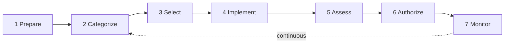

# NIST SP 800-37 (Risk Management Framework)

## Overview

The **Risk Management Framework** — the NIST-defined process for managing risk to information systems and the organizations that operate them.

- **Rev 1** (2010, updated 2014): "Guide for Applying the RMF to Federal Information Systems"
- **Rev 2** (2018): "Risk Management Frameworks for Information Systems and Organizations: A System Lifecycle Approach for Security and Privacy"

Both revisions may appear on the exam (question pools lag revisions).

## The RMF Steps

**Rev 1 — six steps:**
1. Categorize
2. Select (controls — uses 800-53)
3. Implement
4. Assess
5. **Authorize** ← this is where 800-37 lives
6. Monitor

**Rev 2 — adds a seventh:**
0. **Prepare** (new) — get senior management buy-in; establish context organization-wide before diving in
1. Categorize
2. Select
3. Implement
4. Assess
5. Authorize
6. Monitor

## Seven Major Objectives of Rev 2

1. **Tighter link** between risk management and C-suite governance — better top-down communication
2. **Cybersecurity Framework alignment** — CSF functions (Identify/Protect/Detect/Respond/Recover) integrated into RMF steps
3. **Privacy integrated** — privacy risk management now part of the RMF (wasn't in Rev 1)
4. **Trustworthy systems engineering** — aligns with 800-160 across the full system lifecycle
5. **Supply chain risk management** — explicit treatment; critical post-COVID
6. **Baseline control flexibility** — tailoring aligned with 800-53's evolution
7. **Simpler terminology + clearer linkage** to other NIST standards

## How 800-37 Relates to Other NIST Docs

| Doc | Role |
|-----|------|
| **800-37** | The RMF process itself |
| **800-53** | The catalog of controls you select and apply |
| **800-30** | Risk assessment methodology |
| **800-34** | Contingency planning for IT systems (BCP/DRP) |
| **800-160** | Systems security engineering |
| **CSF** | Higher-level cybersecurity outcomes; references 800-53 controls |

## For the Exam

- Know what RMF is and what step 800-37 sits at (Authorize)
- Know Rev 2 added the **Prepare** step
- Understand it's a **lifecycle** — you continuously monitor, not one-and-done
- Privacy + supply chain + insider threat are recurring Rev 2 themes

## Practical Tip

Download the PDF locally (same reason as 800-53 — shutdown-proof your reference).

## Diagrams

### NIST RMF (SP 800-37) — 7-Step Cycle

**Takeaway:** **Prepare → Categorize → Select → Implement → Assess → Authorize → Monitor**, then loop. (Authorize = management's accreditation decision; Monitor = continuous.)

## Related Topics

- [NIST SP 800-53](NIST%20SP%20800-53.md)
- [Standards and Frameworks](Standards%20and%20Frameworks.md)
- [Risk Management](Risk%20Management.md)
- [Supply Chain Risk Management](Supply%20Chain%20Risk%20Management.md)
