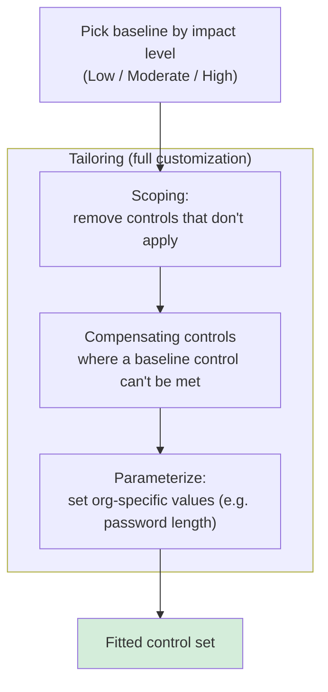
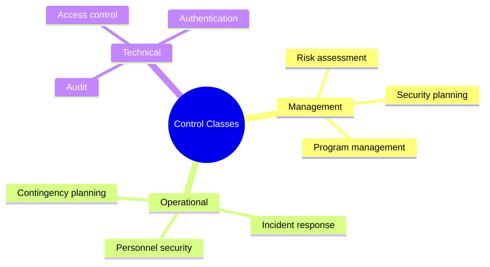

# NIST SP 800-53 (Revision 5)

## Overview

Full title: **Security and Privacy Controls for Information Systems and Organizations**. A catalog of security and privacy controls, primarily for US federal systems (excluding national security). Widely adopted outside government because it's comprehensive and free.

## What It Does

Provides a catalog of controls to:
- Build security policies
- Define security requirements for new systems
- Select and implement controls
- Perform risk assessments
- Comply with federal mandates
- Align with the Risk Management Framework (RMF) and Cybersecurity Framework (CSF)

## Structure

### Control Families (20 of them)
Each family groups related controls. Examples:
- **AC** — Access Control
- **IR** — Incident Response
- **AU** — Audit and Accountability
- **SC** — System and Communications Protection
- **PM** — Program Management
- **PT** — PII Processing and Transparency (new in Rev 5)

### Control Classes (three categories)
| Class | What |
|-------|------|
| **Management** | Strategic/tactical — risk assessments, security planning, program management, policies |
| **Operational** | Day-to-day — personnel security, incident response, contingency planning |
| **Technical** | Tech-focused — access control, audit, system integrity, authentication |

### Baseline Controls
Suggested starting-point controls by system impact level:
- **Low** — public-facing info
- **Moderate** — internal business
- **High** — sensitive/critical

You **tailor** baselines — add, remove, or modify controls based on your organization, environment, and risk tolerance.

## Tailoring vs Scoping (Control Selection)

You always start control selection from a **baseline** and then customize it. Two terms the exam keeps straight:

| Term | What it is |
|------|-----------|
| **Tailoring** | The **broader** process of modifying a control baseline to fit the organization. Tailoring **includes**: scoping + applying compensating controls + assigning organization-specific parameter values (e.g., setting password length). It's the full customization of the baseline. |
| **Scoping** | Reviewing the baseline and **eliminating the controls that do NOT apply** to your specific system/environment. Example: dropping physical-datacenter controls for a fully cloud-hosted system. |

**Key relationship:** scoping is a **subset of tailoring**. Scoping = remove what doesn't apply; tailoring = the full customization (remove + compensate + parameterize).

**Trigger phrase:** "determine which controls are appropriate/applicable to my organization" → **scoping**.

**The "specific systems" vs "org mission" discriminator (picks scoping over tailoring):**
- **"match the SPECIFIC SYSTEMS the company uses"** → **SCOPING** — system-driven applicability; you match/select controls (and their **assessment procedures**) to the specific system they apply to; keep what's relevant, drop what isn't.
- **"align with the ORGANIZATION'S MISSION / needs"** → **TAILORING** — the broader umbrella that customizes controls to the org (scoping is one part of it).

**Alice exam Q:** *Alice ensures her org's controls and assessment procedures match the specific systems the company uses.* → **Scoping** (the tell is "specific systems"). Distractors: **asset management** = inventory tracking; **compliance** = meeting external/regulatory requirements; **tailoring** = customizing to the org's mission/needs (right idea, wrong specificity — "specific systems" points to scoping).

**Other distractors that are NOT control-selection processes** (so they can't be the answer on a scoping/tailoring question):
- **Bounds checking** = a secure-coding control (Domain 8) that prevents **buffer overflows**.
- **Data stewardship** = a data-governance role (Domain 2); the steward handles day-to-day data quality on the owner's behalf.

### Why Start From a Baseline At All?

*Q seen: "Why may Ben choose to use a security baseline?"* → Because a baseline gives a **vetted, pre-defined minimum set of controls to start from**, which you then **scope** (remove what doesn't apply) and **tailor** (customize to the specific system). It saves you from **designing the entire control set from scratch** — you inherit a sensible minimum and adjust. The whole chain in one line: **baseline = starting set of controls → scoping + tailoring → fitted to the org.**

**The "absolutes" trap on this question:** the wrong answers all overreached with absolutes — a classic CISSP wrong-answer tell:
- *"applies to **all** circumstances"* → false; **no baseline fits every situation** (that's the whole reason you tailor).
- *"approved by industry bodies, **preventing** liability"* → false; a baseline **doesn't prevent liability** (compliance ≠ legal immunity).
- *"**ensures** systems are **always** in a secure state"* → false; **nothing guarantees** an always-secure state.

Memorize the pattern: answer choices loaded with **all / always / never / prevents / ensures / eliminates / guarantees** are **usually wrong**, because security deals in risk *reduction*, not certainty. The measured, realistic option (a "starting point that can be **tailored**") usually wins.

## Functional vs Assurance Requirements

Two ways a control requirement is stated:
- **Functional requirement** — what the control must **DO** (the security function it performs, e.g., "the system must encrypt data at rest").
- **Assurance requirement** — the **confidence/evidence** that the control actually works correctly and consistently (testing, documentation, validation that the function is implemented properly).

> Mnemonic: functional = *does it do the thing*; assurance = *can we trust that it does*.

## Key Changes in Revision 5

| Change | Why it matters |
|--------|----------------|
| **Privacy controls integrated** | Rev 4 treated privacy separately; Rev 5 weaves it in — data minimization, notice/consent, lifecycle, accountability |
| **Outcome-based controls** | Less prescriptive, more flexible; specifies what to achieve, not exactly how |
| **Supply chain risk management** | New family of controls addressing vendor risk, component integrity, disruption contingency |
| **Insider threat controls** | New focus on monitoring, awareness, response for internal actors |
| **"Federal" dropped from title** | Acknowledges broad non-federal adoption |

## How It Fits With Other NIST Publications

- **800-37** (Risk Management Framework) — 800-53 feeds the "Select controls" step
- **Cybersecurity Framework (CSF)** — 800-53 provides detailed controls that implement CSF functions
- **800-160** — trustworthy secure system engineering
- **800-30** — risk assessment methodology

## For the Exam

- Don't memorize control IDs (no "What is AC-1?" questions)
- Understand what 800-53 is, how it's structured, and why you'd use it
- Know the major Rev 5 changes (privacy, supply chain, insider threat, outcome-based)

## Practical Tip

Download the PDF locally. US government shutdowns make NIST docs temporarily inaccessible online. 492 pages — don't read cover to cover; use it as a reference.

## Diagrams

### Control Selection: Baseline → Scoping → Tailoring
Start from an impact-level baseline, then customize. Scoping is a subset of tailoring.

### Three Control Classes
800-53 controls split into three classes by what they govern.

## Related Topics

- [NIST SP 800-37](NIST%20SP%20800-37.md)
- [Standards and Frameworks](Standards%20and%20Frameworks.md)
- [Risk Management](Risk%20Management.md)
- [Security Policies and Standards](Security%20Policies%20and%20Standards.md)
- [Supply Chain Risk Management](Supply%20Chain%20Risk%20Management.md)
