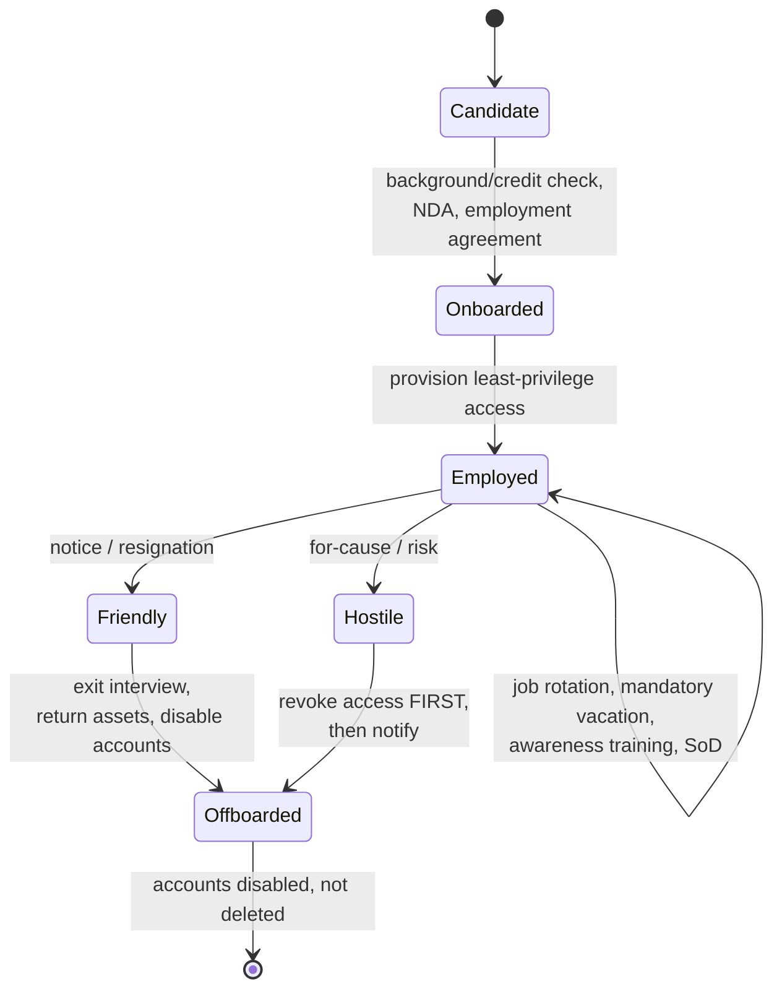

# Personnel Security

## Overview

People are often the weakest link in security. Personnel security covers hiring, managing, and terminating employees securely.

## Key Concepts

### Hiring Practices
- **Background checks** - administrative control, done before hire; criminal, employment verification, references, certifications, education
- **Credit checks** - less common; used for banking/financial roles. Looking for fraud risk/red flags, NOT penalizing bankruptcy per se.
- **NDA** (Non-Disclosure Agreement) - signed before access to sensitive info; may extend years past employment
- **Non-compete clauses** - common in the US; restricts competing employment for X years after leaving
- **Employment agreements** - define security responsibilities
- **Reference checks** - verify character and competence

### During Employment
- **Least privilege** - minimum access needed for the job
- **Separation of duties** - no single person controls an entire process
- **Job rotation** - rotate people through positions (detects fraud)
- **Mandatory vacations** - forces someone else to cover (detects irregularities)
- **Security awareness training** - ongoing education for all employees
- **Need to know** - access to specific information only when justified

### Termination
- **Friendly termination** - exit interview, return of assets, account disabling
- **Hostile termination** - immediate access revocation, escort from building, accounts disabled **before notification**
- Accounts should be **disabled, not deleted** (for forensic/audit purposes)
- Coordinate tightly with HR — they handle the logistics, you handle the access
- Two-week notice cases: many orgs leave access on so the employee can hand off projects. It's a risk-based call.

### Awareness vs. Training vs. Education

These three get used loosely in everyday speech, but the exam treats them as a ladder of depth. They answer different questions:

| Level | Goal | Question it answers | Audience |
|-------|------|--------------------|----------|
| **Awareness** | Change behavior / focus attention | **What** to watch for | **All staff** (everyone) |
| **Training** | Teach a specific job skill | **How** to do the task | **Role-based** (people who need that skill) |
| **Education** | Build deep conceptual understanding | **Why** it works that way | Specialists / those going deeper |

Example: an awareness poster reminds *everyone* not to click suspicious links (the "what"); training teaches the help-desk team *how* to triage a reported phishing email (the "how"); a security degree or CISSP-level study explains *why* the underlying attack works (the "why"). On the exam, "all employees + change behavior" = **awareness**; "role-specific skill" = **training**.

### Third-Party Personnel
- Vendors, contractors, and consultants need controls too
- Service Level Agreements (SLAs)
- Right to audit clauses
- Background checks where possible
- Third parties must meet **your** policies and standards, not just their own

### Outsourcing vs. Offshoring
- **Outsourcing** — another company does the work (usually nearby). Same country/region.
- **Offshoring** — work moves to another country, often for cost savings. Still your responsibility for security.

Both require due diligence on the third party's security posture, and both introduce supply-chain and insider risk. Don't assume "we paid them, so they'll do it right."

## Exam Tips

- **Mandatory vacations** and **job rotation** are primarily detective controls for fraud
- **Separation of duties** prevents any one person from having too much control
- Hostile termination = revoke access FIRST, then notify
- Accounts are disabled, not deleted, to preserve audit trails
- **Awareness** = what (all staff, change behavior); **Training** = how (role-based skill); **Education** = why (deep concept)

## Diagrams

### Employee Security Lifecycle
Controls map to each stage from candidate to offboarding.

## Related Topics

- [Security Governance](Security%20Governance.md) - roles and responsibilities
- [Security Policies and Standards](Security%20Policies%20and%20Standards.md) - AUP, employment policies
- [Domain 5 - Identity and Access Management](../05-identity-and-access-management/00%20Domain%205%20-%20Identity%20and%20Access%20Management.md) - access provisioning/deprovisioning
- [Least Privilege](../01-security-and-risk-management/Least%20Privilege.md)
- [Separation of Duties](../01-security-and-risk-management/Separation%20of%20Duties.md)
