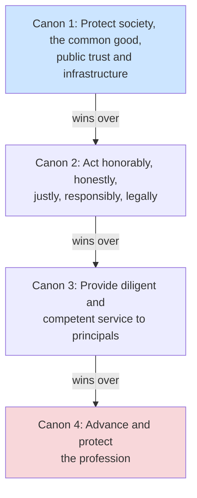

# Professional Ethics

## Overview

(ISC)2 members are bound by a Code of Ethics. Violations can result in revocation of certification. **You sign this before the exam** — know it cold.

## The Preamble (memorize the spirit)

> The safety and welfare of society and the common good, and the duty to our principals and to each other requires that we adhere to and be seen to adhere to the highest ethical standards of behavior. Therefore, strict adherence to this code is a condition of certification.

## Key Concepts

### (ISC)2 Code of Ethics - Canons (in priority order)
1. **Protect society, the common good, necessary public trust and confidence, and the infrastructure**
2. **Act honorably, honestly, justly, responsibly, and legally**
3. **Provide diligent and competent service to principals**
4. **Advance and protect the profession**

**Mnemonic:** Society → Honorably → Service → Profession (priority **outward-in**: society first, profession last).

### Priority Order Matters
- The canons are **applied in priority order** — when canons conflict, the **earlier (lower-numbered) canon wins**
- Protecting society always comes first
- You serve your employer (principal), but not if it harms society

### Which Codes Bind You
- A CISSP holder is **always bound by the (ISC)² Code of Ethics PLUS their employer's code of ethics** (both apply simultaneously)
- A **federal code of ethics** only applies to **federal employees** — not to CISSPs generally
- **RFC 1087** ("Ethics and the Internet") is an old **IAB advisory statement**, **NOT a binding obligation** on a CISSP

### Organizational Ethics
- **RFC 1087** - Ethics and the Internet (IAB)
- **Computer Ethics Institute** - Ten Commandments of Computer Ethics
- Organizations should have their own code of ethics/conduct

### Ten Commandments of Computer Ethics (Computer Ethics Institute)
1. Thou shalt not use a computer to harm other people
2. Thou shalt not interfere with other people's computer work
3. Thou shalt not snoop around in other people's computer files
4. Thou shalt not use a computer to steal
5. Thou shalt not use a computer to bear false witness
6. Thou shalt not copy or use proprietary software which you have not paid for
7. Thou shalt not use other people's computer resources without authorization or proper compensation
8. Thou shalt not appropriate other people's intellectual output
9. Thou shalt think about the social consequences of the program you are writing or the system you are designing
10. Thou shalt always use a computer in ways that ensure consideration and respect for your fellow humans

Don't memorize the exact wording — understand the spirit: don't do things you're not allowed to, think about consequences, act ethically.

### IAB Ethics and the Internet (RFC 1087) — unethical behavior
- Seeking unauthorized access to internet resources
- Disrupting the intended use of the internet
- Wasting resources (people, capacity, computers)
- Compromising the integrity of computer-based information
- Compromising the privacy of users

## Exam Tips

- The canons are in **priority order** - Canon 1 always wins
- "Protect society" trumps "serve your employer"
- If asked to do something unethical by your employer, Canon 1 and 2 take precedence
- Know all four canons and their order

## Diagrams

### (ISC)² Canons in Priority Order
When canons conflict, the lower-numbered canon wins — society first, profession last.

## Related Topics

- [Security Governance](Security%20Governance.md)
- [Compliance and Legal Issues](Compliance%20and%20Legal%20Issues.md)
- [Personnel Security](Personnel%20Security.md)
