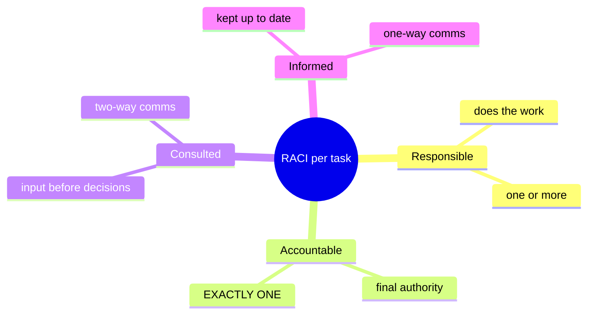

# RACI Charts

## Overview

A simple matrix tool for assigning roles and responsibilities across tasks. Used in project management, IT governance, and information security management.

## The Four Roles

| Letter | Role | Details |
|--------|------|---------|
| **R** | **Responsible** | Does the work. Can be multiple people; at least one required. |
| **A** | **Accountable** | Has final authority; approves or rejects results. **Exactly one** per task — no confusion. |
| **C** | **Consulted** | Provides input before decisions. Two-way communication. |
| **I** | **Informed** | Kept up to date. One-way communication. Doesn't contribute directly. |

## What a RACI Chart Looks Like

A spreadsheet: tasks down the left, people/teams across the top. Each cell holds R, A, C, I, or blank.

```
Task          | CISO | Sec Eng | Legal | HR  | CEO
--------------|------|---------|-------|-----|-----
Define policy |  A   |    R    |   C   |     |  I
Enforce policy|  R   |    R    |       |  C  |  I
Approve budget|  C   |         |       |     |  A
```

## Why It Matters

- Makes ownership visible
- Prevents "I thought they had it" gaps
- Forces exactly one accountable person per task
- Clarifies who needs to hear about what (no surprises for stakeholders)
- Reviewable as roles shift over time — RACI isn't frozen

## Rules of Thumb

- Only **one Accountable** per task (the key discipline)
- Too many C's slows decisions — consult only those whose input changes the outcome
- If someone is listed nowhere across a column, they may not belong in the project

## Exam Tips

- Know what R, A, C, I stand for
- One A per task
- Consulted is two-way; Informed is one-way
- RACI is a living document — evolves with the project

## Diagrams

### The Four RACI Roles
Note the cardinality (exactly one A) and the communication direction.



## Related Topics

- [Security Governance](Security%20Governance.md)
- [Values Vision Mission and Plans](Values%20Vision%20Mission%20and%20Plans.md)
- [Change and Configuration Management](../07-security-operations/Change%20and%20Configuration%20Management.md)
