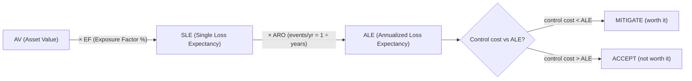
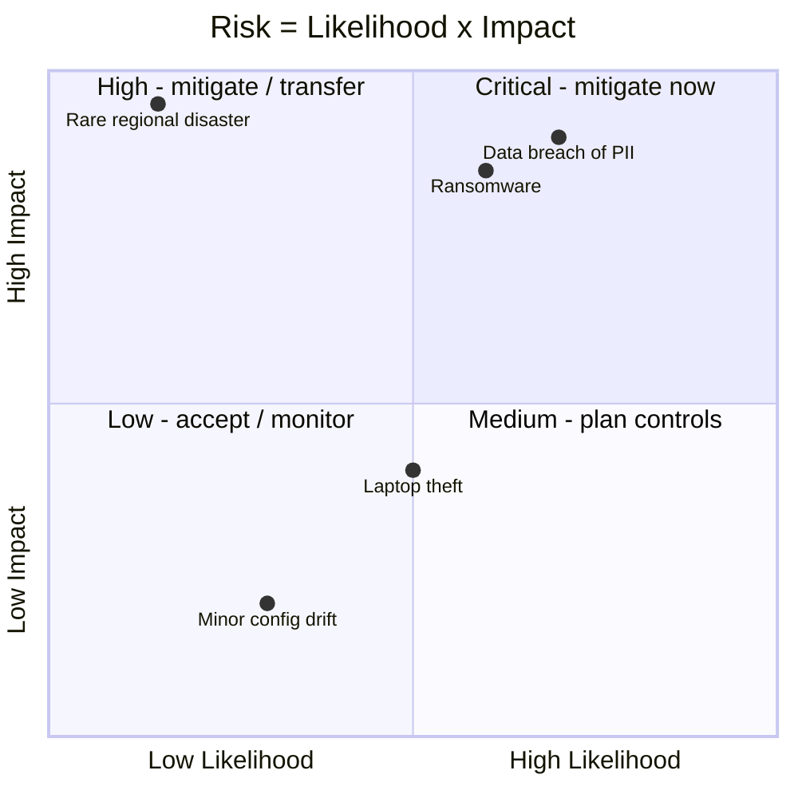

# Risk Management

## Overview

The process of identifying, assessing, and treating risks to reduce them to an acceptable level. This is arguably the most important concept across all CISSP domains.

> **Core equation:** `Risk = Threat × Vulnerability`. No threat OR no vulnerability → no risk. Both must be present. Some frameworks add Impact: `Risk = Threat × Vulnerability × Impact`.

## Risk Management Lifecycle (4 Phases)

Iterative — you're never done. Large orgs are in all four phases simultaneously for different risks.

1. **Risk Identification** — know what you have (assets: tangible + intangible), know what threatens it
2. **Risk Assessment** — qualitative first, then quantitative on the high-impact items
3. **Risk Response & Mitigation** — senior management picks the response; you implement
4. **Risk Monitoring & Reporting** — ongoing; feeds KRIs back to leadership

Phases 1 & 2 = **due diligence** (research). Phase 3 = **due care** (action). Phase 4 = **due diligence** again (verification).

## Key Concepts

### Risk Terminology
| Term | Definition |
|------|-----------|
| **Asset** | Anything of value to the organization |
| **Threat** | Potential cause of an unwanted event |
| **Threat Agent** | Entity that carries out a threat |
| **Vulnerability** | Weakness that can be exploited |
| **Risk** | Likelihood of a threat exploiting a vulnerability x impact |
| **Exposure** | Being susceptible to a loss |
| **Control/Countermeasure** | Measure that reduces risk |
| **Safeguard vs Countermeasure** | **Safeguard** = *proactive* control (reduce risk *before* an event); **Countermeasure** = *reactive* control (responds *after* a specific threat). Both are controls; only the timing differs |
| **Residual Risk** | Risk remaining after controls are applied |
| **Total Risk** | Risk before any controls — **Total Risk = Inherent Risk** (synonyms; "inherent" is just the risk before controls) |
| **Control Gap** | Total/Inherent Risk − Residual Risk = the amount of risk the controls actually removed |
| **Risk Appetite** | Amount of risk an organization is willing to accept |

### Risk Components Chain

How the pieces link in a single attack:

**Threat Agent/Actor** → exploits → **Vulnerability** → realizing a → **Threat** → against an → **Asset** → producing an → **Impact** → which is the **Risk** (likelihood × impact).

- **Threat** = the potential danger (the *what could happen*).
- **Threat Agent/Actor** = the entity that carries it out (e.g., a malicious hacker).
- **Vulnerability** = the weakness exploited (e.g., a missing patch). A vulnerability is **not** a threat.
- **Impact** = the damage done (which CIA pillar is harmed).

Scenario: a hacker (threat agent) uses **SQL injection** (threat/attack method) to exploit a **missing patch** (vulnerability) to **deface a web server** (impact = loss of **integrity**).

**Exam nuances:**
- When the answer options list "malicious attacker" but NOT the attack method, the **attacker is the THREAT** for that question. Pick the agent as the threat when no method is offered.
- Vulnerability ≠ threat — don't confuse the weakness with the danger.
- **Tangible vs intangible** applies to **assets and losses**, NOT to vulnerabilities or threats.

### Risk Formula
```
Risk = Threat x Vulnerability x Impact
Total Risk = Threats x Vulnerabilities x Asset Value
Residual Risk = Total Risk - Controls
```

### Risk Assessment Types

**Quantitative** (numbers-based):
- **AV** (Asset Value) = dollar value of the asset (what it's worth)
- **EF** (Exposure Factor) = % of asset value lost in a single event, expressed as a decimal. Forward: `EF = SLE ÷ AV`
- **SLE** (Single Loss Expectancy) = dollar loss from ONE event. `SLE = AV x EF`
- **ARO** (Annualized Rate of Occurrence) = how many times per year expected. `ARO = 1 ÷ (years between occurrences)`
- **ALE** (Annualized Loss Expectancy) = dollars per year. `ALE = SLE x ARO`
- Used for cost-benefit analysis of controls

#### Which factor a countermeasure changes
When you add a countermeasure and recalculate, the factor that **primarily changes is ARO** (Annualized Rate of Occurrence) — a control is designed to **prevent/reduce how OFTEN** the risk occurs. It *may* also lower the EF (loss per event), but ARO reduction is the expected/standard answer. Asset value and "threat focus" don't change because of a countermeasure.

#### ARO and the "count the zeros" trap
`ARO = 1 ÷ years`. The exam's favorite quantitative trap is a 10× error here — count the zeros in the year span; that's how many decimal places the ARO has.

| Event recurs every... | ARO |
|---|---|
| 10 years | 0.1 |
| 100 years | **0.01** (NOT 0.1) |
| 200 years | 0.005 |

- A "100-year flood/storm" is **0.01**, not 0.1 — a one-zero slip multiplies your final ALE by ten.
- **ARO must match the specific asset AND the specific event in the question.** "A tornado hits *my building* once every 200 years" → ARO = 0.005 for that specific strike, even in a tornado-prone region. The regional hazard rate (how often tornadoes occur in the area) is NOT the probability of one hitting your specific target. Use the number tied to the asset in the scenario.

#### Asset Valuation Methods
Which valuation you use changes AV, so changes SLE and ALE. The scenario's wording is the trigger.

| Method | Meaning | Trigger words |
|---|---|---|
| **Replacement cost** | Cost to rebuild / buy an equivalent **today** | "rebuild", "restore", "recover", recovery scenarios |
| **Purchase / Original / Acquisition cost** | What was actually paid historically | "originally paid", "acquired for" |
| **Depreciation (book value)** | Original cost minus value lost over time | accounting / book-value framing |
| **Opportunity cost** | Value of the next-best alternative forgone | "instead of", choosing between options |

Rule of thumb: any scenario emphasizing **rebuilding or restoring** → use **replacement cost**.

**Qualitative** (judgment-based):
- Uses categories: High/Medium/Low
- Techniques: Delphi method, brainstorming, interviews, checklists
- Faster but more subjective

### Risk Treatment Options
1. **Mitigate/Reduce** - Implement a control to lower risk (most common)
2. **Transfer/Share** - shift the loss to a third party; classic example = **insurance**. Also outsourcing, contracts, 50/50 partnerships
3. **Accept** - knowingly retain the risk (must be a formal, documented decision by management) — used when mitigation costs exceed the risk
4. **Avoid** - stop the activity causing the risk entirely (e.g., stop issuing laptops)
5. **Reject/Ignore** - NEVER acceptable (this is the wrong answer on the exam — also exposes you to negligence liability)

#### Acceptance & the cost-benefit test
- Decision rule: **if cost of the control > ALE (the potential loss) → ACCEPT the risk.** Spending more to fix a risk than the risk could ever cost is wasteful.
- Acceptance must be a **formal, documented decision made by senior management with the authority** to own that risk.
- **Ignoring an un-assessed risk is NOT acceptance — it's negligence.** Acceptance is a deliberate, informed choice; negligence is failing to assess at all.

### Worked Example: Laptop Risk

- **AV** (asset value) = $10,000 ($1K hardware + $9K intangibles / PII on device)
- **EF** (exposure factor) = 100% (stolen laptop = total loss)
- **SLE** = AV × EF = $10,000
- **ARO** = 25 laptops lost per year (historical)
- **ALE** = SLE × ARO = **$250,000/year**

Mitigation plan (full-disk encryption + remote wipe + staff):
- Implementation: $75K (encryption) + $20K (remote wipe) = $95K one-time
- Annual maintenance: $5K + $4K + $25K = $34K/year
- Over 4-year refresh cycle: $231K total = **~$57,750/year**

Post-mitigation ALE: $25K (still lose 25 laptops at $1K hardware each; PII protected by encryption).
ROI = save $225K/year by spending $57K/year. **Mitigate.**

### Worked Example: Data Center Flood

- AV = $10M, EF = 15%, SLE = $1.5M
- ARO = 0.25 (flood every 4 years)
- ALE = **$375K/year**
- Response: buy insurance (**transfer**) or build DR site elsewhere (**avoid** the location)
- **Insurance caveat (exam):** standard business/property insurance typically does **NOT** cover **flood** — separate flood coverage (e.g., FEMA's National Flood Insurance Program) is required. (Earthquake is also often excluded/separate; fire and theft are usually covered.)

### Worked Example: Data Center Rebuild (200-year event)

Shows replacement-cost valuation + the 200-year ARO.

- **AV** = $10,000,000 — *rebuild cost* of the datacenter → use **replacement cost** (scenario emphasizes rebuilding)
- **SLE** = $5,000,000 — typical damage from one event
- **EF** = SLE ÷ AV = $5M ÷ $10M = **0.5** (50% of the asset lost per event)
- **ARO** = 1 ÷ 200 = **0.005** (occurs once per 200 years — watch the zeros)
- **ALE** = SLE × ARO = $5,000,000 × 0.005 = **$25,000/year**

### Control Types by Function
| Function | Description | Examples |
|----------|-------------|---------|
| **Preventive** | Stops an incident | Firewall, encryption, locks |
| **Detective** | Identifies an incident | IDS, logs, CCTV, audit |
| **Corrective** | Fixes after incident | Patching, restore from backup |
| **Deterrent** | Discourages action | Warning signs, policies |
| **Compensating** | Alternative control | Supervision when segregation isn't possible |
| **Recovery** | Restores operations | DR site, backup |
| **Directive** | Directs behavior | Policies, procedures |

### Control Types by Implementation
- **Administrative** (management) - policies, procedures, training
- **Technical** (logical) - firewalls, encryption, access controls
- **Physical** - locks, fences, guards, CCTV

## Risk Analysis Matrix (Qualitative)

Axes: **Likelihood** (rare → almost certain) vs **Consequence** (insignificant → catastrophic). Cells are color-coded Low / Medium / High / Extreme. Use this to decide what deserves quantitative analysis — don't run full ALE math on every asset.

## NIST SP 800-30 Nine-Step Process

1. System characterization
2. Threat identification
3. Vulnerability identification
4. Control analysis
5. Likelihood determination
6. Impact analysis
7. Risk determination
8. Control recommendations
9. Results documentation

## Risk Management Maturity Model

1. **Initial/Ad Hoc** — no real process, unpredictable outcomes
2. **Repeatable** — basic processes, inconsistent application
3. **Defined** — documented processes (documented ≠ followed)
4. **Managed** — risk management early in projects, senior leadership engaged
5. **Optimizing** — fully integrated, continuous lessons learned

Higher levels → less waste, higher productivity, less risk. Most orgs land at 2-3.

## Exam Tips

- Know the quantitative formulas cold: SLE = AV x EF, ALE = SLE x ARO
- Risk can never be eliminated completely - only reduced to acceptable levels
- Management must formally **accept** residual risk
- "Reject/ignore risk" is always wrong on the exam — it's also **negligence**
- Cost of control should never exceed the value of the asset it protects
- You make **recommendations**; senior management makes **decisions**
- **Qualitative** (quality, gut-feel) comes before **Quantitative** (numbers) — use qualitative to pick what's worth quantitative analysis
- Secondary risk = mitigating one risk opens another. Always check.

## Diagrams

### Quantitative Risk Formula Chain



**Takeaway:** AV × EF = SLE; SLE × ARO = ALE. Compare ALE to control cost → mitigate or accept.

### Qualitative Risk Matrix — Quadrant Chart

Quadrant charts map two axes into four action zones — perfect for likelihood × impact.



**Takeaway:** High likelihood + high impact (top-right) = **mitigate first**; low/low = **accept**. This is qualitative risk analysis.

## Related Topics

- [CIA Triad](CIA%20Triad.md) - risk is a threat to CIA
- [Threat Modeling](Threat%20Modeling.md) - structured approach to identifying threats
- [Business Continuity Planning](Business%20Continuity%20Planning.md) - managing risk of business disruption
- [Supply Chain Risk Management](Supply%20Chain%20Risk%20Management.md)
- [Domain 6 - Security Assessment and Testing](../06-security-assessment-and-testing/00%20Domain%206%20-%20Security%20Assessment%20and%20Testing.md) - measuring risk
