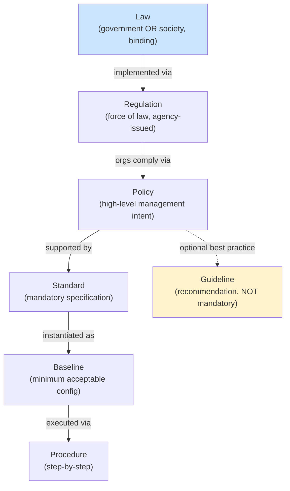

# Rule Hierarchy — Law / Regulation / Policy / Standard / Procedure / Guideline

## Overview

CISSP tests precise definitional distinctions between rule types. These terms are often used loosely in practice but the exam expects exact mapping. From [Laws and Regulations](Laws%20and%20Regulations.md) you have law *types*; this note covers the rule *hierarchy* — which terms describe what kinds of rules.

## The Hierarchy (top → bottom)

### Law
- A **system of rules** created by either **a government or a society**
- Recognized as **binding** by that group
- **Enforced by some specific authority**
- May be statutory (written by legislature), common (judge-made), or customary
- **Trigger phrase:** "system of rules created by either a government or a society, recognized as binding, enforced by specific authority"

### Regulation
- **Written rules** dealing with specific details or procedures
- Issued by an **executive body or government agency**
- Has the **force of law** — non-compliance is legally actionable
- Implements / fills in details of underlying legislation
- **Examples:** HIPAA Security Rule, GDPR specific articles, SEC regulations
- **Trigger phrase:** "written rules with the force of law, issued by executive body / government agency"

### Policy
- **Organizational high-level directive**
- States management's intent and direction
- Doesn't specify how — that's for standards/procedures
- Mandatory within the organization
- Examples: Acceptable Use Policy, Information Security Policy
- **Trigger phrase:** "high-level organizational directive" / "management intent"

### Standard
- **Mandatory specification** that supports policy
- Defines specific technologies, configurations, behaviors required
- Can be internal (organizational) or external (industry: PCI-DSS, ISO 27001)
- **Trigger phrase:** "mandatory specification" / "PCI-DSS"

### Baseline
- **Minimum acceptable level** of security for a system or process
- Specific configuration that meets the standard
- Examples: hardened OS image baseline, password complexity baseline

### Procedure
- **Step-by-step instructions** for accomplishing a specific task
- Operational detail; "how to do X"
- Examples: incident response procedure, backup procedure

### Guideline
- **Recommendation** — NOT mandatory
- Best practice suggestions
- Provides flexibility when standards don't apply directly

## Quick Trigger Map

| Question phrase | Answer |
|---|---|
| "Rules by government OR society, binding, enforced by authority" | **Law** |
| "Written rules with force of law, executive body" | **Regulation** |
| "High-level organizational directive, management intent" | **Policy** |
| "Mandatory specification, e.g. PCI-DSS" | **Standard** |
| "Minimum acceptable level / hardened configuration" | **Baseline** |
| "Step-by-step instructions for a task" | **Procedure** |
| "Recommendation, not mandatory, best practice" | **Guideline** |

## Common Trap

A typical exam question asks: "System of rules created by either a government or a society, recognized as binding by that group, and enforced by some specific authority?"

- Options: Law / Regulation / Policy / Standard
- The phrase "**either government OR society**" is the discriminator — only **Law** fits both (society-created customary law is still law)
- Regulation = government-only (executive body)
- Policy = organizational
- Standard = internal or external technical specification

Correct answer: **Law**.

## Hierarchy Direction

```
Law (society/government, binding, enforced)
  ↓ implemented via
Regulation (specific written rules, force of law)
  ↓ organizations comply via
Policy (high-level directive)
  ↓ supported by
Standard (mandatory specification)
  ↓ instantiated as
Baseline (minimum acceptable configuration)
  ↓ executed via
Procedure (step-by-step instructions)
  + Guideline (recommendations, optional)
```

## Mandatory vs Recommended

- **Mandatory:** Law, Regulation, Policy, Standard, Baseline, Procedure
- **Recommended:** Guideline only

## Diagrams

### Rule Hierarchy (top → bottom)
External legal authority cascades down into internal mandatory rules, with guidelines as the only optional layer.



## Related Topics

- [Laws and Regulations](Laws%20and%20Regulations.md) — types of law (criminal/civil/admin/private)
- [Security Policies and Standards](Security%20Policies%20and%20Standards.md)
- [Security Governance](Security%20Governance.md)
- [Standards and Frameworks](Standards%20and%20Frameworks.md)
- [CRAM-SHEET](../../practice/sheets/CRAM-SHEET.md)
