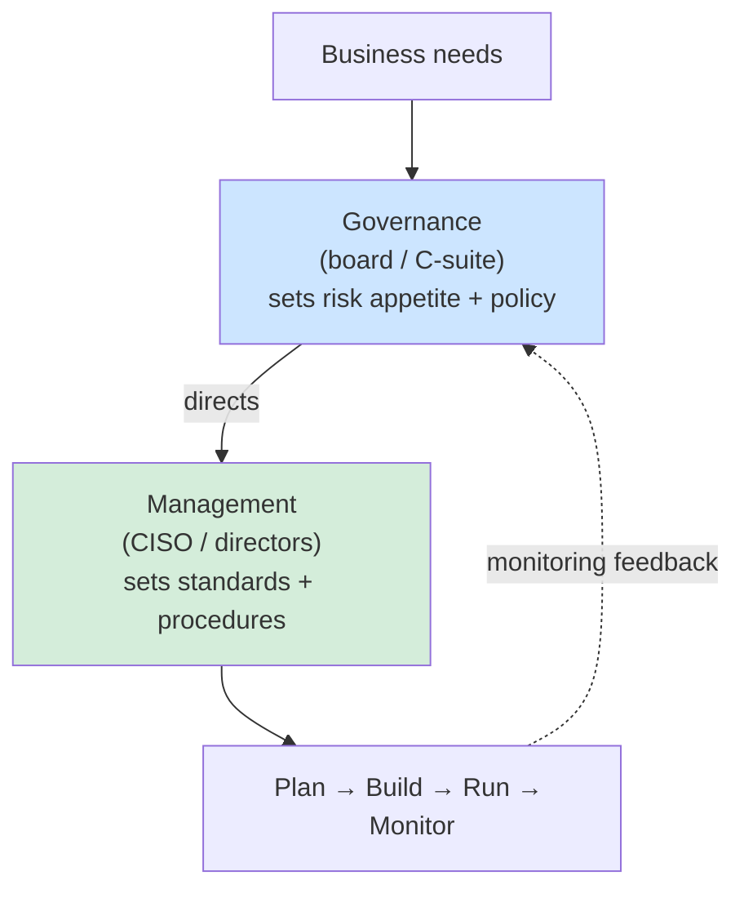
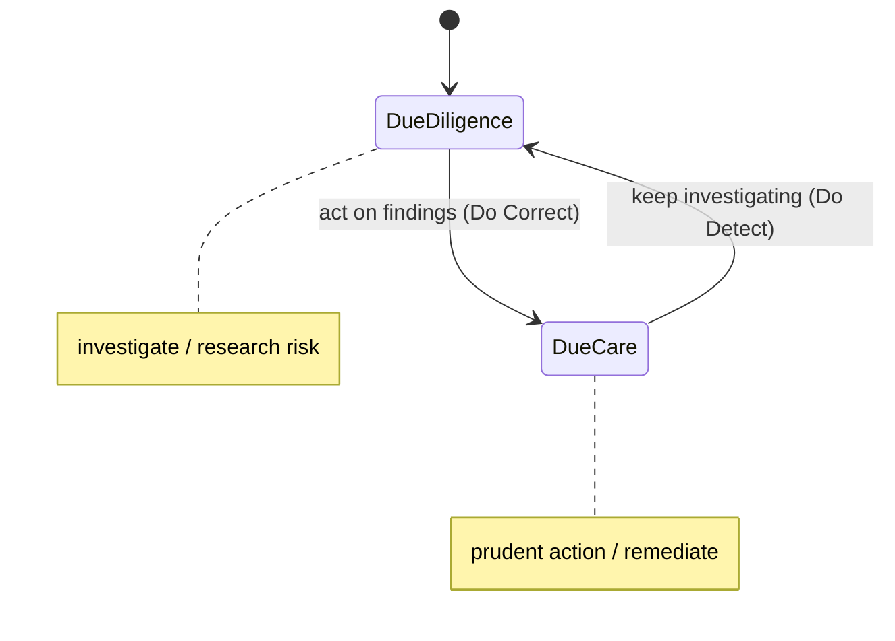

# Security Governance

## Overview

The system by which an organization's security efforts are directed and controlled. Governance ensures security aligns with business objectives.

## Key Concepts

### Corporate Governance vs. Security Governance

- **Corporate governance** is the system for directing and controlling the **whole organization** on behalf of its stakeholders (owners, shareholders, regulators) — it covers finance, operations, ethics, everything.
- **Security governance** is the **subset** of that which aligns the security program to the business's objectives. It's a slice of corporate governance, not a separate kingdom.

This matters because of *why* security exists. The **primary focus of security is to enable the business / increase its value** — not to lock everything down. Controls that strangle the business fail the governance test even if they're "secure." When an exam scenario pits security against business goals, the governance-correct answer supports the business while managing risk.

### Governance vs. Management

| | Governance | Management |
|---|-----------|-----------|
| Who | Board / C-suite / owners | IT security manager, CISO, directors |
| Focus | Strategic direction, vision | Plan, build, run, monitor |
| Horizon | Long-term (3-5 years) | Tactical (1 year) / operational |
| Sets | Risk appetite, policies | Risk tolerance, standards, procedures |
| Output | Direction | Execution |

**Flow:** Business needs → Governance evaluates → Directs management → Management plans/builds/runs/monitors → Monitoring feeds back to Governance.

### Top-Down vs. Bottom-Up Security

- **Top-down** (what the exam assumes) — senior leadership drives security, supports it, provides resources. The "perfect world."
- **Bottom-up** — security seen as a nuisance, no executive buy-in. Most orgs live here until a major breach forces a switch.

On the exam, always answer as if it's a top-down, well-run organization.

### Security Roles
| Role | Responsibility |
|------|---------------|
| **Senior Management** | Ultimately responsible; approves policy; accepts risk |
| **CISO** | Leads security program; reports to senior management |
| **Data Owner** | Business executive responsible for classifying data |
| **Data Custodian** | IT staff implementing controls the owner defines |
| **Data Processor** | Entity that processes data on behalf of the controller |
| **System Owner** | Responsible for a specific system |
| **Security Administrator** | Implements and manages security controls |
| **User** | Follows policies; reports incidents |

### Frameworks and Standards
- **NIST CSF** - Identify, Protect, Detect, Respond, Recover
- **ISO 27001/27002** - ISMS requirements and best practices
- **COBIT** - IT governance framework (business-focused)
- **ITIL** - IT service management
- **TOGAF** - Enterprise architecture framework
- **SABSA** - Security architecture framework

### Accountability vs. Responsibility

A classic exam distinction that hinges on one word: **delegation**.

- **Accountability** = answering for the outcome. It sits with **senior management** and **CANNOT be delegated**. You can hand someone the work, but you still own the result.
- **Responsibility** = actually doing the task. It **CAN be delegated** down to the people who perform the work.

Example: a CISO can assign an engineer to configure the firewall (responsibility passes to the engineer), but if it's misconfigured and breached, senior leadership is still **accountable** to the board and regulators. "The buck stops here" = accountability.

### Due Care vs. Due Diligence
- **Due Care** = doing what a reasonable person would do — the **prudent action itself**
- **Due Diligence** = the **ongoing investigation** of risks that informs that action
- One-liner: **diligence = investigate, care = act.** Due diligence is the research; due care is acting on it.

**Prudent vs. reasonable action** (exam splits these hairs): a **prudent** action shows a *high* degree of caution, foresight, and adherence to **best practices/industry standards** (the higher bar). A **reasonable** action is simply what a person of *ordinary* prudence would do in similar circumstances (the lower, baseline bar). When a scenario stresses thorough investigation + acting per best practice → **prudent**.

**Mnemonic:**
- DD = **D**o **D**etect (due diligence — you investigate and find the problem)
- DC = **D**o **C**orrect (due care — you fix it)

**Audit example:** All the prep work (allocating people, budget, time, scope) = due diligence. The actual audit = due care. Presenting the report = due diligence. Fixing findings = due care. It's a continuous cycle.

### Negligence
Failure to exercise due care. If you researched but didn't act, you're probably okay. If you ignored a known risk and did nothing — **gross negligence**, you're liable. This is why "risk rejection" is always the wrong answer.

### CISO Reporting Line (Exam Ideal)
In the perfect world, the **CISO reports to the CEO**, NOT to the CIO/CTO. This keeps security independent of IT operations (no favoritism). Senior leadership (C-suite) is **ultimately liable**, but that doesn't absolve you — due care/due diligence is on you.

### Allies in the C-Suite
The **CFO** is your best friend. Explain security investments as cost avoidance in dollars (ALE language) and you get buy-in much faster.

## Exam Tips

- Senior management is ALWAYS ultimately responsible for security
- Data **owner** classifies data; data **custodian** implements protections
- Know the difference between due care and due diligence
- Governance is about **direction**, management is about **execution**
- **Accountability cannot be delegated** (stays with senior management); **responsibility can** be delegated to whoever does the work
- Security exists to **enable the business**, not just to lock it down — security governance is a subset of corporate governance

## Diagrams

### Governance Directs, Management Executes
Direction flows down; monitoring feeds back up.

### Due Diligence → Due Care Cycle
Diligence investigates; care acts; the loop repeats continuously.

## Related Topics

- [Security Policies and Standards](Security%20Policies%20and%20Standards.md)
- [Risk Management](Risk%20Management.md)
- [Compliance and Legal Issues](Compliance%20and%20Legal%20Issues.md)
- [Domain 6 - Security Assessment and Testing](../06-security-assessment-and-testing/00%20Domain%206%20-%20Security%20Assessment%20and%20Testing.md) - auditing governance effectiveness
