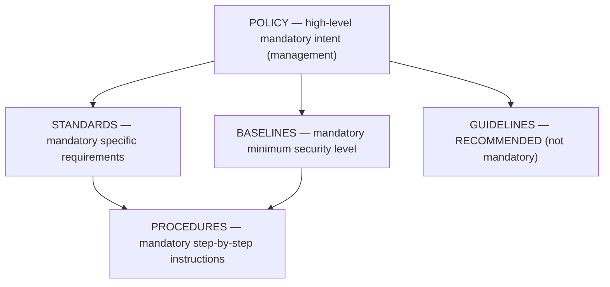

# Security Policies and Standards

## Overview

The hierarchy of documents that define an organization's security posture, from high-level policy down to specific procedures.

## Key Concepts

### Document Hierarchy (top to bottom)

1. **Policies** - High-level management statements of intent
   - Mandatory, broad, strategic, rarely change
   - Approved by senior management (you build from them, you don't write them)
   - Three types:
     - **Regulatory** — required by industry/regulation (HIPAA, PCI DSS)
     - **Advisory** — behavior rules with consequences (AUP, internet use)
     - **Informative** — just informs (vision/mission)
   - Example wording: "We use strong encryption." Never tells you what version.
   
2. **Standards** - Specific mandatory requirements
   - Define what must be used (e.g., "AES-256 for encryption at rest"; "Cisco switches ≥ v15")
   - Compulsory compliance — tactical
   
3. **Baselines** - Minimum level of security
   - Documented **minimum mandatory** security / configuration that **all systems of a given type must meet**
   - The **starting point** for measuring and enforcing security (you build up from the baseline)
   - Platform-specific (e.g., Windows hardening baseline)
   - Reference configurations
   - Trigger: "documented minimum level of security every system must have" → Baseline
   - **Example baseline to harden a specific OS = a CIS Benchmark** (consensus, vendor-neutral, OS-specific settings, L1/L2 profiles). To harden a Win11 box that processes cards, the answer is the **CIS Windows 11 Benchmark** — PCI DSS is the compliance *obligation*, not the host baseline. See [Standards and Frameworks](Standards%20and%20Frameworks.md#cis-benchmarks-host-hardening-baselines).
   
4. **Guidelines** - Recommendations and best practices
   - Not mandatory (this is what distinguishes them from standards)
   - Discretionary — offer flexibility
   
5. **Procedures** - Step-by-step instructions
   - Mandatory, low-level, very specific "how to" documents
   - Automate these when possible — humans skip steps, scripts don't

**Summary:** Policies are strategic. Standards, baselines, guidelines, procedures are tactical.

## Security Awareness Program

Users are the biggest and most common risk — often unintentionally. Training alone isn't enough; it must raise **awareness** which changes **behavior**.

| Level | What it does |
|-------|--------------|
| **Training** | Gives knowledge |
| **Awareness** | Makes the knowledge stick in daily behavior |
| **Behavior change** | What you actually want |

Tactics that work:
- **Gamification** — rewards, leaderboards, badges
- **Security champions** — one per team, rewarded when the team performs
- **Phishing simulations** with team-level recognition
- Relatable, engaging training — not the mandated 2 hours of boredom

One org went from 1-2 daily security reports to 40-50 after proper awareness investment. That's a good thing: visibility up, incidents down over time.

### Key Policy Types
- **Acceptable Use Policy (AUP)** - rules for using organizational resources
- **Information Security Policy** - overarching security direction
- **Data Classification Policy** - how to categorize data
- **Access Control Policy** - who gets access to what
- **Incident Response Policy** - how to handle security events
- **Change Management Policy** - how to manage system changes

### NDA (Non-Disclosure Agreement)
- Legal **contract** not to disclose confidential / proprietary information
- Signed by employees **at onboarding** and by **vendors / third parties**
- An **administrative control** that protects **confidentiality**
- Trigger: "agreement to protect confidential info / signed at hire" → NDA

## Exam Tips

- **Policies** are mandatory and approved by senior management
- **Guidelines** are the only optional/recommended level
- **Standards** specify the exact technology or method
- **Procedures** are the most detailed/specific
- Know the hierarchy: Policies > Standards > Baselines > Guidelines > Procedures

## Diagrams

### Governance Document Hierarchy

**Takeaway:** Policy sits at the top (the "why/what"). Standards, baselines, procedures are **mandatory**; **guidelines are recommendations** (optional) — the classic distinction.

## Related Topics

- [Security Governance](Security%20Governance.md) - policies are a tool of governance
- [Compliance and Legal Issues](Compliance%20and%20Legal%20Issues.md) - policies often reflect legal requirements
- [Professional Ethics](Professional%20Ethics.md)
