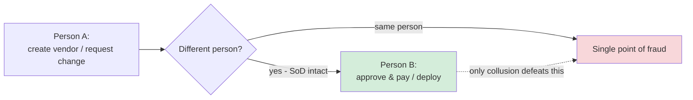

# Separation of Duties

## Overview

Separation of duties (SoD) splits a sensitive process so that no single person controls it end to end — completing a fraudulent or risky action requires at least two people to act together. The reasoning is that most fraud needs one person to both *commit* the act and *conceal* it; if those steps belong to different people, a lone insider can't do both, and forcing **collusion** raises the cost and the chance of getting caught. The same split also catches honest mistakes, since a second set of hands reviews the work. Classic case: whoever can create a vendor in the accounts-payable system should not also be able to approve and pay that vendor's invoices.

## Examples
- The person who **requests** a change should not be the one who **approves** it
- The person who **writes code** should not be the one who **deploys** to production
- The person who **creates accounts** should not be the one who **approves access**
- Financial controls: one person authorizes payments, another processes them

## Related Concepts
- **Dual Control** - two people required to complete a single task (both present)
- **Split Knowledge** - no single person has all the information needed (e.g., split encryption keys)
- **Compensating Controls** - if separation isn't possible, use supervision or audit

## Exam Tips

- SoD's defining weakness is **collusion** — two or more people conspiring defeats it. If the question asks what undermines separation of duties, that's the answer.
- **Common trap — distinguish the look-alikes:** SoD = *different people do different steps* of one process; **dual control / two-person rule** = *two people together* to do a single act; **split knowledge** = no one person holds the whole secret (e.g., split keys); **least privilege** = minimizing one person's own access. Don't confuse them.
- In small teams where you can't fully separate duties, the expected answer is **compensating controls** (management oversight, audit logging, mandatory vacations, job rotation).
- **Mandatory vacations** and **job rotation** are detective controls that expose fraud hidden by someone who refuses to let anyone else touch their process.

## Diagrams

### Splitting a Process Forces Collusion
No single person can both commit and conceal — defeating SoD requires two people to collude.

## Related Topics

- [Least Privilege](Least%20Privilege.md)
- [Personnel Security](../01-security-and-risk-management/Personnel%20Security.md)
- [Access Control Models](../05-identity-and-access-management/Access%20Control%20Models.md) - RBAC enforces separation of duties
- [Security Models](../03-security-architecture-and-engineering/Security%20Models.md) - Clark-Wilson model enforces this
