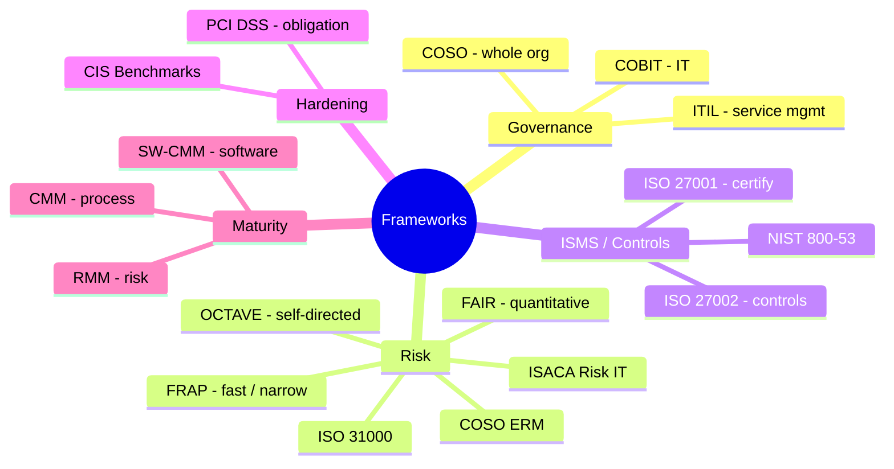

# Standards and Frameworks

## Overview

Industry-standard frameworks that organizations adopt (or are required to adopt). For the exam: know what each does, how it works, and when to pick it — not how to implement it.

## The Major Frameworks

### PCI DSS (Payment Card Industry Data Security Standard)
- Not a law — a **contractual standard** from card brands
- Required for anyone issuing or handling credit cards
- Covers policies, devices, control techniques, monitoring
- Industry enforces it aggressively to prevent government regulation
- **It's a COMPLIANCE obligation (the WHAT), not a host configuration baseline** — it tells you that systems must be hardened, but it does **not** ship OS-specific, settings-level config. PCI DSS itself **points you to industry baselines like CIS** to actually do the hardening. See [CIS Benchmarks (host hardening baselines)](#cis-benchmarks-host-hardening-baselines).

### CIS Benchmarks (host hardening baselines)
- From the **Center for Internet Security** — **consensus-based, vendor-neutral** secure-configuration guides for a specific OS or application (e.g., a **CIS Windows 11 Benchmark**)
- This is the **HOW** of hardening: detailed, settings-level config for **that exact OS/app** (registry keys, GPO settings, services to disable, etc.)
- **Tailorable via two profiles:** **Level 1** = general-purpose, minimal disruption; **Level 2** = high-security/defense-in-depth (more restrictive, may break functionality)
- **Cross-maps to compliance frameworks** (PCI DSS, HIPAA, NIST) — so applying the benchmark helps you *meet* the compliance obligation
- **PCI DSS = obligation; CIS Benchmark = the tool you use on the system to meet it.**

**EXAMPLE Q — "Best security standard to harden a Windows 11 system that processes credit cards?"** → the **CIS Windows 11 Benchmark**. The **credit-card detail is a DISTRACTOR** pulling you toward **PCI DSS** — but PCI DSS is the *compliance requirement*, not a host hardening baseline, and gives no Windows 11-specific settings. CIS is the OS hardening baseline (the HOW) that actually hardens the box.

**Why CIS over the other baselines:**
- **vs Microsoft Windows 11 security baseline** — Microsoft's is good but it's the **vendor's own**; CIS is **independent, more widely recognized for compliance, and has tiered L1/L2 profiles** → CIS wins, Microsoft is a **solid runner-up**
- **vs NSA Windows 11 host baseline** — NSA's is oriented to **government / national-security high-security** environments and is **often overly restrictive** for a commercial credit-card system

> [!warning] CIS Benchmarks ≠ CIS Controls — don't conflate
> - **CIS Benchmarks** = OS/app **secure-configuration hardening guides** (this topic)
> - **CIS Controls** = a prioritized list of **~18 security controls** (a different thing; see the CRAM-SHEET "CIS Controls Categorization" line)

**Enforcing a Windows baseline across many PCs:**
- **Group Policy (GPO)** is the most effective way — centralized enforcement that **auto-reapplies and corrects configuration drift**. **Requires the devices to be domain-joined (Active Directory).** (Centralized startup scripts also need AD.)
- If the PCs are **NOT domain-joined**, push the baseline with **Intune / MDM** (cloud-delivered) instead.

### OCTAVE (Operationally Critical Threat, Asset, and Vulnerability Evaluation)
- Keyword: **Self-directed risk management**
- Team-oriented, facilitated workshops
- Assesses organizational and IT risks together

### COBIT (Control Objectives for Information and related Technology)
- **IT-focused** (note: ends in "IT")
- From **ISACA** — an **IT governance & management** framework
- **Aligns IT goals with business objectives**; provides control objectives for IT governance, risk, and compliance
- Maps stakeholder needs to IT-related goals
- Four domains: Plan & Organize → Acquire & Implement → Deliver & Support → Monitor & Evaluate
- More operational than COSO
- Trigger: "align IT with business / IT governance framework" → COBIT
- Role trigger: "which data management role **selects/applies COBIT to balance security controls against business requirements**?" → the **business / mission owner** (NOT the data owner, who only classifies/protects data). See [Data Ownership and Roles](../02-asset-security/Data%20Ownership%20and%20Roles.md)

### COSO (Committee of Sponsoring Organizations)
- **Organization-wide** (ends in "O" = organization)
- Higher-level, strategic perspective
- Components: Control Environment, Risk Assessment, Control Activities, Information & Communication, Monitoring
- COBIT was built FROM COSO for IT specifically

### Risk Frameworks: ISO 31000, COSO, ISACA Risk IT

Three risk frameworks the exam likes to contrast. Pick by **how broad** the risk is and **whose lens** you're using:

| Framework | Lens | Scope |
|-----------|------|-------|
| **ISO 31000** | Generic, **enterprise-wide risk management** | Broadest — risk of *any* kind (financial, safety, strategic, security). High-level principles + process; not security-specific and not certifiable |
| **COSO** | **Enterprise risk + internal controls** | Governance/financial-reporting flavor (born from fighting financial fraud); strategic, whole-org |
| **ISACA Risk IT** | **IT risk** specifically | Part of the **COBIT** family from ISACA; ties IT risk to business risk |
| **FAIR** (Factor Analysis of Information Risk) | **Quantitative** risk analysis | Puts **dollar values** on risk (probability × magnitude); use when the scenario wants risk expressed in money |
| **TARA** (Threat Assessment and Remediation Analysis) | Threat/risk | A **MITRE** threat-and-remediation framework |

- **ISO 31000 vs COSO:** both are enterprise-wide, but ISO 31000 is the neutral international risk standard, while COSO carries a financial-governance/internal-controls emphasis.
- **Risk IT vs the others:** Risk IT narrows the focus to **IT** risk (and lives in the COBIT/ISACA world). Trigger: "IT-specific risk framework from ISACA" → Risk IT.
- **COSO ERM** is COSO's **Enterprise Risk Management** framework — the full name to recognize on the exam.
- **Full risk-framework roster** to recognize: NIST RMF, ISO 31000, COSO ERM, ISACA Risk IT, OCTAVE, FAIR, TARA. Distractors that are **NOT** frameworks: CEH, CCMP, ARO.

### ITIL (Information Technology Infrastructure Library)
- IT Service Management framework
- Aligns IT services with business needs
- Processes for change, release, configuration, incident, problem, capacity, availability, IT financial management

### FRAP (Facilitated Risk Analysis Process)
- **Focused and fast** — one business unit, one application, or one system at a time
- Roundtable brainstorming with internal employees
- Analyzes impacts, threats, and risks, then prioritizes
- Cheap way to identify where to focus real risk analysis
- Requires a skilled facilitator

### ISO 27000 Series

| Standard | Purpose |
|----------|---------|
| **27001** | ISMS requirements — the **management system you certify against**. Uses PDCA (Plan-Do-Check-Act). Demonstrates seriousness to customers/partners. |
| **27002** | Internationally accepted **catalog of information security controls / control objectives** — the *controls*, not the management system. Implementation guidance for 27001. NOT certifiable. |
| **27004** | Metrics to measure ISMS effectiveness |
| **27005** | Standards-based approach to risk management |
| **27799** | Focused on **PHI** (Protected Health Information) |

### NIST RMF (Risk Management Framework, SP 800-37)
- **7-step** Risk Management Framework: **Prepare → Categorize → Select → Implement → Assess → Authorize → Monitor**
- Federal risk management process for authorizing systems to operate
- Full detail in [NIST SP 800-37](NIST%20SP%20800-37.md)

## Maturity Models

Frameworks that measure how mature/disciplined an organization's processes are. Pick based on **what** is being assessed.

### CMM (Capability Maturity Model)
- Measures **process maturity** across **5 levels: Initial → Repeatable → Defined → Managed → Optimizing**
- General process maturity (see [CMMI Levels](../03-security-architecture-and-engineering/CMMI%20Levels.md) for the full level-by-level breakdown and naming traps)

### SW-CMM (Software CMM)
- Maturity model specifically for **software development processes**
- Same 5 levels: **Initial, Repeatable, Defined, Managed, Optimizing**

### RMM (Risk Maturity Model)
- Assesses the maturity of an organization's **risk management processes**
- Trigger: scenario asks to **"assess the processes used to manage risk"** → RMM

**Disambiguation:** CMM / SW-CMM = software/process maturity; **RMM = risk maturity**. Match the model to the thing being measured (process vs. risk).

## Quick Disambiguation

- **COBIT vs COSO** — COBIT is IT, COSO is the whole org
- **27001 vs 27002** — 27001 = the ISMS (management system, certify against it); 27002 = the catalog of controls. Trigger: "information security controls + worldwide/internationally accepted" → 27002
- **FRAP vs OCTAVE** — FRAP is narrow/specific, OCTAVE is broader and team-driven
- **ITIL** — service management, not security per se, but important context

## Exam Tips

- Questions won't ask for definitions — they'll describe a scenario ("we want to evaluate one system with a facilitated workshop") and you pick the matching framework
- Watch the verbiage — "specific/targeted business unit" hints at FRAP
- Health-specific → 27799
- "Certifiable ISMS" → 27001

## Diagrams

### Frameworks by Purpose
Group each framework by the job it does so you can match the scenario to the right one.

## Related Topics

- [Security Governance](Security%20Governance.md)
- [Risk Management](Risk%20Management.md)
- [GRC - Governance Risk Compliance](GRC%20-%20Governance%20Risk%20Compliance.md)
- [NIST SP 800-53](NIST%20SP%20800-53.md)
- [NIST SP 800-37](NIST%20SP%20800-37.md)
- [Compliance and Legal Issues](Compliance%20and%20Legal%20Issues.md)
