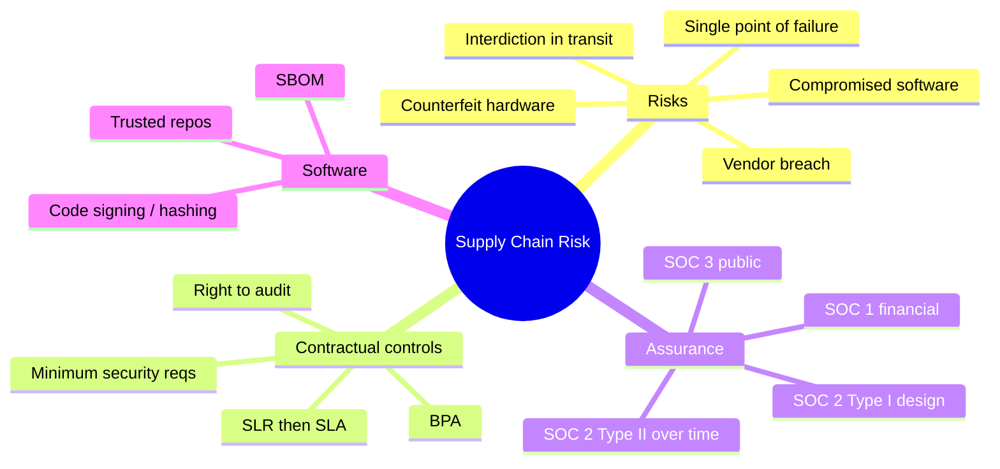

# Supply Chain Risk Management

## Overview

Managing security risks introduced through third-party vendors, suppliers, and service providers throughout the supply chain.

## Key Concepts

### Supply Chain Risks
- Counterfeit hardware components
- Compromised software (backdoors, malicious updates)
- Vendor data breaches affecting your data
- Single points of failure in the supply chain
- Insider threats at vendor organizations

### Risk Management Practices
- **Vendor assessment/due diligence** - evaluate security posture before engagement
- **SLA** (Service Level Agreement) - define security requirements contractually
- **Right to audit** - contractual right to assess vendor security
- **SOC reports** (SOC 1, SOC 2, SOC 3) - independent assessment of vendor controls
- **Third-party risk assessments** - ongoing monitoring
- **Minimum security requirements** - baseline requirements for all vendors

> NOTE: Best security standard to require of a vendor handling your data
> Require the vendor to **handle your data the same way YOUR organization would** (apply your own security standard to it). This beats weaker exam distractors like "comply with all applicable laws" (a floor, not your standard) and "eliminate all risk" (impossible — an absolutes trap).

### Vendor Agreement Types (keep straight)
- **SLA** (Service Level Agreement) — the agreed service/security levels in the contract (uptime, response times, security requirements).
- **SLR** (Service Level Requirement) — what **YOU (the customer)** require and communicate to a vendor *before/while forming* the deal; the requirements that feed into the SLA.
- **BPA** (Business Partner Agreement) — defines the terms of a **business partnership** between two organizations.

### SOC Reports
| Report | Audience | Scope |
|--------|----------|-------|
| **SOC 1** | Financial auditors | Financial reporting controls |
| **SOC 2 Type I** | Restricted | Control design at a point in time |
| **SOC 2 Type II** | Restricted | Control effectiveness over a period |
| **SOC 3** | General public | Summary of SOC 2 (marketing) |

### Software Supply Chain
- Verify software integrity (hashing, code signing)
- Software Bill of Materials (SBOM)
- Trusted repositories and build pipelines
- Open-source component management

### Interdiction (Hardware Tampering in Transit)

**Interdiction** is when a third party **intercepts hardware while it's in transit and modifies it** — implanting a keylogger, backdoor, or hardware bug — **before it reaches the buyer**. The device arrives looking factory-fresh but is already compromised. This is why supply-chain security covers the **entire chain of custody**, not just the vendor you bought from.

**Practice scenario:** *Chris worries his recently ordered laptops were modified by a third party to contain keyloggers before delivery. Where should he focus to prevent this?*
- ✅ **His supply chain** — the tampering can happen anywhere along the path (manufacturer → shipping → distribution → him), so secure the **whole chain of custody**.
- ❌ **Vendor contracts** — define terms/liability, but a clause can't physically stop in-transit tampering.
- ❌ **Post-purchase build process** — too late; the device was already compromised *before* he received it.
- ❌ **OEM (manufacturer)** — too narrow; a *third party* in transit did it, not necessarily the OEM.

**Trigger phrase → answer:** "modified by a **third party** **before delivery**" → **supply chain** (the whole journey), not any single point.

**Defenses against interdiction:** secure/trusted shipping, tamper-evident packaging and seals, chain-of-custody tracking, verifying hardware integrity on receipt, and buying direct from trusted sources.

## Exam Tips

- SOC 2 Type II is the most valuable - it tests controls over time
- SOC 3 is public; SOC 2 is restricted (NDA required)
- Supply chain attacks are increasingly common and tested on the exam
- Always verify hardware and software integrity from suppliers

## Diagrams

### Supply Chain Risk Landscape
The risks introduced by vendors and the controls that counter them.

## Related Topics

- [Risk Management](Risk%20Management.md)
- [Compliance and Legal Issues](Compliance%20and%20Legal%20Issues.md)
- [Domain 7 - Security Operations](../07-security-operations/00%20Domain%207%20-%20Security%20Operations.md) - monitoring third-party access
- [Domain 8 - Software Development Security](../08-software-development-security/00%20Domain%208%20-%20Software%20Development%20Security.md) - secure software supply chain
