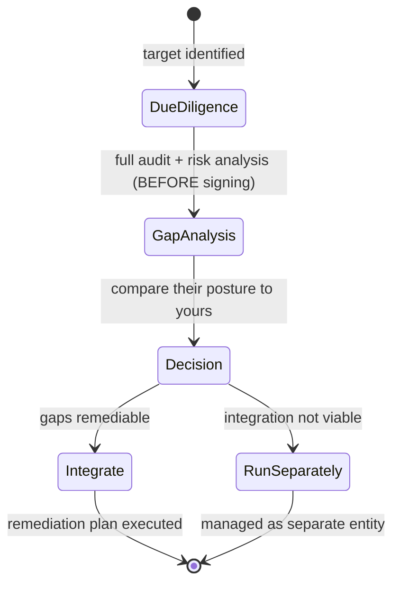

# Third Party, Acquisitions, and Divestiture Security

## Overview

Large orgs run hundreds or thousands of third-party apps and services. Attackers target the weakest link — which is often the third party. Acquisitions and divestitures create massive short-term security risks.

## Third Party / Vendor Security

### Service Level Agreements (SLAs)
Define the service level the vendor commits to. Scale the aggressiveness to what's at stake:
- Critical systems: 2-4 hour replacement
- Non-critical: 12-24 hours, maybe 5 days
- Don't over-spec; it gets expensive

### Key SLA Elements to Include
- Uptime commitments (e.g. 99.99%)
- Response times for incidents / hardware replacement
- Security requirements (must match your policies/standards)
- **Right to audit** — you (or a third party) can audit their security
- **Right to pentest** — you can test them
- Compliance obligations (e.g., PCI DSS if applicable)
- Data handling and breach notification terms

### Alternative: SOC reports
Most vendors won't let you audit directly. Instead, accept a SOC 2 Type II report from an independent auditor.

## Acquisitions (M&A)

When you acquire a company:
1. Conduct a **full audit and risk analysis before** signing
2. Identify gaps between their security posture and yours
3. Build a remediation plan with timeline/cost
4. Sometimes integration isn't feasible — run them as a separate entity

**Real-world example:** A hospital system acquired two smaller hospitals to keep them open for the community. Their IT was so different and their security so poor that full integration wasn't viable. Over years, IT slowly migrated their infrastructure. A for-profit wouldn't have accepted that cost — but for a non-profit whose mission was "healthcare for the community," it made sense.

## Divestitures

When the company splits:
- Who owns which infrastructure?
- How do you separate without creating new gaps?
- If two data centers exist and you split them, neither entity has redundancy anymore
- Plan network separation carefully — no ongoing traffic between split entities
- Data ownership, license transfers, credentials — all need to be deliberate

Due diligence + due care, always. You're the risk advisor with the holistic view — give senior leadership the information they need to make decisions.

## Exam Tips

- **Before acquiring** — audit + risk analysis
- The weakest link principle applies across the extended enterprise
- SLAs should include security requirements, not just uptime
- Vendor compliance may be required to match yours (e.g., PCI DSS)

## Diagrams

### Acquisition Security Lifecycle
Audit and assess risk BEFORE signing, then decide integrate vs. run separately.

## Related Topics

- [Supply Chain Risk Management](Supply%20Chain%20Risk%20Management.md)
- [Security Auditing](../06-security-assessment-and-testing/Security%20Auditing.md)
- [Risk Management](Risk%20Management.md)
- [External Dependencies in BIA](External%20Dependencies%20in%20BIA.md)
