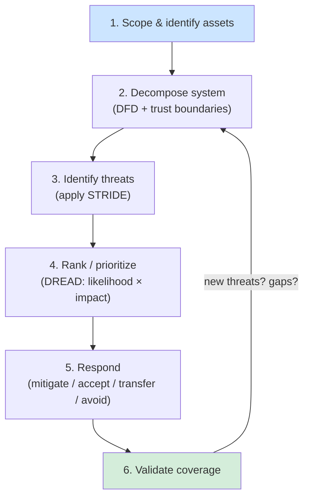
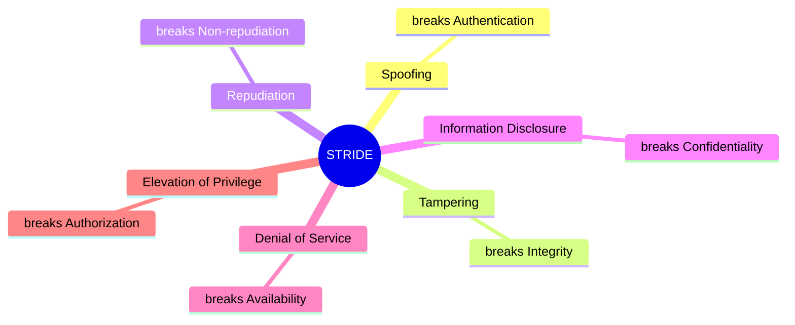

# Threat Modeling

## Overview

A structured approach to identifying, quantifying, and addressing security threats to a system — **proactively, at design time**, before attackers find the holes. Replaces the three weak postures: reactive (fix after breach), random (guess what to protect), compliance-checklist (generic controls not matched to *your* threats).

### The three lenses (every methodology is one of these)
1. **Asset-focused** — start from *what's valuable* → what threatens it.
2. **Attacker-focused** — start from *who would attack* (actors, goals, capabilities) → toward the system.
3. **Software/system-focused** — start from *the design* (components, data flows) → where it's weak. ← STRIDE lives here.

### The process (6 steps)
1. **Scope & identify assets** — what are we protecting?
2. **Decompose the system** — DFD with trust boundaries (= *reduction analysis*, below).
3. **Identify threats** — apply STRIDE across the DFD.
4. **Rank/prioritize** — risk = likelihood × impact (structured: DREAD).
5. **Respond** — mitigate / accept / transfer / avoid (STRIDE hands you the countermeasure class).
6. **Validate** — coverage complete? did mitigations create new threats? Iterate.

## Key Concepts

### Threat Modeling Methodologies

**STRIDE** (Microsoft):
| Threat | Violates | Example | Countermeasure |
|--------|----------|---------|----------------|
| **S**poofing | Authentication | Impersonating a user | strong auth, MFA |
| **T**ampering | Integrity | Modifying data in transit | hashing, signing, access control |
| **R**epudiation | Non-repudiation | Denying an action | logging, audit trails, signatures |
| **I**nformation Disclosure | Confidentiality | Data leak (e.g. sensitive info left in an HTML comment, visible in View Source) | encryption (TLS, at rest) |
| **D**enial of Service | Availability | Flooding a server | redundancy, rate-limiting |
| **E**levation of Privilege | Authorization | Gaining admin rights | least privilege, authz checks |

**DREAD** (Risk Rating):
- **D**amage potential
- **R**eproducibility
- **E**xploitability
- **A**ffected users
- **D**iscoverability

**PASTA** (Process for Attack Simulation and Threat Analysis):
- 7-stage **risk-centric** methodology; ties threats to **business impact**
- Stages: 1) define objectives 2) define technical scope 3) decompose app 4) threat analysis (threat intel) 5) vulnerability analysis 6) attack modeling (simulate) 7) risk & impact analysis

**VAST** (Visual, Agile, and Simple Threat modeling):
- Designed for Agile/DevOps environments
- Application and operational threat models

**Others (recognition-level):**
- **Trike** — risk-management/audit-oriented; acceptable risk per asset.
- **OCTAVE** — organizational, asset/risk-based, strategic (not technical).
- **MITRE ATT&CK** — not a methodology but a knowledge base of real attacker tactics & techniques; informs modern threat models.

### Attack Trees
- Hierarchical diagram of attacks against a system
- Root = goal of the attacker
- Branches = methods to achieve the goal
- Leaves = specific attack steps
- Nodes combine with **AND/OR logic** (OR = any child suffices; AND = all required). Label leaves with cost/difficulty → find the **cheapest attack path** → defend it first. (PASTA stage 6 uses attack trees.)

### Reduction Analysis (Decomposing the System)
The threat-modeling step that breaks a system down into its core elements to find the **attack surface**. Five key elements to identify:
1. **Trust boundaries** — where the level of trust changes (e.g. internet → DMZ → internal)
2. **Data flows** — how data moves between components
3. **Input points** — where external data enters (prime attack targets)
4. **Privileged operations** — actions requiring elevated rights
5. **Security controls** — existing protections (encryption, authN/authZ, logging)

- **Tool:** typically performed using a **Data Flow Diagram (DFD)**.
- **Don't confuse:**
  - **Reduction analysis** = the *step* of decomposing the system.
  - **DFD** = the *diagram/tool* used to do it (not the same as the step itself).
  - **Data modeling** = database schema design — **unrelated** to threat modeling; a classic distractor answer.

### Example Attack: SQL Injection (SQLi)
- SQLi lets an attacker run their **own database commands** via **unsanitized input**.
- Primary real-world use = **DATA THEFT** (dumping databases). Often the answer when asked the *most common* goal.
- Can lead to **defacement (integrity)**, but usually as a stepping stone: steal admin creds → log in → deface, or write files to the server.
- **Risk-component framing:** SQLi / the attacker = **threat / threat agent**; the missing patch (unsanitized input) = **vulnerability**; the defacement (or data loss) = **impact** (integrity).

## Exam Tips

- STRIDE maps directly to security properties (authentication, integrity, etc.)
- DREAD is for **rating/ranking** threats, not identifying them
- PASTA is the most comprehensive, 7-stage methodology
- Know what each letter in STRIDE stands for
- **Reduction analysis** decomposes a system into 5 elements (trust boundaries, data flows, input points, privileged operations, security controls) via a **DFD**. Watch the distractor **"data modeling"** (database schema design — unrelated).

## Diagrams

### Threat Modeling Pipeline (6 steps)
A proactive, iterative loop performed at design time.

### STRIDE → Security Property Violated
Each STRIDE threat maps to the property it breaks.

## Related Topics

- [Risk Management](Risk%20Management.md) - threat modeling feeds into risk assessment
- [Domain 3 - Security Architecture and Engineering](../03-security-architecture-and-engineering/00%20Domain%203%20-%20Security%20Architecture%20and%20Engineering.md) - secure design uses threat models
- [Domain 8 - Software Development Security](../08-software-development-security/00%20Domain%208%20-%20Software%20Development%20Security.md) - threat modeling in SDLC
