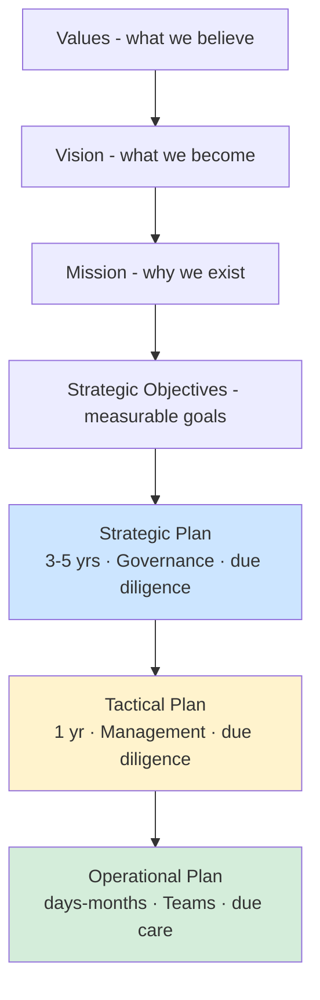

# Values, Vision, Mission, and Plans

## Overview

An organization's direction flows top-down: values shape vision, vision shapes mission, mission drives strategic objectives, which cascade into plans.

## The Pyramid

```
         [Values]            ← What we believe in, ethics
            ↓
         [Vision]            ← What we want to become
            ↓
         [Mission]           ← Why we exist; who we serve
            ↓
    [Strategic Objectives]   ← Measurable goals
            ↓
    [Strategic Plan]         ← 3-5 year direction (governance)
            ↓
    [Tactical Plan]          ← 1 year (management — you)
            ↓
    [Operational Plan]       ← Day-to-day detail (your teams)
```

## Planning Horizons

| Plan | Horizon | Owned by | Nature |
|------|---------|----------|--------|
| **Strategic** | 3-5 years | Governance (senior leadership) | High-level direction, due diligence |
| **Tactical** | 1 year | Management | Projects, hiring, budget, due diligence |
| **Operational** | Days to months | Teams | Detailed tasks; due care — you act |

Strategic and tactical = due diligence (planning/research). Operational = due care (execution).

## Why This Matters to You

Whenever you join an org, learn its values/vision/mission. It shapes:
- Which security initiatives to propose
- How to frame ROI conversations
- What trade-offs leadership will accept

IT security **supports the business** — we're not the most important department, we just span the whole org. Align your recommendations with the mission. A hospital whose mission is "quality healthcare for the people of Hawaii in perpetuity" will respond differently than a VC-funded startup aiming to be first to market.

## Example: A Hospital's Mission Flowing into IT Security Plans

- **Strategic (5 yr):** In-source IT, build a best-in-class IT organization with proper policies and procedures
- **Tactical (yr 1):** Hire team, establish help desk/server/network/security functions, baseline current state
- **Operational:** Build 200+ projects: standardize workstations, decommission XP, migrate data center, etc.

## Projects vs. Operations

- **Operations** = keep the lights on (where we are)
- **Projects** = take us from A to B (where we want to go)

Risk management must be embedded in both.

## Exam Tips

- Governance sets strategic direction — you execute tactical/operational
- Mission/vision/values can influence exam answers when "business alignment" comes up
- Always answer as the risk advisor who understands the business

## Diagrams

### Direction Cascade with Planning Horizons
Beliefs flow down into time-bounded plans; governance owns the long view, teams own the day-to-day.



## Related Topics

- [Security Governance](Security%20Governance.md)
- [Risk Management](Risk%20Management.md)
- [GRC - Governance Risk Compliance](GRC%20-%20Governance%20Risk%20Compliance.md)
- [KPIs KRIs and KGIs](KPIs%20KRIs%20and%20KGIs.md)
