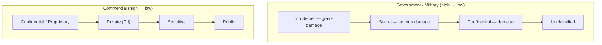

# Data Classification

## Overview

Categorizing data based on its sensitivity, value, and criticality to determine appropriate protection levels.

## Key Concepts

### Government/Military Classification
| Level | Damage keyword | Examples |
|-------|---------------|----------|
| **Top Secret** | Exceptionally grave damage to national security | Weapon blueprints, war plans, espionage data |
| **Secret** | Serious / critical damage | Troop/deployment plans |
| **Confidential** | Damage to national security | Intelligence reports, battle reports, mobilization plans |
| **Sensitive But Unclassified (SBU)** | Minor damage or embarrassment | Controlled Unclassified Information (CUI) |
| **Unclassified** | No damage from disclosure | Public, though may still require access request |

**Exam keyword trick:** If the question contains "grave" → **Top Secret**. "Serious" or "critical" → Secret. "Damage to national security" (no qualifier) → Confidential.

### Commercial/Private Sector Classification
| Level | Description | Examples |
|-------|-------------|----------|
| **Confidential / Restricted** | Most sensitive — exceptionally grave damage | Trade secrets, "secret sauce," source code, competitive IP |
| **Private** | Serious damage (financial + reputation) | PHI, PII, financial data, employee data, payroll |
| **Sensitive** | Damage possible | Network diagrams, IP assignments, system-specific data (attacker reconnaissance gold) |
| **Public** | No impact from disclosure | Marketing materials |

**Attack reconnaissance note:** Most attacks start by mapping the network and identifying systems/IPs — exactly the content that sits in the Sensitive bucket. Treat it as more sensitive than the name suggests.

### Commercial order + the "Confidential" cross-scheme TRAP

**Commercial order highest → lowest:** **Confidential/PROPRIETARY (highest) > Private > Sensitive > Public (lowest)**. **Proprietary = the commercial equivalent of Confidential** — trade secrets / "secret sauce" / source code; the most damaging to disclose.

> **Example Q:** Fred classifies data using *Private, Sensitive, Public, Proprietary* — which is the HIGHEST? → **PROPRIETARY** (it's the commercial equivalent of Confidential / trade secrets).

**TRAP — "Confidential" ranks DIFFERENTLY in the two schemes:**
- **Commercial:** Confidential is the **HIGHEST** level (= Proprietary).
- **Government:** Confidential is the **LOWEST classified** level — **Top Secret > Secret > Confidential > Unclassified**.
- Don't let the word "Confidential" anchor you to one position; the scheme decides whether it's top or bottom.

**Second trap — "Sensitive" sounds important but is LOW in commercial** (sits just above Public, below Private). Its name oversells its rank.

### Commercial Damage-Level Mapping + PII = Private

Each commercial tier maps to a **disclosure-damage level** (highest → lowest):

| Level | Damage if disclosed | What lives here |
|-------|--------------------|------------------|
| **Confidential / Proprietary** | **Exceptional / grave** damage | Trade secrets, "secret sauce," source code, most-sensitive competitive IP |
| **Private** | **Damage, but NOT exceptional** | **PII / personal information about INDIVIDUALS** (phone number, address, employee/personal data) |
| **Sensitive** | **Some** damage | Internal data needing protection (network diagrams, system-specific data) |
| **Public** | **No** damage | Freely shareable (marketing materials) |

**Key tell — "Private" is the personal-data tier.** When data is **PII about individuals** (phone, address, personal info), the commercial level is **Private**. Pair that with the damage phrasing: "damage but not exceptional" sits **just below Confidential** (which = exceptional/grave damage) → **Private**.

> **Example Q:** Amanda works at a healthcare company subject to **HIPAA**. She classifies patient data that is **NOT medical data** but **contains PII** (phone number, address). The company believes exposure would cause **damage but NOT exceptional damage**. Which classification level — public / sensitive / private / confidential? → **PRIVATE.**

**Two tells point to Private:**
1. It's **PII about individuals** → "Private" is the commercial tier specifically for **personal information about individuals**.
2. **"Damage but not exceptional"** → one rung **below Confidential** (= exceptional/grave damage) → **Private** (not Sensitive, which is lower = only "some" damage).

**TRAP — the HIPAA / healthcare context tempts "Confidential,"** because health data feels maximally sensitive. But the question **explicitly says it is NOT medical data and NOT exceptional damage** → the answer is **Private, not Confidential**. Also don't drop to **"Sensitive"** (the lower internal-data tier) — "Private" is the dedicated personal-data tier for PII about individuals.

### Classification Criteria
- **Value** of the information
- **Age/useful life** of the information
- **Legal/regulatory requirements**
- **Sensitivity** and damage from disclosure
- **Who needs access** (need to know)

### Classification Process
1. Identify the data owner (business executive)
2. Define classification levels
3. Classify the data according to policy
4. Label/mark the data appropriately
5. Handle according to classification level
6. Periodically review and reclassify

### Label vs Marking (commonly confused)

Both happen at step 4, but they point at different audiences:

- **Security Label** = **system/machine-readable** classification metadata attached to the data. This is **what DLP reads** to enforce handling rules automatically (the label travels with the file).
- **Security Marking** = the **human-readable** classification banner a **person** sees — e.g., the "TOP SECRET" header stamped on a document or shown on screen.

> **Tell:** "machine reads it / DLP keys off it" → **label**. "a person sees the classification banner" → **marking**.

### Categorization vs Classification

- **Categorization** = grouping data/systems by **impact level**. The federal model is **FIPS 199**: rate confidentiality, integrity, and availability impact as **Low / Moderate / High**.
- **Classification** = assigning a **sensitivity level** (Top Secret, Confidential, Private, etc.).

They're related but not interchangeable: categorization is about *how much damage* (impact), classification is about *how sensitive*. FIPS 199 categorization drives which NIST 800-53 baseline you start from.

## Clearance + Formal Access Approval + Need-to-Know

Classification gets very granular. A clearance might be "Top Secret / Nuclear / Submarine" — you need that clearance AND the data owner's **formal access approval** AND a specific **need-to-know** before you see the record.

- **Objects have labels** (the data)
- **Subjects have clearance** (you) — based on current AND future trustworthiness; higher clearance = deeper background check
- **Formal access approval** — granted by the data owner
- **Need-to-Know** — you have a valid reason for this specific data (not just the category)

Think of it as **DAC inside MAC**: the lattice (MAC) says which levels you can see at all; need-to-know (DAC) says whether you have a reason to look at this specific record.

**Healthcare example:** Doctors have access to all patient records, but must be treating a patient to access their file. Accessing records without a need-to-know (remember the Nadya Suleman case) results in termination — caught via audit logs.

## Exam Tips

- The **data owner** (business executive) is responsible for classification decisions
- The **data custodian** (IT) implements the protections
- Data should be classified at the **highest level** of sensitivity it contains
- Classification can be **downgraded** when data becomes less sensitive
- Default to classifying UP when uncertain
- MAC = least privilege (military/intel); RBAC + need-to-know = private sector
- Keywords matter — "grave" = Top Secret, etc.
- **Trigger:** "which administrative process assigns the appropriate **level of security controls** to **sensitive information** (by sensitivity)?" → **Data classification**. It is an **administrative control** that primarily protects **confidentiality** by mapping each sensitivity tier to the right protection level.
- Discriminator — don't confuse with: **Remanence** = residual recoverable data left after deletion (a *risk*, not a control-assignment process); **Data in transit / transmitting** = a data *state*, not a process; **Clearing** = a *sanitization* method (overwriting), about removing data, not classifying it.

## Diagrams

### Classification Schemes — Government vs Commercial

**Takeaway:** Trap — "Confidential" is HIGHEST in commercial but LOWEST classified in government.

## Related Topics

- [Data Ownership and Roles](Data%20Ownership%20and%20Roles.md)
- [Data States and Handling](Data%20States%20and%20Handling.md)
- [Security Governance](../01-security-and-risk-management/Security%20Governance.md) - roles that classify data
- [Security Policies and Standards](../01-security-and-risk-management/Security%20Policies%20and%20Standards.md) - classification policies

## Process vs System (Scheme/Framework)

Don't conflate the two — the exam phrases both:

- **Data classification = the PROCESS.** The set of activities (identify owner → define levels → classify → label → handle → review) that *assigns* a sensitivity label to data.
- **Information classification system = the SCHEME/FRAMEWORK.** The structured set of defined **sensitivity levels + handling rules** that the process *uses*. It categorizes data into defined tiers so that appropriate, consistent controls apply per level — based on the data's value and the impact of disclosure.

Relationship in one line: the **process assigns the labels**; the **system is the framework of levels (and their handling rules) it applies**. The **data owner assigns** the classification, and the **controls flow from the assigned level**. Primary goal of both = protect **confidentiality** by matching protection to sensitivity.

The two common schemes (levels high → low):
- **Government/Military:** Top Secret > Secret > Confidential > Sensitive but Unclassified (SBU) > Unclassified
- **Commercial/Private Sector:** Confidential/Proprietary > Private > Sensitive > Public

## Classification Drives Control Selection for a System

This is the operational payoff of classification: it tells you **which controls to apply to a given system/software**.

> **Example Q:** How do you determine which controls from the baselines should be applied to a given system or software package? → **Select them based on the DATA CLASSIFICATION of the data it stores or handles.**

**Principle:** the data's **classification LEVEL drives control selection** — higher classification → stronger controls. Classification exists *precisely* to assign the appropriate **level** of controls to data; a system inherits the control level required by the most sensitive data it touches.

**Chain:** data classification → required control level → which baseline controls apply.

**Distractor reasoning (why the near-misses fail):**
- **"Consult the business owner" = the TRAP.** The business owner helps *classify*/balance, but the question asks how to **determine which controls** apply, and the direct criterion is the data's **classification** (the mechanism) — not a person one step removed from it. The owner feeds the classification; the *classification* feeds the controls.
- **"Consult the custodian" — wrong.** The custodian **implements** controls; they don't decide which apply.
- **"Apply the same controls to all systems" — wrong.** Opposite of scoping/tailoring; ignores classification. One-size-fits-all over-protects low-value systems and under-protects sensitive ones (an absolute-style answer — see the absolutes trap).

> Don't confuse this with **scoping** (org-level: *which controls apply to my organization*, e.g. drop physical-datacenter controls when cloud-only). Here the selector for a *specific system* is the **classification of its data**.

## High Water Mark — Mixed-Classification Systems

When a single system holds data at **MULTIPLE classification levels**, the system as a whole is classified at the **HIGHEST level of any data it contains**. This is the **"high water mark" principle**: the system "rises to" its most sensitive data.

> **Example Q:** A government/military system contains a **MIX** of **Secret, Confidential, and Top Secret** data — how is the SYSTEM classified? → **TOP SECRET** (the highest level of any data it contains).

**Principle:** everyone who accesses the system and every control protecting it must meet the requirements of the **MOST SENSITIVE data present**. You **can't protect Top Secret data with only Secret-level controls** — so the whole system inherits Top Secret requirements.

**Government order (highest → lowest):** **Top Secret > Secret > Confidential > Unclassified**. Mixed **TS + Secret + Confidential → Top Secret**.

**Practical consequence:** **ONE Top Secret file makes the WHOLE system — and everyone who touches it — require TS clearance/controls.** This is *why* mixing classification levels is operationally expensive, and *why* downgrading is hard: once TS touches the system, it's TS; dropping it back to Secret requires the expensive **verified sanitization** (cleared labor + verification + spill risk — see the sanitization notes in [Data States and Handling](Data%20States%20and%20Handling.md) / Anki).

**Connection:** this is the system-level version of "a system inherits the control level required by the most sensitive data it touches" (above) — the high water mark names the rule and supplies the TS-mix exam answer.

## Classification Criteria — Commercial vs Government

The *criteria* are the factors used to **decide which level** a piece of data gets (distinct from the level ladders above). The exam tests that **commercial and government use different criteria**.

### Commercial data classification criteria
What drives the classification decision in the private sector:
- **Value / worth** to the organization
- **Useful lifespan / age** — data loses value/sensitivity over time and may be **declassified/downgraded** (e.g., an earnings figure is highly sensitive pre-announcement, public after)
- **Regulatory or legal requirements** — HIPAA / PCI DSS / GDPR can *force* a protection level
- **Sensitivity / criticality** — damage from disclosure
- **Usefulness** of the information

### Government / military criterion
- **Impact to national security** — the single defining government criterion. Maps to the level ladder:
  - **Top Secret** = grave / exceptionally grave damage
  - **Secret** = serious damage
  - **Confidential** = damage
- This is the **government** criterion, **NOT** a commercial one.

### KEY EXAM POINT / Q
> **"Which is NOT a common criterion for COMMERCIAL data classification?"**
> Options: useful lifespan / data value / impact to national security / regulatory or legal requirements
> **Answer: impact to national security** — it is the *government* criterion.

- The setup hint "commercial uses different criteria than government" points you straight at the **government** option as the odd one out.
- **Data value** (worth of the data to the organization) is a **core/strong commercial** criterion, so it is *not* the answer.
- **Impact to national security** is **unambiguously government** → that's the one that doesn't belong.

**Memory hook:** Commercial = **business value / lifespan / legal-regulatory**. Government = **damage to national security**.

## Data as an Asset — Tangible vs Intangible (don't conflate with "value")

- **DATA/INFORMATION is an INTANGIBLE asset** — because it has **NO PHYSICAL FORM** (not because it has value). The criterion for tangible vs intangible is **PHYSICAL SUBSTANCE**, not value.
- The **STORAGE MEDIA** (HDD/SSD/server) holding the data is a **TANGIBLE asset**.
- **"Data value"** (a classification criterion above) is **NEITHER tangible nor intangible** — it's a **FACTOR used to classify** data, not an asset type. Don't conflate "value" with "intangible": tangible assets (e.g., a server) also have value. **Value ≠ intangibility.**
- **Insight:** when a drive fails you lose a **tangible** asset (cheap, replaceable hardware); losing the **DATA** loses an **intangible** asset (often far more valuable / irreplaceable) — this is why the *replacement cost of hardware* is trivial vs the *value of the data* on it.

## Criteria That Determine the VALUE of Data (intangible asset)

"Value" is itself the most important classification criterion above — but *how* do you determine the value of data? Several factors feed into it. Group them into four buckets:

**1. COST-BASED — what it cost you**
- **Cost to create/acquire** — resources and time spent to develop, collect, or purchase the data.
- **Cost to replace/recreate if lost** — often huge or *impossible* for unique data (e.g., original research, one-of-a-kind records).
- **Cost to maintain/protect** — ongoing storage, security, and management overhead.

**2. BENEFIT / UTILITY — what it's worth to you**
- **Operational value** — how much the business depends on it to function.
- **Revenue it generates** — directly or indirectly (e.g., a customer list that drives sales).
- **Usefulness** — how broadly and how often it's used.
- **Timeliness / currency** — stale data is worth less (ties to *useful lifespan* above; an earnings figure is priceless pre-announcement, worthless after).

**3. RISK / EXPOSURE — what it'd cost if compromised**
- **Value to competitors/adversaries** — what they'd gain or pay (trade secrets, customer lists).
- **Liability if disclosed** — fines, lawsuits, breach-response costs.
- **Reputational / damage cost if lost or leaked** — loss of customer confidence, brand harm.

**4. LEGAL / STRATEGIC**
- **Regulatory/legal value** — data you are legally required to protect and/or retain.
- **Intellectual property value** — patents, designs, proprietary algorithms.

### Three-lens summary
> **Data value = what it COST you** (create/replace) **+ what it's WORTH to you** (operational/revenue/usefulness) **+ what it'd COST if compromised** (competitor value, liability, reputation).

### Connection
- These factors **feed the "value" classification criterion → classification level → controls**: higher value → higher classification → stronger controls.
- They also tie directly to **quantitative risk** (see [Risk Management](../01-security-and-risk-management/Risk%20Management.md)): **"cost to replace" = replacement cost** (an AV valuation method); **"cost if disclosed/lost" = the impact behind SLE/ALE**. **Valuing the asset is step one of risk assessment** — you can't size a loss until you've valued what's at stake.
