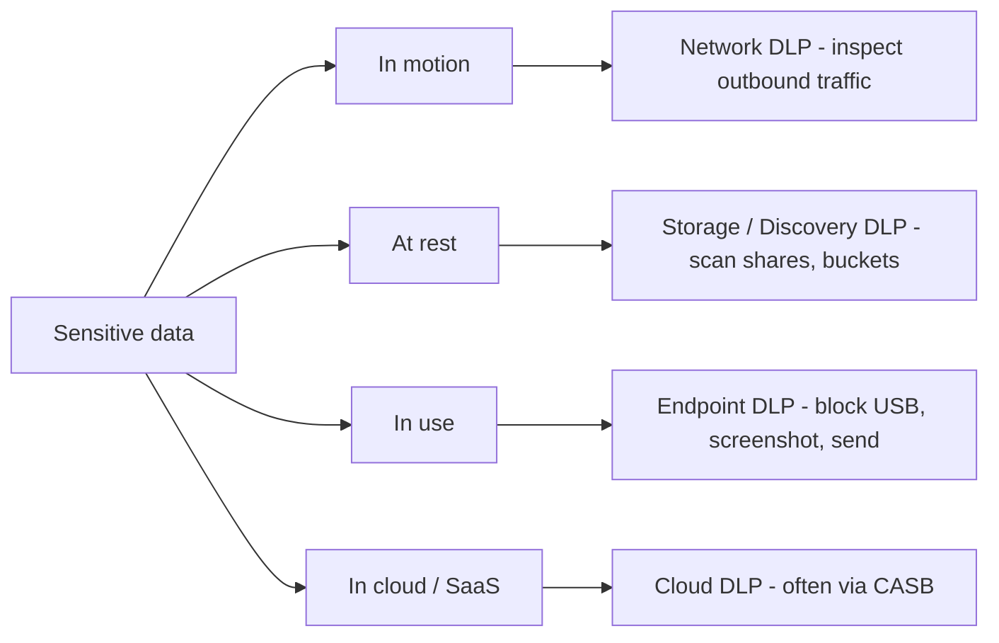
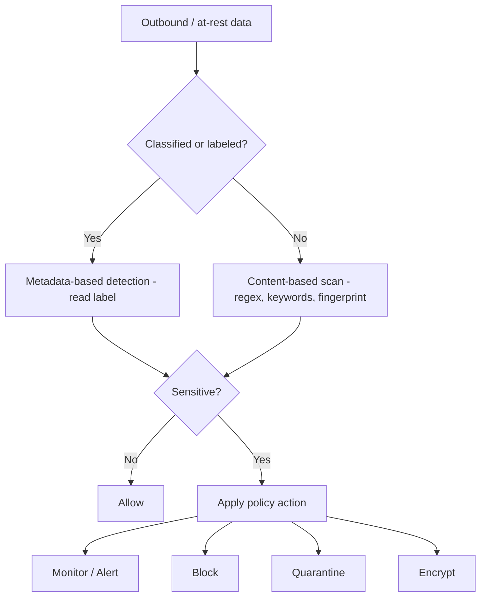

# Data Loss Prevention

## Overview

DLP systems detect and prevent unauthorized transmission of sensitive data outside the organization.

### Loss vs. Leak (exam keyword distinction)

- **Loss** — you lose access to the data (stolen laptop, destroyed drive). You no longer have it.
- **Leak** — you still have the data, but so does someone unauthorized (breach, exfiltration, unintended email).

DLP = "Data Loss Prevention" or "Data Leak Prevention" — some sources use them interchangeably, but the distinction matters when reading questions carefully.

## Key Concepts

### DLP Types by Data State

| Data state | DLP type | What it does |
|------------|----------|--------------|
| **In motion** | **Network DLP** | Sits at network edge; inspects outbound traffic; blocks/alerts on sensitive data leaving |
| **At rest** | **Storage / Discovery DLP** | Scans file shares, SharePoint, buckets for sensitive data in wrong places |
| **In use** | **Endpoint DLP** | On the workstation — blocks copy to USB, screenshots, unauthorized send actions in real time |
| **Cloud** | **Cloud DLP** (often via CASB) | Inspects data going to/in SaaS apps |

### Data Identification First

DLP can't protect what it hasn't classified. Either:
- **Manual labeling** by data owners
- **Machine-learning classification** based on content patterns (SSN, credit cards, PHI formats)

Without classification, DLP can only apply coarse rules.

### Real-World Example

The Sony Pictures breach exfiltrated **unencrypted** data out of Sony's network. A properly configured Network DLP would have flagged/blocked those bulk outbound transfers. DLP is a layer in defense-in-depth — not a silver bullet, but a meaningful one.

### Detection Methods
- **Content inspection** - examines actual data content (patterns, keywords)
- **Context analysis** - examines metadata (sender, recipient, destination)
- **Exact data matching** - fingerprints of actual sensitive records
- **Regular expressions** - pattern matching (SSN, credit card formats)
- **Machine learning** - statistical analysis of content

### DLP Actions
- **Monitor/Alert** - log and notify but allow
- **Block** - prevent the transfer
- **Quarantine** - hold for review
- **Encrypt** - automatically encrypt before allowing transfer
- **Redirect** - route for approval

## Data Discovery / Sensitive Data Scanning

A **sensitive data scanning tool** (a.k.a. **data discovery tool**) automatically scans systems, storage, databases, and files to **locate and identify** sensitive information (PII, PHI, PCI/cardholder data) so the org knows **WHERE its sensitive data lives** — in order to classify, protect, and control it.

- **Why it matters:** *"you can't protect what you don't know you have."* Discovery surfaces unknown/forgotten sensitive data (e.g., SSNs sitting on a random file share, a forgotten DB export).
- **How it works:** **pattern matching** (regex for SSNs / credit-card numbers), **keywords**, and sometimes existing **classification labels** to recognize sensitive content.
- **Where it fits:** discovery is the **FIRST STEP** before applying any control — it feeds [Data Classification](Data%20Classification.md): **find → classify → protect**. Often a **feature of DLP and CASB platforms** (the at-rest "Storage / Discovery DLP" type above is this capability).
- **Parallels:** the "discover what you didn't know was there" capability mirrors **CASB's Visibility pillar** (finds shadow cloud apps) and **EDR/Defender device discovery** (finds unmanaged devices). Data discovery aims that same idea at **SENSITIVE DATA** rather than cloud apps or devices.

### Three Data Discovery Approaches

How a tool *finds* the data falls into three approaches:

| Approach | What it searches | Strengths | Weaknesses |
|----------|------------------|-----------|------------|
| **Metadata-based** (a.k.a. **label-based** / **"asset metadata search"**) | The **metadata/attributes ABOUT the data** — labels, tags, file type, owner, creation/modified dates, classification markings — **NOT the content inside** | Fast & lightweight | Only as good as the metadata is accurate; **misses unlabeled data** |
| **Content-based** | The **actual data INSIDE** via **pattern matching** (regex for SSNs/credit cards) and keywords | Thorough — finds **UNLABELED** sensitive data | Slower / heavier (must read every file's content) |
| **Analytics-based** | **Patterns, behavior, and context** across data (ML-driven correlation, frequency analysis) | Context-aware; catches what static rules miss | Most complex; needs ML/tuning |

- **Trade-off summary:** metadata = **fast but depends on accurate labels**; content = **thorough but heavy**; analytics = **context/ML**.
- **Key exam distinction:** an **"asset metadata search tool" = METADATA-BASED** (searches labels/attributes *about* the data); a **"sensitive data scanning tool" = CONTENT-BASED** (searches the data *itself*).

## How Labeling Enables Automated DLP Enforcement

**Labeling data is what lets a DLP system RECOGNIZE and ENFORCE POLICIES on sensitive data based on its classification LABEL — without having to inspect content every time.** A label is a **machine-readable instruction attached to the data**; DLP reads it and enforces the handling rules for that classification.

Specifically, labels let DLP:

1. **IDENTIFY sensitive data quickly** — read the classification label/tag (metadata-based detection) instead of deep content scanning.
2. **APPLY the right policy/controls automatically** based on the label — block, quarantine, encrypt, or alert (e.g., when **"Confidential"**-labeled data is emailed externally or copied to USB).
3. **TRACK / MONITOR sensitive data across all three states** — at rest, in transit, in use.
4. **ENFORCE handling rules CONSISTENTLY** — the **label travels WITH the data**, so every system knows how to treat it.

**Key idea:** classification + labeling is what makes **AUTOMATED DLP enforcement** possible — the label is the metadata DLP keys off.

- This is the **METADATA-BASED detection path** (labels = the metadata): fast and reliable *when data is labeled correctly*.
- **Content-based scanning is the fallback** for **UNLABELED** data (pattern matching / regex catches what has no label).

## Exam Tips

- DLP addresses all three data states (rest, transit, use)
- Network DLP cannot inspect encrypted traffic without SSL inspection
- DLP is a **detective and preventive** control
- Endpoint DLP is needed for removable media (USB drives)

## Diagrams

### DLP placement by data state
Each data state needs a different DLP type to cover it.

### DLP detection and enforcement pipeline
Labels enable fast metadata-based detection; content scanning is the fallback for unlabeled data.

## Related Topics

- [Data States and Handling](Data%20States%20and%20Handling.md) - protecting data in all states
- [Data Classification](Data%20Classification.md) - DLP policies based on classification
- [Data Privacy](Data%20Privacy.md) - DLP helps enforce privacy
- [Domain 4 - Communication and Network Security](../04-communication-and-network-security/00%20Domain%204%20-%20Communication%20and%20Network%20Security.md) - network-level DLP
