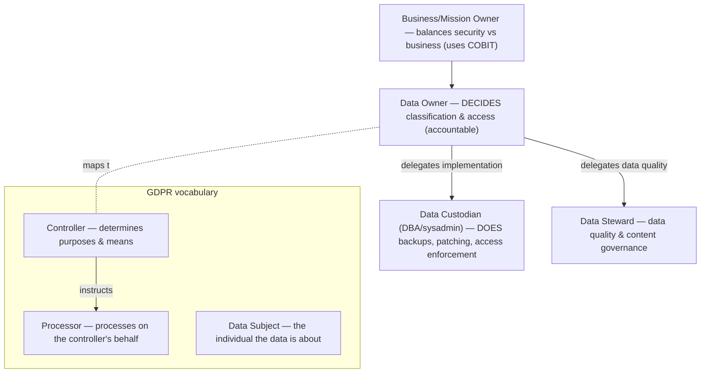

# Data Ownership and Roles

## Overview

Clearly defined roles ensure accountability for data protection throughout its lifecycle.

## Key Concepts

### Data Roles
| Role | Responsibility |
|------|---------------|
| **Mission / Business Owner** | Senior leadership owning a business unit/process that delivers value; makes the policies governing data security; ultimately liable. **Balances security requirements against business needs** and uses governance frameworks like **[COBIT](../01-security-and-risk-management/Standards%20and%20Frameworks.md)** to align IT/security goals with business objectives |
| **Data Owner** | Management-level (HR director, payroll director, dept head); assigns sensitivity; responsible that proper controls and backups exist; approves access requests (doesn't grant them) |
| **Data Custodian** | IT/IT-security techs — do the hands-on work: backups, patches, restores, configs; acts on direction of data owner |
| **Data Steward** | Ensures data quality, accuracy, and proper use; day-to-day data governance |
| **Data Controller** | (GDPR) Determines purposes and means of processing personal data — HR, payroll |
| **Data Processor** | (GDPR) Processes data on behalf of the controller — e.g., outsourced payroll vendor |
| **Data Subject** | The individual whose personal data is being processed |
| **System Owner** | Owns the system that hosts the data (data center manager, server manager); responsible for security profile, patching, isolation from less-secure systems |
| **Security Administrator** | Creates accounts, **grants** access at the discretion of the data owner; runs firewalls, IDS/IPS, patches |
| **Supervisor** | Responsible for the users under them — their actions, training, and timely notification to security when roles change |
| **User** | Uses data to do the job; must follow policies; the weakest link — controlled via administrative controls (awareness) + technical controls |
| **Auditor** | Independent verification of controls; mostly detective (after the fact), sometimes continuous monitoring (e.g., flagging when loan needs 2 supervisors but got 1) |

### Key Distinctions
- **Owner vs. Custodian**: Owner decides WHAT to protect; Custodian decides HOW to implement. **Hook: "Owner DECIDES; custodian DOES (day-to-day)."** The custodian handles the hands-on, day-to-day implementation and maintenance of the protections the owner defines — backups, applying/enforcing access controls, patching, system maintenance — carrying out the owner's decisions without setting policy (often IT/sysadmin). Trigger: "day-to-day tasks / implements & maintains protections" → **data custodian**.
- **Custodian vs. Steward**: Custodian = technical/operational day-to-day caretaker (backups/patching/access enforcement); Steward = data **quality**/content governance. Don't confuse the technical caretaker (custodian) with the data-quality governor (steward).
- **DBA / sysadmin = data CUSTODIAN (example)**: A **DBA** (or sysadmin) is the classic concrete example of a data custodian — the technical/operational role that **implements and maintains** the protections the owner defines: backups/recovery, **enforcing access control** (grant/revoke DB permissions), patching the database, and maintaining **integrity & availability**. The DBA **carries out the owner's decisions**; they do **not** set classification/access **policy** — they enforce it. Owner decides (WHAT) / custodian does (HOW). **Exam tell:** "DBA / sysadmin / person doing backups & access enforcement" → **data custodian** (not owner, not steward).
- **Controller vs. Processor (GDPR)**: **Controller** determines the **PURPOSES and MEANS** of processing (the WHY and HOW) — e.g., Henry's EU org that collects the data and decides why/how it's used. **Processor** processes the data **ON BEHALF OF** the controller, following its instructions — e.g., a 3rd-party analytics firm the org sends data to so it can analyze it and return insights. **Tell:** "send to a 3rd party to process/analyze **on your behalf**" → **processor**; "decides **why & how**" → **controller**.
- **"Owner" is NOT a GDPR term**: GDPR's vocabulary is **controller / processor / data subject** only. "Owner" (data owner, business owner, system owner) is a **data-governance** role from a different framework — don't mix the two vocabularies. If a question is framed in GDPR/EU terms, the answer set is controller/processor/subject, not "owner."
- **Owner vs. Steward**: Owner is accountable; Steward handles day-to-day quality
- **Owner APPROVES access; Security Admin GRANTS it** — exam watches these verbs carefully
- **Business/Mission Owner vs. Data Owner (COBIT trap)**: "balance security controls against business requirements + uses **COBIT**" → **business/mission owner** (enterprise IT-vs-business strategy). "classify and protect specific data / assign classification / define access" → **data owner** (too narrow for the COBIT-balancing answer)

### Data Processor Concerns (GDPR context)

If you outsource data processing:
- Right-to-audit clause (usually annual)
- Their jurisdiction may have weaker laws than yours — check compliance
- Their security must match your standards
- Data residency / cross-border transfer issues apply

### Users as Weakest Link

Users get a bad rap but most "mistakes" are unintentional. Controls:
- **Administrative** — training + awareness (supervisor's responsibility to ensure they're trained)
- **Technical** — DLP, auto-lock, least privilege
- Carrot > stick. Reward right behavior; consequences for deliberate violations.

## Exam Tips

- Data owner is always a **business executive**, never IT staff
- Custodian handles the **technical implementation** of protections
- Under GDPR, both controllers and processors have obligations
- The data owner bears **ultimate responsibility** for classification
- **Data steward** = day-to-day management, quality, and proper handling of data on behalf of the data **owner** — a data-**governance role**. Don't confuse it with a control-selection/tailoring activity if it shows up as a distractor on a Domain 1 control-selection question.
- **"Which role selects/applies COBIT to balance security controls against business requirements?"** → the **business (mission) owner**. The owner of a business unit/process must balance security needs against business value and reaches for a governance framework like COBIT to align IT/security with business objectives. **Data owner is a distractor** here — the data owner only classifies and protects specific data, not enterprise security-vs-business strategy.

## Diagrams

### Data Roles — Who Does What

**Takeaway:** **Owner decides; custodian does; steward governs quality.** GDPR: **Controller ≈ owner** (why/how), **Processor** acts on its behalf, **Subject** = the person. "Owner" is NOT a GDPR term.

## Related Topics

- [Data Classification](Data%20Classification.md) - owners classify data
- [Security Governance](../01-security-and-risk-management/Security%20Governance.md) - organizational roles
- [Data Privacy](Data%20Privacy.md) - GDPR roles
- [Laws and Regulations](../01-security-and-risk-management/Laws%20and%20Regulations.md) - legal role definitions
