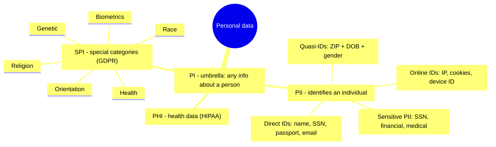
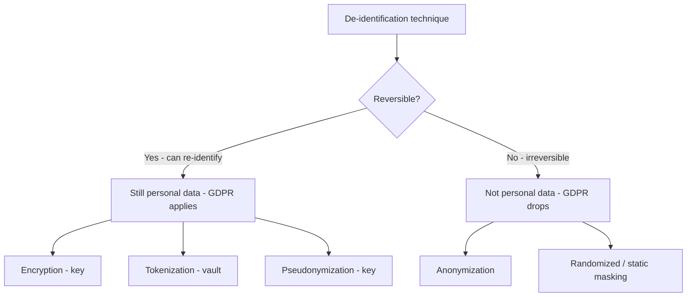

# Data Privacy

## Overview

Privacy is about controlling personal data — who collects it, why, how it's used, and who it's disclosed to. Security and privacy are not the same thing: security protects data from unauthorized access; privacy governs whether you should be holding and using that data at all. The key relationship to remember is that **you cannot achieve privacy without security** — access controls, encryption, and the rest are the foundation that *enables* privacy. Strong security with no privacy policy is possible; privacy with no security is not.

## Key Concepts

### Types of Personal Data
- **PII** (Personally Identifiable Information) - data that can identify an individual (name, SSN, email, biometrics)
- **PHI** (Protected Health Information) - health data linked to an individual; the category **HIPAA** protects
- **SPI** (Sensitive Personal Information) - a special-protection subset: **race/ethnicity, religion, political opinions, health, sexual orientation, biometrics, genetic data**. GDPR calls these "special categories" and requires extra safeguards because disclosure can lead to discrimination or serious harm.
- **PI** (Personal Information) - the broad umbrella term for any information relating to a person
- **Sensitive PII** - PII that causes significant harm if disclosed (SSN, financial data, medical records)

### Identifiers — how data points to a person
- **Direct identifiers** - **alone** identify a specific person: name, SSN, passport number, email address.
- **Indirect (quasi-) identifiers** - **alone** they don't identify anyone, but **combined** they re-identify. The classic result: **ZIP code + date of birth + gender** uniquely identifies most of the US population. This is why "we removed the names" is not enough.
- **Online identifiers** - IP address, cookies, device IDs, advertising IDs. **GDPR explicitly treats these as personal data**, even though older thinking dismissed them as anonymous.

> **Exam trap:** anonymization that ignores quasi-identifiers isn't real anonymization. If ZIP + DOB + gender remain, the data can be re-identified, so it's still personal data under GDPR.

### Privacy Principles (OECD Guidelines / GAPP)
1. **Collection Limitation** - collect only what is needed, with consent
2. **Data Quality** - keep data accurate and up to date
3. **Purpose Specification** - state why data is collected
4. **Use Limitation** - only use data for stated purposes
5. **Security Safeguards** - protect data with appropriate controls
6. **Openness** - be transparent about data practices
7. **Individual Participation** - allow people to access/correct their data
8. **Accountability** - organization is responsible for compliance

### GDPR Supervisory Authority
The **Supervisory Authority** is the **national data-protection regulator** that enforces GDPR in each member state (e.g., Ireland's DPC, France's CNIL). It investigates complaints, issues fines, and is the body you **notify of a personal-data breach within 72 hours** of becoming aware of it (**Article 33**). Memory hook: breach clock = **72 hours to the Supervisory Authority**.

### Privacy by Design (7 Principles)
1. Proactive not reactive
2. Privacy as the default setting
3. Privacy embedded into design
4. Full functionality (positive-sum, not zero-sum)
5. End-to-end security (full lifecycle protection)
6. Visibility and transparency
7. Respect for user privacy

### De-identification Techniques
- **Anonymization** - irreversibly remove identifying information (cannot be reversed). **Randomized masking**, done correctly, is an anonymization method that is **irreversible** → GDPR no longer applies to truly anonymized data. *When a question asks for the control that CANNOT be reversed, the anonymization/randomized-masking answer wins over encryption/tokenization/pseudonymization.*
- **Pseudonymization** - replace identifiers with artificial ones (**reversible** with a key)
- **Tokenization** - replace sensitive data with non-sensitive tokens (**reversible** via the token vault)
- **Encryption** - **reversible** with the key
- **Data masking** - obscure portions of data (e.g., XXX-XX-1234); *static/randomized* masking can be irreversible, dynamic masking just hides on display
- **Generalization** - reduce precision (exact age -> age range)

> **Reversible vs irreversible (key exam split):** Encryption, tokenization, and pseudonymization are all **REVERSIBLE**. Anonymization (incl. correctly-done randomized masking) is **IRREVERSIBLE**.

## Exam Tips

- Anonymization is **irreversible**; pseudonymization is **reversible** with a key
- GDPR treats pseudonymized data as **still personal data** (can be re-linked)
- Privacy by Design means building privacy in from the start, not adding it later
- Know the OECD privacy principles - they underpin most privacy laws
- **No privacy without security** — if a question asks what privacy depends on, security controls are the foundation
- Breach notification to the GDPR Supervisory Authority = **72 hours** (Art 33)
- **SPI / special categories** (race, religion, health, sexual orientation, biometrics) get **extra** protection beyond ordinary PII

## Diagrams

### Personal data taxonomy
PI is the umbrella; PII, PHI, and SPI are the categories that trigger specific protections.

### Reversible vs irreversible de-identification
Only irreversible techniques take data out of scope for GDPR.

## Related Topics

- [Laws and Regulations](../01-security-and-risk-management/Laws%20and%20Regulations.md) - GDPR, HIPAA, CCPA
- [Data Classification](Data%20Classification.md) - privacy classification
- [Data Loss Prevention](Data%20Loss%20Prevention.md) - preventing privacy breaches
- [Data Ownership and Roles](Data%20Ownership%20and%20Roles.md) - controller/processor roles
