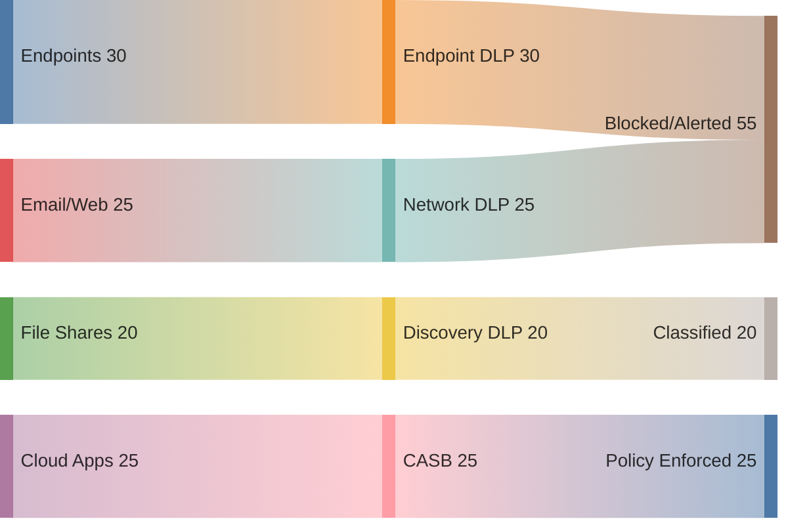

# Data Protection - DRM, CASB, DLP

## Overview

Three technology categories for protecting data beyond basic classification and encryption.

## DRM - Digital Rights Management

Technologies to protect copyrighted digital media and licensed software.

### Core idea — protection TRAVELS WITH THE FILE

DRM controls **how digital content/files can be USED after distribution** — copying, printing, forwarding, editing, screenshotting, and time-based expiry. The protection is **persistent**: the rules are bound to the file itself, so they **still apply after the file leaves your network**. Goal = **enforce USAGE RIGHTS on content wherever it goes** ("what can you DO with this file?").

- **Consumer examples:** protected ebooks/movies — Kindle, Netflix (region locks, expiry, copy/screen-capture blocks).
- **Enterprise version = IRM (Information Rights Management):** applies persistent usage rules to internal documents/email — e.g., **Microsoft Purview / Azure RMS** (a "Confidential" doc can be set to no-forward, no-print, view-only, or auto-expire even after it's emailed outside the org).

### Common DRM Controls
| Control | Example |
|---------|---------|
| **Region locks** | DVD regions (Europe vs North America) |
| **License key activation** | Microsoft software serials; limited activations |
| **Subscription expiry** | Software "expires" after 1 year without renewal |
| **IP restrictions** | Detects unexpected login IPs |
| **Geolocation** | "Registered in Denmark, now logging in from US?" |
| **VPN/proxy blocking** | Netflix / Hulu / Prime deny playback over VPN |
| **Copy restrictions** | PDFs that can't be copied, edited, saved, printed, or screenshotted |
| **Screen recording blocks** | Streams that black out when capture is attempted |
| **Persistent authentication** | Must be online to access content |
| **Persistent audit trails** | Concurrent-login detection |
| **Watermarks / metadata** | "This ebook sold to Thor Peterson" embedded visibly or invisibly for traceback |

## CASB - Cloud Access Security Broker

Gatekeeper between users and cloud apps. Software on-prem or in the cloud.

### What a CASB Does
- **Monitors user activity** in cloud services — warns about account takeovers
- **Detects shadow IT** — users using cloud services the IT team doesn't know about
- **Prevents malware** moving via cloud apps
- **Cloud DLP** — classifies and blocks sensitive data leaving the org
- **Enforces compliance + policies** — e.g., ensures all cloud-stored files are encrypted per your policy

Cloud doesn't automatically comply with your security policies. CASB makes it comply.

### The 4 Pillars of CASB (Gartner)

1. **Visibility** — discover what cloud services are used, by whom. This is the **Shadow IT discovery** pillar.
2. **Compliance** — ensure cloud usage meets regulatory/internal policy (HIPAA / PCI / GDPR); **enforce policy and report exceptions**.
3. **Data Security** — protect the data in the cloud; this is where **DLP** lives (encryption, tokenization, access control, prevent leakage).
4. **Threat Protection** — detect/block malicious or risky cloud activity (compromised accounts, malware, anomalous behavior, insider threats).

**Memory hook — V-C-D-T** (Visibility, Compliance, Data security, Threat protection): *"See it → Govern it → Protect the data → Stop the threats."*

### Exam scenario — when the answer is CASB

> Hybrid cloud; on-site monitoring is already satisfactory; the org needs to **apply security policies to user activity in cloud services** and **report on exceptions** across a **growing number of cloud services**. → **CASB**.

**Trigger phrase:** "cloud services + apply policies to user activity + visibility / Shadow IT + report exceptions" → **CASB**.

#### Discriminator — why not NGFW / IDS / SOAR
| Tool | What it actually does | Why it's NOT the answer |
|------|----------------------|--------------------------|
| **NGFW** (Next-Gen Firewall) | Protects the **network perimeter** — deep packet inspection, app awareness, IPS | Not built to govern user activity inside cloud SaaS |
| **IDS** (Intrusion Detection System) | Detects and **alerts** on attacks | Doesn't enforce cloud-usage policies or manage cloud-app access |
| **SOAR** (Security Orchestration, Automation, and Response) | Automates incident-response **workflows** across tools | A response-automation layer, not a cloud-policy/visibility broker |

#### Mental model — CASB is a bundle, not a NAC

CASB is **NOT** like a **NAC** (e.g., Cisco ISE governs **network** access). CASB is better understood as a **bundle of security functions pointed at the CLOUD ACCESS BOUNDARY** — discovery/visibility, DLP, policy/compliance, and threat protection — bolted onto a **broker that sits between users and cloud apps** (as a proxy or via cloud APIs), a natural **chokepoint**.

**Shared DNA with EDR** = the *"discover what I didn't know was there"* (shadow-asset discovery) capability: **EDR** finds shadow **devices**; **CASB** finds shadow **cloud apps**.

## DLP - Data Loss Prevention

Detects and prevents unauthorized movement or destruction of sensitive data.

### Loss vs. Leak
- **Loss** — you lose access (stolen laptop)
- **Leak** — attacker now has a copy (you still have yours too)

### Data States and DLP Types
| State | DLP Type | How |
|-------|----------|-----|
| **In motion** | Network DLP | Edge appliance / inline agent; blocks sensitive outbound traffic |
| **At rest** | Storage / Discovery DLP | Scans shares/buckets for misplaced sensitive data |
| **In use** | Endpoint DLP | Real-time blocks on copy-to-USB, screenshots, unauthorized app send |
| **Cloud** | Cloud DLP (often in CASB) | Cloud-specific monitoring |

### Identification First
DLP can only protect what's **classified**. Use manual labels, automated content inspection (SSN/CC patterns), or ML classification.

### Example Prevention
Phishing tricks HR into emailing 10 SSNs externally. Endpoint or Network DLP detects the SSN pattern and:
- Blocks the send
- Alerts an admin
- Logs the event

### Sony Breach Lesson
Exfiltrated data left Sony's network unencrypted. A properly tuned Network DLP would have flagged the bulk outbound traffic. DLP is a layer — not a silver bullet — but a meaningful one.

## DRM vs DLP — key difference

| | **DRM** (incl. enterprise **IRM**) | **DLP** |
|---|---|---|
| **Controls** | **USAGE of content after distribution** — copy/print/forward/edit/screenshot/expiry | **EXFILTRATION** — unauthorized movement of sensitive data |
| **Where it acts** | **Travels WITH the file** (persistent rights) — rules apply even after the file leaves your network | Mostly at the **boundary / egress** (network/endpoint/storage monitoring) |
| **The question it answers** | *"What can you DO with this file?"* | *"Is sensitive data LEAVING where it shouldn't?"* |
| **Goal** | Enforce usage rights on content wherever it goes | Stop sensitive data from leaving where it shouldn't |

**One-liner:** DRM = persistent **usage control** that follows the file; DLP = **boundary monitoring** that blocks data from getting out.

## Exam Tips

- **DRM** protects copyrighted content via tech controls (region, license, watermark, etc.); protection **travels with the file** (persistent); enterprise = **IRM** (Purview/Azure RMS)
- **CASB** = cloud gatekeeper; also detects shadow IT
- **DLP** = loss/leak prevention across all three data states
- Network DLP = in-motion; Endpoint DLP = in-use/at-rest on device; Storage DLP = at-rest in storage
- DLP requires classified data to be effective
- Cloud services inherit **your** compliance scope — CASB helps enforce it

## Diagrams

### Where Data-Protection Controls Sit — Sankey

**Takeaway:** Sensitive data flows through different control points — **endpoint DLP** (USB/clipboard), **network DLP** (egress), **discovery DLP** (data at rest), and **CASB** (cloud apps).

## Related Topics

- [Data Loss Prevention](Data%20Loss%20Prevention.md)
- [Data States and Handling](Data%20States%20and%20Handling.md)
- [Data Classification](Data%20Classification.md)
- [Data Privacy](Data%20Privacy.md)
- [Intellectual Property](../01-security-and-risk-management/Intellectual%20Property.md) — copyright / what DRM protects
