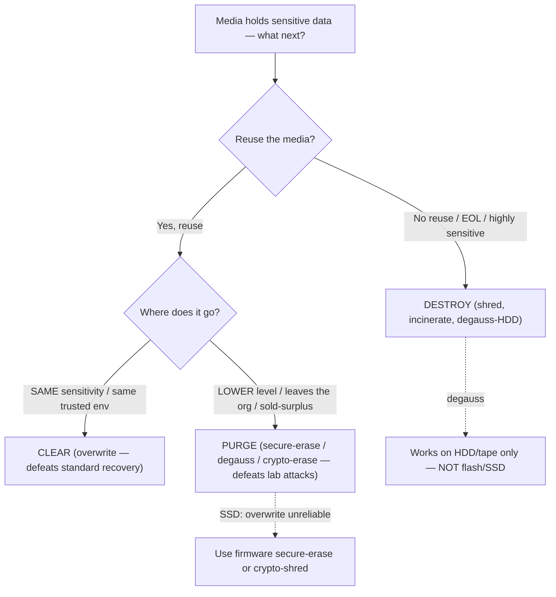

# Data Retention and Destruction

## Overview

Managing how long data is kept and ensuring it is securely destroyed when no longer needed.

> **Keep it only as long as needed OR legally required, whichever is greater.** Exception: privacy laws may cap retention — e.g., if you accept credit cards but aren't a processor, you usually must delete the transaction record once handed off. Many major card breaches involved data the company shouldn't have kept in the first place.

## Key Concepts

### Data Lifecycle
1. **Create/Collect** - data is generated or acquired
2. **Store** - data is saved to media
3. **Use** - data is accessed and processed
4. **Share/Transfer** - data is distributed
5. **Archive** - data is moved to long-term storage
6. **Destroy** - data is permanently removed

### Retention Policies
- Define how long each data type must be kept
- Driven by legal, regulatory, and business requirements
- Must balance compliance with storage costs and risk
- Different regulations have different retention periods
- E-discovery and legal hold can override retention schedules

### How a Retention Policy Reduces Liability

Core principle: **"Don't keep what you don't need."** Every record kept beyond its useful life is a liability waiting to happen — it can be breached, subpoenaed, or fined over. A good retention policy reduces liability four ways:

1. **Less to be BREACHED (smaller attack surface)** — data already destroyed on schedule can't be stolen or exposed. You can't lose what you no longer hold.
2. **Less to be SUBPOENAED in litigation (E-DISCOVERY)** — data legitimately destroyed under a consistent policy *before* litigation arose simply doesn't exist to be produced or used against you. (E-discovery = the legal process of identifying/collecting/producing electronically stored information for a case.)
3. **Defensible, CONSISTENT destruction protects against SPOLIATION claims** — you must destroy routinely and consistently per policy, **not** selectively the moment a lawsuit looks likely. A documented, consistently-followed policy is the legal defense: it's a *routine business practice*, not evidence-hiding.
4. **REGULATORY COMPLIANCE (min AND max)** — laws set both a **minimum** retention (e.g., keep tax records X years) and a **maximum** (e.g., GDPR storage limitation — delete personal data when no longer needed). A policy keeps you inside both bounds, avoiding fines for keeping data too long *or* not long enough.

### Spoliation & Legal Hold (critical, commonly tested)

- **Spoliation** = the intentional or negligent destruction, alteration, or concealment of evidence relevant to known or *reasonably anticipated* litigation. It is illegal and carries severe penalties (sanctions, adverse-inference instructions, even default judgment).
- **Legal hold** (litigation hold) = the moment litigation is reasonably anticipated, the organization must **suspend** its normal retention/destruction schedule for all relevant data and preserve it.
- **The trap:** routine destruction *reduces* liability, but destruction *after* a legal hold attaches *increases* it — continuing to destroy relevant data once a hold is in place is spoliation. Destroying records to dodge a known/anticipated case is the textbook spoliation example.
- Bottom line: legitimate, consistent, pre-litigation destruction = defensible. Selective or post-hold destruction = spoliation.

> **Defensible destruction** (named term) = destroying data through a **documented, consistent, repeatable process** that will **hold up in litigation**. The point isn't just that the data is gone — it's that you can *prove* it was destroyed as routine business practice under policy, not to dodge a case. Ties directly to **retention schedules + legal hold**: defensible destruction follows the schedule and stops the moment a hold attaches.

### Archiving vs Backup

- **Archive** = long-term storage of data you may need later. Expected to remain accessible for years; rarely changes.
- **Backup** = point-in-time copy for restore. Rotates frequently. Older backups become less useful; archives stay useful.

You need **both** for different purposes. A 7-year-old backup is usually unusable; a 7-year-old archive should still be retrievable.

### Tape Storage Horror Stories (what NOT to do)

- Tapes taken home by an employee "for off-site storage" — house burglarized, unencrypted tapes stolen
- Tapes in an unlocked office supply cabinet next to pens and paperclips
- **10,000+ tapes stashed under the raised floor of a data center** — some unneeded, some critical backups. Same data center that might flood.

All weak links. Attackers target the weakest point. Backup media requires the same protection level as the source data.

### Tape Courier Requirements

- Vendor's personnel must be **licensed and bonded** (liable if they lose tapes)
- Maintain an authorized-pickup list — unknown couriers don't leave with tapes
- Delivery time affects MTD — if your recovery window is 4 hours but tape delivery takes 4 hours, your plan is broken before restore even starts

### Data Destruction Methods

**For Magnetic Media:**
| Method | Description | Effectiveness |
|--------|-------------|--------------|
| **Overwriting** | Write patterns over data (e.g., DoD 5220.22-M) | Moderate |
| **Degaussing** | Strong magnetic field destroys data | High (renders media unusable) |
| **Physical Destruction** | Shredding, incineration, pulverizing | Highest |

**For Solid-State (SSD/Flash):**
- Overwriting is **unreliable** for SSDs (wear leveling)
- **Cryptographic erasure** (crypto-shredding) - destroy the encryption key
- Physical destruction is most reliable for SSDs

**For Paper:**
- Cross-cut shredding (better than strip-cut)
- Incineration
- Pulping

### Data Remanence
- Data remnants that remain after attempted destruction
- Even after deletion or formatting, data may be recoverable

> **Format ≠ secure.** Formatting (or a standard delete/erase) only rebuilds the file table / marks the space free — the underlying bits stay on the media and are **trivially recoverable** with off-the-shelf tools. A quick format is **not sanitization**. Real sanitization is clearing, purging, or destruction (below).
- **Clearing** - overwriting; protects against software-based recovery
- **Purging** - degaussing or crypto erasure; protects against lab-based recovery
- **Destroying** - physical destruction; no recovery possible

### Clearing vs Purging — the SAME-vs-LOWER environment discriminator (commonly tested)

The exam doesn't just test the *strength* ordering (clearing < purging < destruction) — it tests **where the media goes next**. Match the method to the destination, then pick the *best option that MEETS the need* (no more, no less).

- **CLEARING** = prepare media for **reuse WITHIN THE SAME security environment / SAME sensitivity level**. Protects against **standard, non-invasive recovery** (keyboard / standard software tools). Sufficient because the data stays inside an **equally-trusted zone** — nobody outside that trust level ever touches it.
- **PURGING** = prepare media for **reuse in a DIFFERENT / LOWER sensitivity environment**, or **release OUTSIDE the organization**. More rigorous — protects against **laboratory / advanced attacks**. Needed precisely because the media is **leaving its trusted zone**.
- **DESTRUCTION** = **no reuse at all**; physically destroy the media.

**Discriminator (memorize):**
- "same sensitivity level" → **clearing**
- "lower level / released outside / different environment" → **purging**
- "no reuse at all" → **destruction**

**Erasing vs sanitization (distractors):**
- **Erasing** = a standard delete — just marks the space available; data is **easily recoverable**. NOT secure sanitization.
- **Sanitization** = the **umbrella term** for the whole category (clearing / purging / destruction are its *types*). Too general to ever be the *specific* answer.

> **Common reasoning gap:** people pick **purging** because it sounds "thorough but short of destruction." But purging is **OVERKILL when reuse is at the SAME level** — clearing already meets the need. Don't pick the strongest survivable option; pick the **best option that meets the requirement** given **where the media goes**.
>
> Exam example: *"Megan wants to prepare media for REUSE in an environment operating at the SAME sensitivity level — best option?"* → **CLEARING** (not purging, not erasing, not "sanitization").

### EXAM Q — EOL workstations + highly sensitive trade secrets → DESTRUCTION

*"Workstations at END OF LIFE (EOL) hold proprietary data and sensitive trade secrets — what's the best sanitization method?"* → **DESTRUCTION**. Two factors drive it together:

1. **EOL = being retired/disposed, NOT reused** — destroying the media loses nothing, because the gear isn't going back into service. The "reuse" tradeoffs that make clearing/purging attractive simply don't apply.
2. **Highly sensitive data (trade secrets) = want MAXIMUM ASSURANCE** it can never be recovered → destruction is the **highest-assurance** method.

**Decision rule:** **EOL + no reuse + highly sensitive → destruction.** (If the gear were being **REUSED / RESOLD / donated**, you'd **PURGE** instead — but at end-of-life with trade secrets, **destroy**.)

**Destroy vs purge (the pivot):** the discriminator is *future use*. **Reusing/reselling at a lower level or outside the org → purge** (media survives, just sanitized). **No reuse + highly sensitive / EOL disposal → destroy** (media doesn't survive; max assurance).

**Distractors (why each fails here):**
- **Clearing** = **same-level REUSE only** — too weak for trade secrets, *and* these aren't being reused. Wrong on both counts.
- **Erasing** = a standard delete — trivially recoverable (data remanence); **never** adequate for sensitive data.
- **Sanitizing** = the **UMBRELLA term** (clearing/purging/destruction are its types). Too general when the specific best method — **destruction** — is on offer. Pick the specific method, not the category.

### EXAM Q — classified defense tapes: degauss-and-reuse vs DESTROY → DATA REMANENCE

*"A government defense contractor's project is shut down. To save money she wants to DEGAUSS and REUSE the classified storage tapes, but the internal process requires they be DESTROYED. Why can't she degauss-and-reuse?"* → because **DATA REMANENCE** is a concern.

**The reasoning:** for highly classified gov/defense data, the risk that **RESIDUAL RECOVERABLE DATA (remanence)** could remain even after sanitization is **unacceptable**, so policy mandates **DESTRUCTION over sanitize-and-reuse**. Degaussing is *technically effective* on tapes — but at that classification level the remanence risk + the internal policy still require destroy. It's not that degaussing fails; it's that "good enough" isn't good enough for classified, so the policy removes the reuse option entirely.

> **Rule:** *"why can't I sanitize-and-reuse classified media?"* → **data REMANENCE** is the concern → **destruction required**.

**Distractor traps (know why each fails):**
- **"Data PERMANENCE may be the issue"** = **WORDPLAY TRAP** — the real concept is data **REMANENCE** (residual *leftover* data after deletion), NOT "permanence." Near-miss vocabulary designed to catch you; if you read too fast they look identical. Remanence = what *remains*. There is no security concept called "data permanence" being tested here.
- **"Bit rot"** = **irrelevant** — bit rot is gradual **media degradation / reliability** loss over time (data decaying on the medium), a *data-integrity/availability* concern, NOT the security reason tapes must be destroyed.
- **"Data from tapes can't be erased by degaussing"** = **FALSE** — tapes are **MAGNETIC**, so degaussing **DOES** work on them (unlike SSDs/flash, which store electrical charge). The issue is the remanence risk + policy at that classification, NOT degaussing failing on tape.

> **Tie-in:** contrast with the [EXAM Q — EOL workstations + highly sensitive trade secrets → DESTRUCTION](#exam-q-eol-workstations-highly-sensitive-trade-secrets-destruction) case — same destination (destruction) for the same reason family (highly sensitive + max assurance, no reuse). Classified gov/defense data is the clearest "destroy, don't sanitize-and-reuse" trigger.

### Why HIGH-QUALITY media is cost-effective for sensitive data

**Exam answer (the reason):** the **VALUE OF THE DATA often FAR EXCEEDS THE COST OF THE MEDIA**. Sensitive data is worth far more — and carries far more breach liability — than the physical media it sits on, so paying a small premium for high-quality media is **negligible relative to the value of what it protects**. You spend a little more on the container because the contents are priceless.

- **Cost logic in one line:** media is cheap, the data (and its breach liability) is expensive → a small media premium is trivial insurance on a high-value asset.

**Distractor reasoning (know why each fails):**
- **"Expensive media is less likely to fail"** — this is **TRUE**, but it's a *property of the media*, NOT the cost-effectiveness argument. Tempting distractor; reliability is a benefit, but the *reason it's cost-effective* is the data's value, not the failure rate.
- **"Easier to encrypt"** — **FALSE.** Encryption doesn't depend on media price; any media encrypts the same.
- **"Improves data integrity"** — **FALSE/misleading.** Integrity comes from controls like hashing and checksums, not from how much the media cost.

> **Secondary / real-world note (NOT the exam answer):** durable media can also be reliably sanitized (cleared/purged) and reused across many cycles, which spreads its cost — but this reuse/amortization point is a real-world consideration, not the exam's cost-effectiveness reason. The exam answer is **data value far exceeds media cost**.

### What actually makes media "high-quality" (metrics)

"High-quality media" = enterprise/durable-grade storage rated for reliability and repeated use, as opposed to cheap consumer-grade. The qualities that earn the label:

- **ENDURANCE** — how many write/erase cycles the media survives. For SSDs this is **TBW** (terabytes written) or **DWPD** (drive writes per day). This is the spec that matters *most* for sanitize-and-reuse, because **each clearing is a full rewrite** of the media.
- **DURABILITY / RELIABILITY** — **MTBF** (Mean Time Between Failures), lower failure rate, better error correction.
- **BUILD GRADE** — enterprise-grade components, power-loss protection, longer warranty, 24/7-rated for continuous operation.

**High-quality vs low-quality examples by media type:**
- **HDD** — enterprise (high MTBF, 24/7-rated, helium-filled) vs consumer desktop drive.
- **SSD** — enterprise high-TBW SLC/MLC with power-loss protection vs cheap consumer QLC/TLC.
- **Tape** — enterprise LTO (rated for thousands of passes) vs cheap or old tape.
- **Optical** — archival-grade **M-DISC** (decades of life) vs standard CD/DVD-R.

> **The key tie-in:** the single most important spec is **ENDURANCE**. High-quality media tolerates **many rewrite cycles**, which is exactly what **CLEARING** (overwriting for reuse) demands. Cheap low-endurance media wears out after only a few sanitize-and-reuse cycles → forced **destruction + rebuy**. So "high quality" really means **durable enough to survive repeated sanitization and reuse**.

### EXAM Q — DOWNGRADING a classified system for reuse (TS → Secret) → SANITIZATION COST MAY EXCEED NEW-EQUIPMENT COST

*"Fred's org allows DOWNGRADING classified systems for reuse after PURGING (e.g., Top Secret → Secret). What is the concern regarding reuse?"* → the **COST OF THE SANITIZATION PROCESS may EXCEED THE COST OF NEW EQUIPMENT**.

**The reasoning:** safely downgrading a *highly classified* system requires **rigorous, verified, documented purging** — and that process is so resource- and labor-intensive that it can cost **MORE than simply buying new equipment**. So reuse-via-downgrade may **not be cost-effective** at high classification. This is where the **reuse-vs-replace economics FLIP**: at low sensitivity, sanitize-and-reuse is cheaper than rebuying; at high classification, the cost of *proving* the media is clean overtakes the cost of new gear, so **replace instead of reuse**. Ties to the broader principle: **reuse only if sanitizing is cheaper than replacing.**

> **Rule:** *"why might reuse be a concern when downgrading a highly classified system?"* → **rigorous purging can cost more than new equipment** → reuse may not be worth it.

> **Why verified declassification is so expensive (grounding):** the wipe itself is trivial — what you actually pay for is the **CLEARED LABOR** and the **VERIFIED ASSURANCE** that the data is truly gone, plus the **RISK** if it isn't. Hardware is CHEAP; **trust/assurance is EXPENSIVE.** Four cost drivers:
>
> 1. **CLEARED LABOR (the big one)** — only personnel holding the **appropriate clearance** (e.g., TS) may sanitize/verify TS media. Cleared staff are **expensive and scarce**, and a downgrade burns **hours of their time per device**. You're spending cleared-human time, not machine time.
> 2. **VERIFIED, DOCUMENTED PROCESS** — you must **PROVE no residual high-classification data remains**: follow a formal standard (**NIST SP 800-88**, NSA guidance), **verify** the purge actually worked, and produce full **documentation / chain-of-custody / sign-offs** — often with a **second person to witness**. Proving it's clean costs far more than wiping it.
> 3. **SPECIALIZED EQUIPMENT** — **NSA-approved degaussers / certified destruction devices** cost **thousands**, plus ongoing certification and maintenance.
> 4. **RISK / LIABILITY (the silent multiplier)** — a single mistake = a **CLASSIFIED SPILL**: residual TS data sitting on a box now labeled *Secret* and handed to people cleared only to *Secret*. That triggers an investigation, re-securing of the system, and a **national-security incident report**. To avoid this, the process is deliberately made **conservative — slow and expensive by design.**
>
> **The math:** commodity hardware = a few hundred to ~$2,000. Verified declassification = **cleared labor-hours + equipment + verification + documentation + risk**, which **routinely EXCEEDS** that → cheaper to **destroy + buy new**.
>
> **Real-world practice:** media that has ever held classified data is usually **NOT downgraded** — it's kept at its **highest classification for life**, or **DESTROYED** — precisely because verified downgrading costs more (labor + risk) than the box is worth. The **highest-assurance NSA guidance often says DESTROY**, so you frequently can't even reuse it.
>
> **Punchline:** "downgrade-for-reuse" of a classified system is usually a **FALSE ECONOMY** — you're spending expensive cleared-human time + accepting spill risk to salvage a **cheap, replaceable box.**

**Distractor traps (know why each fails):**
- **"TS data commingled with Secret → must relabel"** = the **runner-up / closest distractor**. It gestures at remanence/spillage, but the **'relabel' consequence is minor** — and **proper purging should prevent residual data** in the first place. Plausible but not *the* concern the exam is testing here.
- **"Data could be exposed during the sanitization process"** = **not a standard concern** — sanitization is a controlled, on-prem process; exposure-during-purge isn't the recognized reuse risk.
- **"DLP would flag the system due to label differences"** = **not a real reuse concern** — DLP label mismatches aren't the sanitization/reuse issue being asked about.

> **Note (close call):** this is genuinely a tight call between the **cost** answer and the **remanence/commingle** answer. But the **cost-of-sanitization-vs-replacement** point is what CISSP/Sybex explicitly teaches as the *reuse concern* for downgrading highly classified systems. When the question frames it as "concern regarding REUSE," pick the **cost** answer.

> **Contrast with the [EXAM Q — classified defense tapes: degauss-and-reuse vs DESTROY → DATA REMANENCE](#exam-q-classified-defense-tapes-degauss-and-reuse-vs-destroy-data-remanence) case:** that one tests *why you can't sanitize-and-reuse classified media at all* → **remanence → destroy**. This one tests *why reuse-via-downgrade may not be worth it even when allowed* → **sanitization cost can exceed replacement cost**. Same family (high classification makes reuse hard), different specific concern.

### Sanitization cost picture (illustrative $)

> **ILLUSTRATIVE BALLPARKS ONLY — orders of magnitude, NOT vendor quotes or exam-tested numbers.** Real figures vary widely by vendor, volume, region, and classification level. This section grounds the *intuition* behind the downgrade-cost reasoning above by putting rough dollar scales on it — the **relative** magnitudes are the point, not the exact numbers.

**Commercial per-drive sanitization (at volume, illustrative):**

| Method | Rough $/drive | Note |
|--------|--------------|------|
| **Erase / Delete** | **~$0** | Insecure — just marks space free (remanence) |
| **Clearing** (overwrite) | **~$5–50** | Mostly **labor/time** (full rewrite takes hours) |
| **Purging** (secure-erase / degauss) | **~$10–50** | Firmware secure-erase or NSA-degauss pass |
| **Destruction** (bulk shred) | **~$1–10** | Per-drive at volume via a shredding service |

> **THE IRONY:** **destruction (~$1–10) is often CHEAPER than purging (~$10–50)** at volume. Bulk shredding is a fast mechanical act; purging burns per-drive overwrite/secure-erase time plus verification. This proves the cost lives in **labor + verification**, not in the physical act of destroying the bits.

**Capital equipment (in-house, illustrative):**
- **Software wipe tool** — **$0–50 / license** (or free/open-source).
- **NSA-approved degausser** — **$10,000–50,000+**.
- **Certified shredder / disintegrator** — **$5,000–40,000+**.

(In-house capex only pays off at scale; most orgs use a certified destruction *service* instead — which is why bulk destruction is cheap per drive.)

> **KEY CLARIFICATION — the purge-vs-destroy cost gap is NOT the equipment.** Look at the capex above: the PURGING machine (NSA-degausser ~$10k–50k) and the DESTRUCTION machine (certified shredder/disintegrator ~$5k–40k) cost **comparable** money. So the per-drive cost difference between purging and destruction can't be the machine — it's **VERIFICATION + SPEED**:
>
> 1. **VERIFICATION (the big one).** A destroyed drive is **SELF-EVIDENTLY gone** — visual confirmation, you can *see* it's shredded → **no verification step needed**. Purging requires **PROVING** the data is actually gone → a verification step (in classified contexts, expensive **cleared-labor** verification + documentation). You pay to confirm a purge worked; you don't pay to confirm a shred worked.
> 2. **SPEED / THROUGHPUT.** Shredding = **seconds/drive**. Software-overwrite purging = **minutes-to-hours/drive** — overwrite passes take real time, and time is cost. (Degaussing is *fast*, but it **DESTROYS the HDD anyway** — it's magnetic destruction, not purge-for-reuse — so it doesn't buy you the reuse that justifies purging.)
> 3. **RESIDUAL-RISK QUESTION.** Destruction = **certain** — there's no "did it work?" left to ask. Purging always leaves the open question *"is it truly unrecoverable?"* → which is exactly what **demands verification**.
>
> **The theme this reinforces:** you pay for **ASSURANCE**. **Destruction provides assurance for FREE** (you can *see* it's gone); **purging must BUY assurance** via verification — and verification is the expensive part. This is part of why classified environments lean toward **destruction even though degaussers and shredders cost similar**: destruction's certainty comes built-in.
>
> **Correcting the earlier figures:** the illustrative per-drive numbers above (destruction ~$1–10 vs purging ~$10–50) are **OPERATIONAL / service costs driven by verification + time** — **NOT capital costs**. The *machines* cost similar (~$5k–50k either way); the per-drive gap is labor, throughput, and the cost of *proving* a purge worked.

**Classified declassification cost explosion (illustrative):**
- **Cleared personnel** — **~$75–150+/hour** (the **clearance premium** — cleared staff are scarce and expensive; you're buying cleared-human time, not machine time).
- **Verified downgrade** = purge + verify + document + 2-person witness, roughly **~2–8 hrs × 2 people** → **~$400–1,600+ per device**.
- **Spill-risk tail** — if done wrong, a **classified SPILL** (residual TS data on a box now labeled Secret) can cost **$10,000s–100,000s** in investigation, re-securing, and incident reporting. **Rare but catastrophic** — a long, expensive tail that you're insuring against.
- **Versus commodity hardware** — a replacement box is only **~$200–2,000**.

> **THE COMPARISON:** verified declassification **labor alone (~$400–1,600+/device)** already **rivals or exceeds the hardware it's trying to salvage (~$200–2,000)** — *before* you even price in the spill-risk tail. So **destroy + buy new** wins on cost.

**DESTROY vs DOWNGRADE for classified (the backwards economics):**
- **DESTROY** = a few-$ shredding service + **minutes** of cleared-witness time → **LOW labor**.
- **DOWNGRADE** = **hours** of cleared labor + verification + documentation + spill risk → **HIGH labor**.

So for classified, **destruction is the CHEAP option and verified downgrade is the EXPENSIVE one** — exactly **backwards from commercial intuition** (where reuse-via-sanitize is the thrifty move). This is why classified media is usually **kept-at-level-for-life or destroyed, rarely downgraded**.

> **The principle the numbers prove:**
> - **Commercial** → sanitizing is cheap → **reuse makes sense**.
> - **Classified** → cleared-labor + verification + the **risk of PROVING the data is gone** dwarfs the cheap, replaceable hardware → the economics **flip** → **destroy-and-rebuy beats downgrade**.
>
> You're not paying for the wipe — **you're paying for ASSURANCE, and assurance is the expensive part.**

### Why GOVERNMENT costs more than COMMERCIAL for the SAME wipe

**The core reframe: it's NOT the same operation.** The *physical wipe is identical* — same overwrite, same degauss, same secure-erase. What differs is the **legally-MANDATED assurance/accountability apparatus bolted around it**: OPTIONAL (cost-benefit) in commercial, **MANDATORY (regardless of cost)** in government. You're not buying a different wipe; you're buying a different *amount of proof and accountability* around the same wipe.

**Five cost drivers that make government more expensive for the identical wipe:**

1. **STAKES (size of the downside)** — a commercial spill = lawsuit / fine / reputation hit: **bounded and recoverable**. A classified spill = potential **grave national-security damage** (blown sources/operations, lives at risk) and can be a **FEDERAL CRIME** (espionage statutes). Cost scales with the size of the downside, and government's downside is effectively **unbounded**. You armor the process in proportion to what failure costs.
2. **MANDATED PROCESS (no cost-benefit escape)** — commercial **CHOOSES** its sanitization by cost-benefit ("good enough for the risk"). Government **MUST** follow prescribed standards (**NSA/CSS policy, DoD directives, NIST SP 800-88**) — specific methods, verification, accreditation — **regardless of cost**. There's no "this is good enough for the money" option; compliance is non-negotiable.
3. **CLEARED LABOR (legally non-substitutable)** — commercial uses any IT tech. Classified requires personnel holding **active CLEARANCES** (cost **$thousands–tens of thousands**, **months** of background investigation) — scarce, premium, and **legally non-substitutable** (you can't sub in a cheaper uncleared tech). Every labor-hour is expensive **by mandate**, not by choice.
4. **TRUST THRESHOLD = near-ZERO acceptable residual risk** — commercial **ACCEPTS residual risk** ("probably erased, good enough" = risk acceptance). High classification has effectively **NO acceptable residual risk** → government **doesn't trust sanitization at the top levels** → which is exactly **why downgrading is often disallowed and destruction mandated**. They will not accept the uncertainty commercial happily accepts.
5. **VERIFICATION / ACCREDITATION / ACCOUNTABILITY** — commercial "we wiped it" suffices. Government requires **independent verification, a 2nd cleared witness, documentation / chain-of-custody**, and often an **Authorizing Official (AO) sign-off**. The accountability paperwork is itself a major cost the commercial path simply doesn't carry.

> **Unifying principle:** the physical sanitization is **identical**; in government you're buying **legally-MANDATED assurance/accountability sized to a national-security downside**. Commercial does **cost-benefit and accepts residual risk** (the cheap path); government **can't accept the risk** at top levels (the expensive path is mandatory — or just destroy).

> **Crispest version (memorize):** Commercial asks *"how much protection is this worth?"* (cost-benefit → **cheap wipe**). Government classified says *"failure is unacceptable, comply regardless of cost"* (mandated rigor, near-zero residual risk → **expensive or destroy**). **You pay for CERTAINTY — and only government is FORCED to buy the maximum amount.**

> **Tie-in:** this is the *why* behind the [EXAM Q — DOWNGRADING a classified system for reuse (TS → Secret) → SANITIZATION COST MAY EXCEED NEW-EQUIPMENT COST](#exam-q-downgrading-a-classified-system-for-reuse-ts-secret-sanitization-cost-may-exceed-new-equipment-cost) economics and the cost table above. Same wipe, radically different mandated apparatus → the gov-vs-commercial cost delta.

### NIST SP 800-88 — "Guidelines for Media Sanitization" (the STANDARD behind Clear/Purge/Destroy)

**What it is:** **NIST SP 800-88** ("Guidelines for Media Sanitization") is the **authoritative US federal standard for HOW to sanitize media** so data can't be recovered. It is the **SOURCE of the Clear / Purge / Destroy framework** used throughout these notes — when the exam asks "how do I securely dispose of / reuse media?", the answer model is 800-88's.

**Three categories (increasing strength)** — *mechanics covered above + in [Memory and Data Remanence](Memory%20and%20Data%20Remanence.md); here's the 800-88 naming:*
- **CLEAR** = **logical overwrite via standard read/write** commands. Defeats **standard / keyboard (non-invasive software) recovery**.
- **PURGE** = stronger — **overwrite + firmware SECURE-ERASE / DEGAUSS / CRYPTOGRAPHIC ERASE**. Defeats **laboratory / advanced recovery**.
- **DESTROY** = **physically destroy** the media (shred / disintegrate / incinerate / melt / pulverize) — **nothing left to read**.

**Decision logic (the key 800-88 idea):** match the method to **two factors**:
1. the **CONFIDENTIALITY / security categorization** of the data, AND
2. **WHETHER the media will leave the organization's control.**

→ **Higher sensitivity + leaving your control → stronger method (purge or destroy).** (This is the standard's formalization of the "where does the media go next?" discriminator above.)

**Media-type aware:** 800-88 prescribes **different methods per media type** — HDD vs SSD/flash vs tape vs optical. E.g., **degaussing does NOT work on flash** (no magnetism); **SSDs need firmware secure-erase / crypto-erase**, not overwrite. (See the media-type tables in [Memory and Data Remanence](Memory%20and%20Data%20Remanence.md).)

**Verify + document:** 800-88 requires sanitization to be **VERIFIED and DOCUMENTED** — proving (and recording) the action succeeded. This is exactly the **assurance** that drives the cost story above (you pay to *prove* it's gone).

> **Exam relevance:** **NIST 800-88 is THE media-sanitization reference.** Any "how to securely dispose of / reuse media" question is built on its **Clear / Purge / Destroy** model + the rule **"match the method to data sensitivity AND whether the media leaves your control."**

## Exam Tips

- **Degaussing** does NOT work on SSDs (only magnetic media)
- **Crypto erasure** is the preferred method for cloud and SSD environments
- Data remanence means deleted data may still be recoverable
- Legal holds **override** normal retention/destruction schedules
- Clearing < Purging < Destroying (in terms of thoroughness)

## Diagrams

### Sanitization Decision Tree

> "Where is the media going next?" drives the method.

**Takeaway:** Same level → clear · Lower/leaves org → purge · No reuse / highly sensitive → destroy.

## Related Topics

- [Data States and Handling](Data%20States%20and%20Handling.md)
- [Data Classification](Data%20Classification.md) - classification determines retention requirements
- [Laws and Regulations](../01-security-and-risk-management/Laws%20and%20Regulations.md) - regulatory retention requirements
- [Domain 7 - Security Operations](../07-security-operations/00%20Domain%207%20-%20Security%20Operations.md) - evidence handling and forensics
