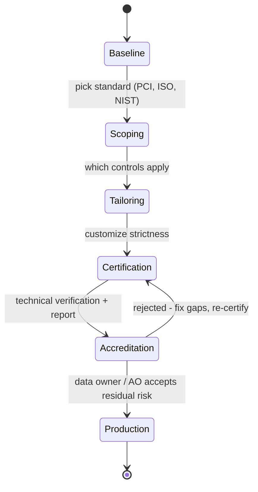

# Data Security Framework - Scoping, Tailoring, Certification, Accreditation

## Overview

Process for taking an industry standard or baseline and turning it into a working set of controls for your organization — then certifying systems built with those controls and getting management to accept them.

## Picking a Baseline

Start with an established standard. Your industry dictates which:
- **PCI DSS** — payment cards
- **ISO 27000 series** — generic ISMS
- **NIST 800-53** — federal-style but broadly usable
- **OCTAVE**, **COBIT**, **ITIL** — depending on scope

## Scoping

Deciding which parts of a standard **apply** to you. Everything else is **out of scope**.

- In scope: the controls and sections relevant to your environment
- Out of scope: controls that don't apply (e.g., cardholder controls when you don't process cards)

Think of scoping as "which chapters of the book are we reading."

## Tailoring

Customizing the in-scope controls to fit your organization. Examples:
- "Use AES-256 for all encryption" (stronger than the baseline)
- "Standard laptop baseline applies to all business units — but these 3 units handling regulated data use the hardened baseline with stricter controls"
- Adding, removing, or modifying individual control requirements

Scoping = what; Tailoring = how strict.

## Certification

Everything you do to a system **before** handing it to the data owner to put it in production. The technical side of the sign-off.

Activities include:
- Server hardening
- Risk analysis
- Vulnerability assessment / pen testing
- Audit and validation
- Documentation of controls implemented

Certification produces a **report**: what was done, how the system performs in your environment, residual risks, caveats.

## Accreditation

The **data owner (or AO — Authorizing Official)** accepts the certification and the residual risk. Management sign-off that the system is ready for production despite imperfect security (all security is imperfect).

- Must happen **before production**
- If the data owner refuses: work with them on the gaps, re-certify, re-present
- Good project management (clear scope, clear success criteria) usually prevents rejection

## Certification vs. Accreditation

| | Certification | Accreditation |
|--|---------------|---------------|
| Who | Technical team | Data owner / Authorizing Official |
| What | Technical verification | Management acceptance of residual risk |
| Nature | Objective, evidence-based | Business decision |
| Output | Report of controls + risks | Go/no-go decision |

## Exam Tips

- **Scoping** = which parts apply
- **Tailoring** = customize in-scope controls
- **Certification** = technical verification; produces evidence
- **Accreditation** = management acceptance of residual risk
- Certification is done; Accreditation decides
- Both precede production deployment

## Diagrams

### From baseline to production authorization
Each stage gates the next; accreditation can bounce a system back to re-certify.

## Related Topics

- [Security Models](../03-security-architecture-and-engineering/Security%20Models.md) — underlying models
- [Security Evaluation Criteria](../03-security-architecture-and-engineering/Security%20Evaluation%20Criteria.md) — Common Criteria, EAL
- [Standards and Frameworks](../01-security-and-risk-management/Standards%20and%20Frameworks.md)
- [Risk Management](../01-security-and-risk-management/Risk%20Management.md)
- [Security Governance](../01-security-and-risk-management/Security%20Governance.md)
