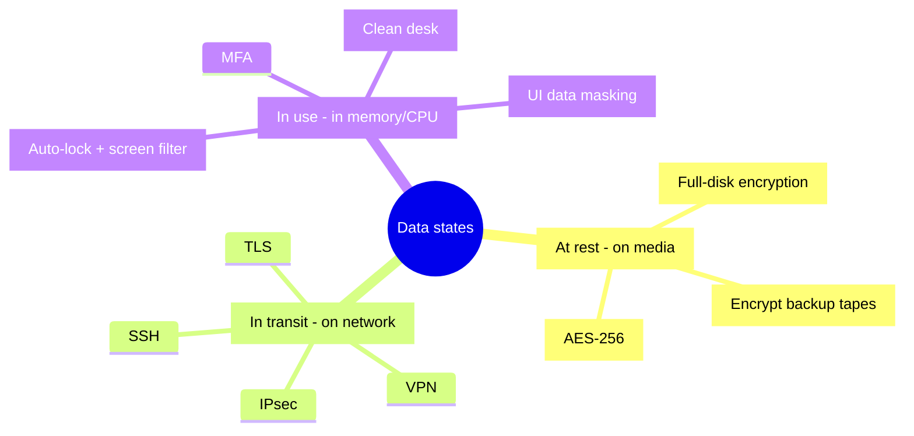
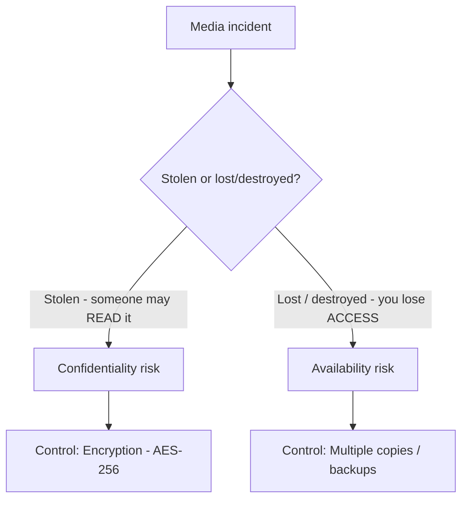

# Data States and Handling

## Overview

Data exists in three states, each requiring different protections.

## Key Concepts

### Three States of Data
| State | Description | Protection |
|-------|-------------|-----------|
| **At Rest** | Stored on media (disk, tape, CD/DVD, USB, backup) | Full-disk encryption (preferred) or at least encrypted partition; hardware or software encryption for backups |
| **In Transit** | Moving across a network | TLS/SSL, VPN, IPsec, SSH — encrypt **internal** traffic too, not just internet-bound |
| **In Use** | Being processed in memory/CPU | Can't encrypt — relies on compensating controls: clean desk, screen filters, auto-lock, MFA, print release, training |

### Data At Rest - Practical Notes

- Full-disk encryption when possible; partition-level when OS+data share a drive (bad architecture, but real)
- **Backup tapes must always be encrypted** — hardware (the tape drive encrypts as it writes, typically faster) or software (backup app encrypts). Hardware often preferred but not always best fit.
- USB/removable drives — full-disk encryption
- CDs/DVDs — rare today; encryption is weaker. Avoid for sensitive data.

#### Data tiering — match storage speed/cost to access frequency

**Data tiering** stores data on different classes of storage (fast/expensive vs slow/cheap) based on **how often it's accessed and how critical it is**.

| Tier | Storage | Data type |
|------|---------|-----------|
| **Hot** | RAM / NVMe SSD | Frequent/urgent, latency-critical |
| **Warm** | SSD / fast HDD | Occasionally accessed |
| **Cold** | HDD / cloud (e.g., S3 Infrequent Access) | Rarely accessed |
| **Archive** | Tape / Glacier | Almost never; compliance retention |

- **Driving principle:** cost-vs-performance **proportionality** applied to storage — don't pay for fast media for data that doesn't need it. Often **automated** via lifecycle policies based on access patterns.
- **Security caveat:** cold/cheap **≠ unprotected** — archived data still needs **encryption + access control** at its classification level.
- **Availability angle:** colder tiers have **slower retrieval** (e.g., Glacier can take hours) → affects **RTO**.
- Ties to the **data lifecycle** (Archive phase) and **retention policies** (cold/archive tiers hold compliance data).

### Data In Transit - Practical Notes

- Encrypt internal traffic too. Attackers inside your network (lateral movement) pick up plaintext easily.
- Milliseconds of overhead are imperceptible to users
- Choose whole-packet vs. payload-only encryption based on threat model

#### Link vs End-to-End vs Onion encryption (commonly tested)

Three ways to encrypt traffic in transit, differing in *what* gets encrypted and *who can read it along the way*:

| Approach | What's encrypted | Headers | Who sees plaintext en route |
|----------|------------------|---------|------------------------------|
| **Link encryption** | The **whole packet, including headers**; encrypted **hop-by-hop** | Encrypted on the wire | **Each node decrypts and re-encrypts** — every hop sees the plaintext briefly |
| **End-to-end (E2E)** | Encrypted **source → destination**; only the **payload** | **Stay visible** for routing | Intermediate nodes route it but **can't read the payload** |
| **Onion routing / Tor** | **Layered** — each relay peels one layer | Per-layer | **No single node knows both source and destination** → anonymity |

- **Link encryption** protects headers too (good against traffic analysis on a link) but exposes plaintext at every node — only acceptable if you trust every hop.
- **End-to-end** keeps the payload secret the whole way but leaks routing metadata (who's talking to whom).
- **Onion routing** adds **anonymity** on top of confidentiality: layered encryption means no relay sees the full path.

### Data In Use - Compensating Controls

You can't encrypt data while it's being used. Mix of admin + technical controls:

**Administrative:**
- Clean desk policy — if you leave your desk for any reason, sensitive material is locked away or shredded
- Print policy — pull-printing / card-release at the printer (send job → walk to printer → swipe card → print)
- "Don't stand behind someone working on sensitive data" policy

**Technical:**
- Screen privacy filters (view-angle protectors) — visible only from directly in front
- Auto-lock PCs after short idle (1 minute is common)
- MFA for sensitive applications
- Data masking in UI (e.g., SSN shown as XXX-XX-1234)

**Awareness tactic:** Pizza-buying ritual — first person to leave an unlocked PC has to buy pizza for the team. After two rounds of pizza, nobody forgets to lock their PC again. Awareness beats memos.

#### In-memory databases — a concrete "data in use" example

A **memory-resident / in-memory database** (Redis, SAP HANA, Memcached — data stored primarily in **RAM** for speed) is the clearest example of *why* data in use is the hardest state to protect:

- Sensitive data sits **unencrypted in RAM** while being processed — exposed via **memory dumps**, **malware reading process memory**, or a **cold-boot attack** (RAM briefly retains data after power-off; an attacker chills the chips and re-reads them to recover keys or data).
- **Disk / at-rest encryption does NOT cover it** — once decrypted into memory, the data is plaintext. You need memory protection, encryption-in-use, and access controls, not just full-disk encryption.
- RAM is also **volatile** — in-memory DB data is **lost on power-off** unless persisted (snapshots, write-ahead logs, replication). That's an availability/durability angle, separate from the confidentiality risk above.

See [Database Security](../08-software-development-security/Database%20Security.md) for the in-memory database concept and [Memory and Data Remanence](Memory%20and%20Data%20Remanence.md) for volatile vs non-volatile memory.

### Data Handling Requirements
- **Labeling/Marking** - physically or logically marking data with classification
- **Storage** - appropriate controls based on classification
- **Transmission** - encryption and secure channels for sensitive data
- **Access** - based on need-to-know and clearance level
- **Backup** - encrypted backups with same classification protection

### Scoping and Tailoring
- **Scoping** - determining which controls apply to a system
- **Tailoring** - customizing controls to fit the organization's needs

## Exam Tips

- Data **in use** is the hardest state to protect
- Encryption protects data at rest and in transit; in-use protection is emerging
- Backups must be protected to the **same level** as the original data
- Labeling is required so handlers know the appropriate protections

### Exam pairing — encrypt proprietary file-server data (at rest + in motion)

**EXAM Q:** "Best encryption for proprietary data on a **file server** (at rest) and to protect it **in motion**?" → **AES at rest, TLS in motion.**

- **AES** (symmetric, fast, strong) = the standard for **DATA AT REST** — it actually encrypts the stored files on disk.
- **TLS** = the protocol for **DATA IN MOTION / TRANSIT** — secures the data as it crosses the network.

**Distractor reasoning:**
- **"TLS at rest" is wrong** — TLS is a *transport* protocol; it secures traffic on the wire, it does not encrypt files sitting on a disk.
- **"VPN at rest" is wrong** — a VPN protects traffic *in motion*, not stored data.
- **"DES at rest" is wrong** — DES is obsolete/broken (56-bit); never the answer when AES is available.

**Rule of thumb: At rest → AES; In motion → TLS.**

### Exam pairing — stolen backup tapes → encryption (confidentiality, not availability)

**EXAM Q:** "Best additional security measure if backup **TAPES are STOLEN**?" Options: keep multiple copies / replace tapes with hard drives / use security labels / **AES-256 encryption** → **AES-256 ENCRYPTION.**

- **Why:** theft is a **CONFIDENTIALITY** risk — the worry is someone *reading* the data. Encryption makes a stolen tape **unreadable without the key**, so the theft yields nothing useful. That is the standard control for data at rest on portable media (ties to "**backup tapes must always be encrypted**" above — tapes get lost/stolen).

**Distractor reasoning:**
- **"Keep multiple copies" is wrong here** — that protects **AVAILABILITY** (you don't *lose* your data), but does **nothing** to stop a thief reading the stolen tape. Different problem. It *feels* like a backup best-practice, which is the trap.
- **"Replace tapes with hard drives" is wrong** — drives get stolen too; changing the **media type** doesn't protect the **data** on it.
- **"Use security labels" is wrong** — labels just mark sensitivity; a thief ignores the label.

**KEY DISTINCTION — match the control to the threat:**
- Media **STOLEN** → risk = **confidentiality** → **ENCRYPTION**.
- Media **LOST / DESTROYED** → risk = **availability** → **multiple copies / backups**.

## Diagrams

### Three states of data and their controls
You can encrypt data at rest and in transit; in-use relies on compensating controls.

### Match the control to the threat
Stolen media is a confidentiality problem; lost/destroyed media is an availability problem.

## Related Topics

- [Data Classification](Data%20Classification.md) - determines handling requirements
- [Cryptography](../03-security-architecture-and-engineering/Cryptography.md) - primary protection mechanism
- [Data Loss Prevention](Data%20Loss%20Prevention.md) - monitoring data in all states
- [Data Retention and Destruction](Data%20Retention%20and%20Destruction.md)
