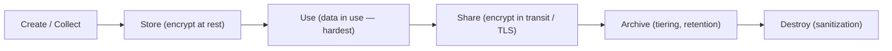

# Information Life Cycle

## Overview

The lifecycle of data in an organization — how we acquire it, use it, archive it, and dispose of it. Framework for thinking about protection at every phase.

## The Four Phases

### 1. Acquisition
Where the data comes in. Usually copied from somewhere or generated from inputs.

**Example:** A bank preparing a loan pulls credit history, formats it, adds timestamps, sets permissions, records creator. Data has PII — encrypt and store securely per policy.

Controls:
- Classify at acquisition
- Encrypt immediately if sensitive
- Apply access permissions per policy

### 2. Use
The loan officer reviews records and decides. This is **data use** (the lifecycle phase) — don't confuse with **data in use** (one of the three states of data).

Controls:
- Access control (need-to-know)
- Logging/audit
- Data in use protections — screen filters, clean desk, auto-lock

### 3. Archive
Data no longer actively used but must be retained (by policy or law). Example: loan archived 7 years after expiration per state retention rules.

**Archive vs. Backup:**
- Archive = long-term, kept just in case or by law
- Backup = point-in-time copy for restore

Controls:
- Maintain CIA (confidentiality, integrity, availability — retrievable when needed)
- Encryption still required
- Access tightly restricted

### 4. Disposal
Data no longer useful and retention has expired. Dispose securely.

Common practice: **use the highest disposal profile for everything**. Reasons:
- Nothing critical gets missed
- No confusion for staff
- Simpler audit

Disposal profile for sensitive data:
1. Overwrite (if drive writable)
2. Degauss (if magnetic)
3. Physical shred

**Not always destruction.** Sometimes data is **transferred** — e.g., a loan broker hands the record to the funding bank, and local law may require the broker to then delete it.

## EXAM Q — technique to IDENTIFY & DISPOSE of END-OF-LIFE data → TAGGING

*"What technique ensures that data which has reached END OF LIFE is IDENTIFIED and DISPOSED of?"* Options: rotation / DRM / DLP / **tagging** → **TAGGING**.

**Reasoning:** tagging data with **METADATA** — creation date, retention period, classification, owner — lets you **IDENTIFY** when data has hit its retention limit / end of life so it can be disposed on schedule. The tag is the **marker that makes expired data FINDABLE**; the retention policy then disposes of it. Identify-then-dispose only works if the data carries the dates/retention info you key off of → that marker is the tag.

> **Logic chain:** need to find EOL data for disposal → it must be labeled/tagged with creation date + retention period → **tagging**.

**Connects to:**
- **Metadata-based discovery** — tags *are* the metadata you search to locate data; same mechanism that powers metadata-based discovery and label-driven DLP enforcement.
- **Data retention / lifecycle** — tags carry the retention info that **triggers disposal** at the Disposal phase above.

**Distractors (why each fails):**
- **Rotation** = media/backup rotation (reuse tapes in a cycle) or key rotation — about reuse/cycling, **not EOL identification**.
- **DRM** = usage control of content (limit copy/print/forward) — **not disposal**.
- **DLP** = exfiltration prevention (stop data leaving) — **not retention/disposal of expired data**.

## Data Maintenance & Scrubbing

**Data MAINTENANCE** = the ongoing organizing, updating, and **SCRUBBING** of data during its useful life to keep it correct and relevant.

**DATA SCRUBBING = cleaning data:** removing outdated, duplicate, or no-longer-needed information to keep it accurate and relevant (the data-quality / **cleansing** sense). Other meanings of "scrub data" exist — **sanitizing** sensitive PII before sharing; storage/RAID **integrity scrub** against bit rot — but in the **lifecycle context, scrubbing = data cleansing**, and cleaning/scrubbing is therefore a **maintenance** activity.

### EXAM Q — scrubbing data to eliminate info no longer needed → which lifecycle step?

*"Ben scrubs data to eliminate information that is no longer needed — which lifecycle step is this?"* Options: data retention / **data maintenance** / data remanence / data collection → **DATA MAINTENANCE**.

**Reasoning:** data maintenance is the ongoing organizing, updating, and **scrubbing** of data during its useful life to keep it correct/relevant. Scrubbing/cleaning **is** maintenance.

**Distractor reasoning (why each fails):**
- **Data retention** = KEEPING data for a period — that's holding it, not cleaning it.
- **Data remanence** = NOT a lifecycle step at all — it's **residual leftover data after deletion** (a *risk/problem*). "Scrubbing" *sounds* related to "remanence," but remanence is the problem of data **not being gone**, not a phase.
- **Data collection** = acquiring data (the FIRST step) — the opposite end of the lifecycle from cleaning data you already hold.

## First Step — Collection / Creation

The **first step of the data lifecycle is collection/creation** (the Acquisition phase above). You can't classify, label, store, analyze, or share data that doesn't exist yet — so it must come into existence (be created or collected) first.

The cloud-flavored phase model states this explicitly: **Create/Collect → Store → Use → Share → Archive → Destroy**. The four-phase model here folds Create/Store into **Acquisition** and Share into **Use**, but the principle is identical: nothing happens until the data exists.

**Distractor reasoning (why these aren't the first step):**
- **Labeling/classification** comes AFTER collection — you label and classify once you actually have the data.
- **Policy** is the governing framework around the *entire* lifecycle, not a step within it.
- **Analysis** is part of the **Use** phase (later) — you analyze data you already hold.

**Memory hook:** you must HAVE the data first → collection/creation is always step one.

## Exam Tips

- First step of the lifecycle = **collect/create** (you can't manage data that doesn't exist yet)
- Know the four phases: acquire → use → archive → dispose
- Archive ≠ backup
- "Data use" (lifecycle) vs. "data in use" (state) — different terms
- Disposal must match the original data's protection level
- Keep data as long as needed OR legally required, whichever is greater — unless a privacy law caps retention

## Diagrams

### Data Lifecycle

**Takeaway:** First step = Create/Collect; each stage has its own controls; ends in secure Destroy.

## Related Topics

- [Data States and Handling](Data%20States%20and%20Handling.md) — the three states of data
- [Data Classification](Data%20Classification.md)
- [Data Retention and Destruction](Data%20Retention%20and%20Destruction.md)
- [Data Ownership and Roles](Data%20Ownership%20and%20Roles.md)
