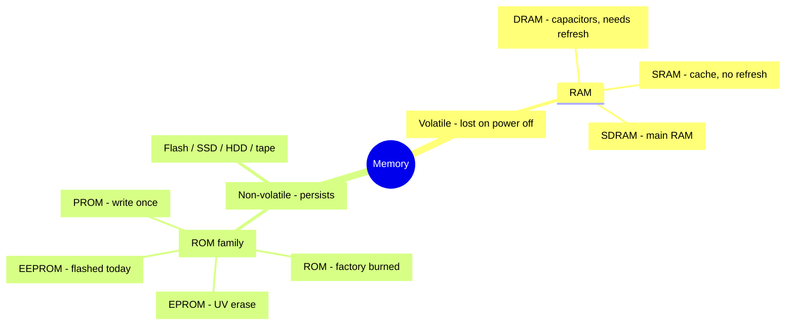
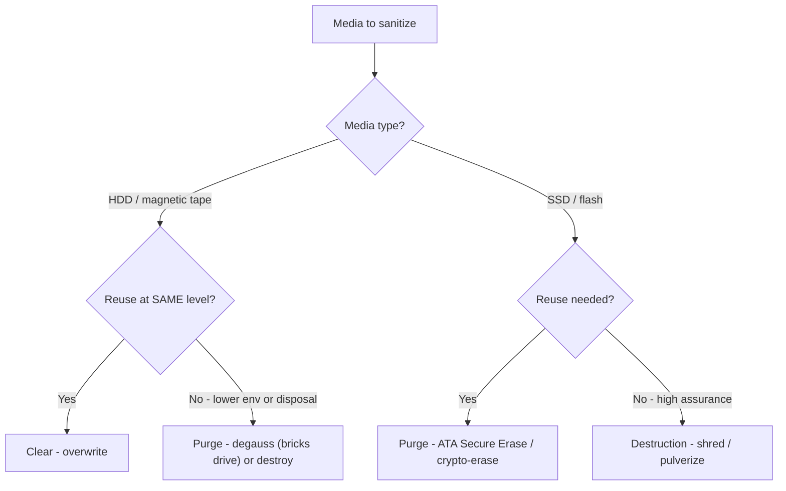

# Memory and Data Remanence

## Overview

Data remanence = what remains on a storage medium after normal deletion. Memory types differ in how — and whether — data persists. On the exam you won't see direct "what is SRAM?" questions, but keywords like **volatile**, **non-volatile**, **flashed**, **programmable** will steer you to the right answer.

## Bits and Memory

All data is 0s and 1s. Memory stores those bits. Systems use **multiple types** of memory with a trade-off between speed and cost — generally, closer to the CPU = faster + more expensive.

- **L1 cache** — on the CPU die itself
- **L2 cache** — directly attached
- Main memory (RAM)
- Storage (disk, SSD, tape)

## Volatile vs. Non-Volatile

| | Volatile | Non-Volatile |
|--|----------|--------------|
| **Keeps data on power loss?** | No | Yes |
| **Examples** | RAM (SRAM, DRAM) | ROM, Flash, SSD, HDD, tape |

## ROM Family (Non-Volatile)

Progression over time — each type loosened the "read-only" part:

| Type | Writable | How |
|------|----------|-----|
| **ROM** (Read-Only Memory) | Never | Burned at factory |
| **PROM** (Programmable ROM) | Once | Programmed after manufacture, then read-only |
| **EPROM** (Erasable PROM) | Multiple times | Erased by UV light through a window on the chip |
| **EEPROM** (Electrically Erasable PROM) | Many times | Erased/written electrically; used to flash BIOS, firmware |

Modern BIOS / firmware uses EEPROM (or NOR flash). Convenience: easy to update. Risk: attackers who can flash firmware can install persistent malware that runs before the OS.

**PLD (Programmable Logic Device):** any chip programmable after leaving the factory. Uses EPROM/EEPROM/flash — never PROM (that's one-time).

## RAM Family (Volatile)

| Type | Speed | Cost | How it stores | Refresh needed? | Where you find it |
|------|-------|------|--------------|-----------------|-------------------|
| **SRAM** (Static) | Fastest | Most expensive | Flip-flops / latches | No — keeps data until overwritten or power lost | CPU cache, GPU on-die memory |
| **DRAM** (Dynamic) | Slower | Cheaper | Capacitors | Yes — must be refreshed continually (on the order of every ~64 ms) | Embedded memory on cards |
| **SDRAM** (Synchronous DRAM) | Synced to clock | — | Capacitors | Yes | Main system RAM (DDR3/4/5 sticks) |

## Firmware

Low-level OS that runs on hardware (PC BIOS, router, switch). Stored on non-volatile memory (EEPROM today). Launches the higher-level OS. Small, critical, must survive power-off.

## Flash Memory

Used for USB drives, SD cards, SSDs, firmware storage. Technically EEPROM. Keeps data without power; wears out over many write cycles.

## SSDs

Combination of **EEPROM** (non-volatile storage cells) + **DRAM** (cache / controller). They're fast and durable but have two destruction implications:
- **Overwriting is unreliable** — wear leveling moves data around behind your back
- Use **ATA Secure Erase** if the drive is functional
- Use **physical destruction** (shredding) if it isn't

## Data Remanence Countermeasures

- **Clearing (Overwriting)** — write patterns (e.g., DoD 5220.22-M). Defeats software-based recovery. Unreliable on SSDs.
- **Purging (Degaussing)** — strong magnetic field. Destroys magnetic media data and often the media itself. **Doesn't work on SSDs** (no magnetic state).
- **Crypto-shredding** — if encrypted, destroy the key. Data becomes permanently unrecoverable. Preferred for cloud/SSD.
- **Physical destruction** — shred, incinerate, pulverize. Always works, never recoverable.

## Remanence at the Mechanism Level — how each method attacks the remnants

> For the *strength ordering* (clearing < purging < destruction) and the **same-vs-lower environment discriminator** (where the media goes next), see [Data Retention and Destruction](Data%20Retention%20and%20Destruction.md). The notes below go to the MECHANISM level — *how* each method physically attacks the remnants.

### Why "delete" isn't enough — the POINTER problem

Deleting a file removes only the **pointer / index entry** that tells the filesystem where the file lives. The actual **bits stay on the platter/cells untouched** — that leftover is **data remanence**, fully recoverable with undelete/forensic tools.

> **Library analogy:** delete = removing the card-catalog entry for a book. The book is still sitting on the shelf — anyone who walks the aisles finds it. To truly get rid of it you have to deal with the book itself, not just the catalog.

### The "remnant ladder" — how each method attacks remanence

Think of it as *how deep you scrub the remnants*: pointer only → overwrite the surface → scramble the physical layer → obliterate the object.

| Method | What it does mechanically | Defeats | Remnant depth reached |
|--------|---------------------------|---------|-----------------------|
| **Erase / Delete** | Removes the pointer/index entry only; bits remain | Nothing — undelete tools recover it | Pointer only (not secure) |
| **Clearing** | **OVERWRITES** storage with new data (zeros/random) via **normal system functions** (logical layer) | Standard / "keyboard" recovery (undelete + forensic software) | Logical surface — does NOT defeat advanced lab tools reading faint physical remnants |
| **Purging** | More intensive — **multiple overwrite passes**, firmware-level **SECURE-ERASE** commands, or **DEGAUSSING**; reaches PHYSICAL-level remnants | Laboratory / advanced attacks | Physical layer |
| **Destruction** | Physically **shred / crush / incinerate / pulverize / melt** the media | Everything — nothing left to read | The object itself |

### Degaussing — mechanics + the key gotchas

- **What it does:** a powerful magnetic field scrambles **ALL magnetism** on the platter — your data **AND** the factory-written **SERVO TRACKS** (the magnetic reference/lane-markings the read/write head uses to position itself).
- **Therefore it BRICKS the HDD:** with the servo tracks gone the head can't navigate the platter, so degaussing **permanently destroys the drive as a functional device** — a **one-way, destructive** operation. The drive **CANNOT be reused** afterward.
  - This is why degaussing counts as a **purge/destruction** method, not a reuse-friendly one. (Ties to the Megan "reuse at SAME level" example in [Data Retention and Destruction](Data%20Retention%20and%20Destruction.md) — degaussing would defeat the reuse goal; clearing is what you want there.)
- **Does NOTHING to SSDs / flash.** They store data as **electrical charge** in cells, not magnetism — there's no magnetic state for the field to scramble. Classic exam gotcha: *"admin degausses an SSD"* → the **data survives intact**.

**Media-type table:**

| Media | Stores data as | Degaussing? |
|-------|----------------|-------------|
| **HDD / magnetic tape** | Magnetism | Works — but **destroys the drive** (servo tracks gone) |
| **SSD / flash (USB, SD)** | Electrical charge | **Useless** — no magnetism. Use built-in secure-erase / crypto-erase, or destroy |

### SSD-specific sanitization

- **Overwriting is UNRELIABLE on SSDs** because of **WEAR-LEVELING** — the controller spreads writes across cells and keeps **spare cells** that the overwrite can't reach, so old data hides in cells your overwrite never touches.
- Sanitize SSDs via the drive's **built-in SECURE ERASE** (ATA Secure Erase) or **CRYPTOGRAPHIC ERASE**, or by **physical destruction**.

### Crypto-shredding (cryptographic erase)

If the **whole drive/volume is encrypted**, you sanitize it by **destroying the key** → all data instantly unrecoverable (ciphertext with no key is noise). Fast modern **purge** method, especially for **SSDs and cloud** storage where you can't physically reach or degauss the media.

### Bad sectors & spare sectors — the hidden remanence trap

**Definitions:**
- **Bad sector / bad block** = a physical area of the drive that has gone faulty and can **no longer reliably store data**; the drive **stops using it**.
- **Spare sector / spare area (over-provisioning)** = **reserve storage the drive keeps hidden** specifically to **REPLACE** bad sectors. When a sector goes bad, firmware **REMAPS** the data to a spare sector **invisibly** (the OS never sees the swap).

> **Theater reserve-seat analogy:** a seat breaks, so the usher ropes it off and moves you to a **reserve seat** held in back. You're fine in your new seat — but **anything you left on the broken seat stays there**, behind the rope, where you can't reach it. The remapped bad sector is that roped-off seat: still holding your original data, just no longer addressable.

**What HDDs and SSDs have in COMMON here:**
- Both keep **spare/reserve areas** and both **REMAP bad sectors via firmware**.
- Both therefore create a **DATA REMANENCE problem**: the remapped (bad) sector **still physically holds the original data**, and **normal OVERWRITING CAN'T REACH IT** because the **OS no longer addresses that sector**. It's invisible to clearing — but **lab-recoverable**.
- So both **defeat simple "clearing."**
- **Security punchline:** overwriting only hits **OS-addressable** sectors; any data sitting in **remapped/spare areas survives**. This is a core reason **purging and physical destruction exist** — clearing alone can't guarantee it's gone.

**HDD vs SSD — the differentiators:**

| Dimension | HDD | SSD |
|-----------|-----|-----|
| **Why sectors go bad** | Physical wear / head crash / magnetic degradation | **Limited write cycles** — cells wear out after N writes |
| **Remap frequency** | **Occasionally**, on actual failure (sector reallocation / **G-list**) | **CONSTANTLY** via **WEAR-LEVELING** — data moved on **every write** to spread wear |
| **Spare area size** | Small | **Large** (over-provisioning ~**7–28%**) |
| **Remanence severity** | **Moderate** — some data trapped in reallocated sectors | **Severe** — wear-leveling scatters **multiple stale copies** across cells incl. spares the OS can't touch |
| **Overwriting** | **Mostly works** (but misses remapped sectors) | **Unreliable** — wear-leveling prevents overwrites hitting the original cells |
| **Degaussing** | **Yes** — but destroys the drive | **No** — not magnetic |
| **Correct sanitization** | **Clear** (overwrite) for same-level reuse; **degauss/destroy** to purge | Firmware **SECURE-ERASE** (reaches all cells incl. spares) or **CRYPTO-ERASE**; **destroy** for high assurance |

> **KEY INSIGHT:** SSDs make the spare-sector remanence problem **MUCH worse** than HDDs — **constant wear-leveling + large over-provisioning** mean lots of stale copies hide in cells the OS can't address. So **overwriting can't reliably erase an SSD** → use **firmware secure-erase** or **crypto-shred** (or destroy for high assurance).

### EXAM Q — spare/bad sectors + SSD over-provisioning common issue

**Q:** "What issue is common to spare sectors and bad sectors on HDDs, as well as over-provisioning space on modern SSDs?"
**A:** **They may not be cleared, resulting in data remanence.**

**The close-pair discrimination (the teaching point):** the tempting wrong answer is *"they are **not addressable**, resulting in data remanence."* Both options end in remanence — you must pick on precision:

- **"Not addressable"** names the CAUSE/mechanism but is **imprecise as a blanket claim** — bad sectors **WERE** addressable before remapping; spare/over-provisioned cells **BECOME** addressable when firmware uses them. So the absolute "are not addressable" **overstates**.
- **"May not be cleared → data remanence"** is the precise **SECURITY ISSUE** — the hedged **"may"** is correct; standard clearing/overwrite can't reliably reach these areas → remanence (that's the literal definition).
- **Rule:** on a close pair, pick the answer naming the precise security **ISSUE** ("can't be cleared → remanence") over the one naming the underlying **MECHANISM** ("not addressable") — especially when the mechanism option uses an **overstated absolute**.
- **Dead distractors:** *"can be used to hide data"* (that's anti-forensics, not the common sanitization issue); *"can only be degaussed"* (false — SSD over-provisioning is flash, can't be degaussed).

## Exam Tips

- Volatile = loses data on power loss (RAM)
- Non-volatile = keeps data (ROM, Flash, SSD, HDD)
- EEPROM is what gets "flashed" today
- SSD = EEPROM + DRAM; don't rely on overwrite — use secure erase or destroy
- Degaussing is useless on SSDs
- Crypto erase is the preferred cloud/SSD method
- Keywords: grave → TopSecret; flashed → EEPROM; volatile → RAM

## Diagrams

### Memory taxonomy
Volatile loses data on power-off; non-volatile persists. Keyword "flashed" points to EEPROM.

### Sanitization decision tree
Pick the method by media type and whether the media will be reused.

## Related Topics

- [Data Retention and Destruction](Data%20Retention%20and%20Destruction.md)
- [Data States and Handling](Data%20States%20and%20Handling.md)
- [Physical Security](../03-security-architecture-and-engineering/Physical%20Security.md) — TEMPEST, media handling
