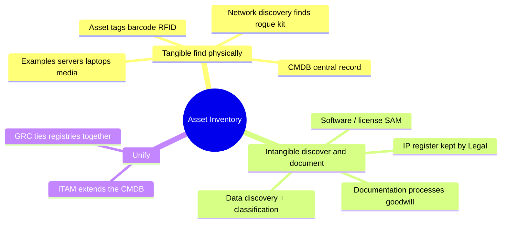

# Asset Tracking and Hardware Hardening

## Asset Tracking

If you don't know what you have, you can't protect it.

### What to Track
- Serial number
- Model number
- Internal asset number (company-assigned)
- Assigned user / location
- Issue date
- Patch/config status
- Tech refresh cycle (e.g., 4 years for laptops)

### Why It Matters
Stolen laptop scenario:
1. Bob reports his laptop stolen
2. Look up Bob in asset tracker → serial number
3. Send remote wipe command to that specific device
4. Device wipes itself next time it's online
5. Issue Bob a new laptop, restore from backup

Without asset tracking — which device do you wipe?

### Inventory for Procurement
Alerts when:
- Only N laptops left to issue
- Only N spare hard drives left
Enables proactive procurement.

## Building the Inventory — Tangible vs Intangible Assets

"You can't protect what you don't know you have" applies to **both** asset types — but you build the two inventories with **different methods**, because one is physical and one isn't.

### Tangible Asset Inventory (hardware, media, facilities)

Physical, network-visible, barcodeable — the **easier** inventory to build.

- **Asset tagging** — barcode / RFID / asset-number tags on each item, recording serial, model, owner, location (the "What to Track" list above).
- **Automated discovery** — network-scanning tools find every connected device; also **surfaces unauthorized/rogue hardware** that nobody tagged.
- **CMDB** (Configuration Management Database) — central record of hardware + configuration.
- **Procurement / receiving records** + **MDM / endpoint management** — captures assets as they enter the org and as they're managed.

### Intangible Asset Inventory (data, IP, software/licenses, reputation/goodwill, processes)

No physical form to tag — the **harder** inventory. You can't barcode data; you **discover** and **record** it.

- **Data discovery / scanning tools** — find *where data lives* via content + metadata scanning (see [data discovery](../02-asset-security/Data%20Loss%20Prevention.md)). You can't tag data, so you scan for it.
- **Data classification** — once found, track it by **sensitivity** (see [Data Classification](../02-asset-security/Data%20Classification.md)).
- **Software / license inventory** — license-management tools tracking **entitlement and compliance** (over-/under-licensing).
- **IP registers** — documented **patents, trademarks, copyrights, trade secrets** (see [Intellectual Property](../01-security-and-risk-management/Intellectual%20Property.md)).
- **Documentation** — for the truly intangible (processes, know-how, brand/goodwill) there's **nothing to scan** — you record it manually.

### Key Difference

| | Tangible | Intangible |
|---|---|---|
| Build it by | **Asset tags + network discovery** | **Data discovery + classification + documentation** |
| Why | Physical / network-visible | No physical form — must be **discovered & recorded** |
| Examples | Servers, laptops, media, facilities | Data, IP, software/licenses, goodwill, processes |

**Unifying principle:** *you can't protect what you don't know you have* — for **tangible** assets you find them physically/on the network; for **intangible** assets you **discover and document** them.

### Centralizing intangible asset management (the CMDB-equivalents)

There is **NO single universal "intangible CMDB."** Tangible/IT config items centralize neatly in a **CMDB** because they're **discrete and network-discoverable**. Intangible assets have no such common form, so they centralize into **category-specific registries** instead:

- **Data → a data catalog / data inventory / data map** — fed by **data discovery + classification** (above). The privacy-specific version is the **RoPA (Record of Processing Activities)** under GDPR. *(Tools e.g. Collibra / Microsoft Purview — but CISSP is vendor-neutral; know the **concept**, not the product.)*
- **Software & licenses → SAM (Software Asset Management) / license management** — tracks installed software + **entitlements/compliance**; often **integrated WITH the CMDB**.
- **IP (patents/trademarks/trade secrets) → an IP register** — maintained by **Legal**.
- **Contracts → a contract management system.**
- **Reputation / goodwill →** not systematized — **brand monitoring** / an accounting concept.

**Unification:** **ITAM (IT Asset Management)** platforms increasingly **extend the CMDB** to cover software/licenses/data; **data-governance** platforms centralize the data side; **GRC** platforms tie the registries together for governance/audit.

**Summary:** **Tangible → CMDB** (discrete/discoverable). **Intangible → category registries:** data catalog (data) + SAM/license tools (software) + IP/contract registers (legal), increasingly unified under **ITAM / data-governance / GRC** = the intangible counterpart to the CMDB.

> **CISSP note:** the exam cares that you **inventory both tangible + intangible**; it won't quiz specific vendor tools. The concept: intangibles need **discovery + their own registries** because you can't barcode data/IP.

## Hardware Hardening

Every piece of hardware, out of the box, is wide open. Before production deployment:
- Apply all patches
- Remove/disable default user accounts
- Change all default passwords
- Close unused ports
- Stop unneeded services
- Remove bloatware (for workstations)

### Automate Everything

Hardening by human checklist → something gets missed eventually. Hardening by script/automation → consistent 100% every time. **Automate hardening wherever possible.**

### Enforcing a Windows Baseline — Group Policy (GPO)

**EXAM Q:** Chris built a security baseline for the org's Windows PCs. What is the MOST EFFECTIVE way to ensure the workstations actually comply — settings set *and* kept set/checked? → **Microsoft Group Policy (GPO).**

**Why GPO:**
- **Centralized enforcement** — push the baseline to *all* domain-joined Windows PCs from one place (no touching each box).
- **Automatic reapplication / refresh** — GPO reapplies periodically (and at login/startup), which **corrects configuration DRIFT**: if a setting gets changed away from the baseline, the next refresh resets it back. This is the "ensure settings *stay* set" part.
- **Consistent + scalable** across every workstation.
- GPO both **APPLIES** the baseline and **continuously ENFORCES/verifies** it.

**Distractors:**
- *Assign users to spot-check* — manual, unreliable, doesn't scale; spot-checking ≠ enforcement.
- *Startup scripts* — **can** apply settings but run **only at startup** (no continuous refresh, no ongoing drift correction) and are less manageable than GPO.
- *Periodically review the baseline with the data owner* — that's **governance/review**, not technical enforcement on the workstations.

**Key distinction:** the question asks for technical **ENFORCEMENT + DRIFT CORRECTION at scale on Windows** → GPO. Trigger: "**enforce + auto-correct a Windows baseline across many PCs**" → **Group Policy**.

#### Prerequisite + non-domain fallback

**PREREQUISITE — domain-joined:** GPO only works on workstations that are **DOMAIN-JOINED** (members of an Active Directory domain). GPO is an **AD mechanism** — it can't reach a machine that isn't joined to the domain. The exam **implies a managed enterprise** (the org's workstations + a baseline = domain-joined by convention), so GPO is the intended answer.

**Why "startup script" is NOT the non-domain fallback (trap):** **centralized** startup-script deployment **also normally relies on GPO/AD** (Group Policy "Startup Scripts" setting). So if the machines aren't domain-joined, startup scripts break for the **same reason** GPO does. The only domain-free way to use a startup script is **per-machine local config** — which doesn't scale and still runs **only at startup** (no continuous drift correction). Startup script never wins here.

**The real non-domain fallback = MDM:** Microsoft **Intune** (MDM) pushes config baselines **over the internet** to **Azure AD-joined / remote / non-domain** devices — no AD needed. (**SCCM / Endpoint Configuration Manager** for mixed or more detailed config.)

**Verify domain membership in practice:** `systeminfo` (Domain field), `whoami /fqdn`, or check Domain vs Workgroup — but **for the exam, assume domain-joined**.

| Device situation | Baseline-enforcement tool |
|---|---|
| **Domain-joined** (AD member) | **GPO** |
| **Azure AD-joined / cloud / remote / non-domain** | **Intune (MDM)** |
| **Standalone / unmanaged** | Local config (doesn't scale) |

## What Gets Hardened?

Everything that connects:
- Servers
- Workstations
- Wireless access points
- Routers, switches, firewalls
- **IoT devices** — smart TVs, smart thermostats, smart locks, smart speakers. Most forgotten; most often on the default corporate network. Harden + patch + segment to an IoT VLAN.

## Patching

- Test in non-production first
- Push to production after validation
- Use proper change management + configuration management
- **Everything** patchable gets patched

## Planned Obsolescence & Asset Lifecycle (EOL / EOS)

**Planned obsolescence** = a strategy where a product is deliberately designed with a **limited useful lifespan** — built to wear out, become outdated, or lose vendor support after a set time — forcing replacement/upgrade.

**Why it's a security problem:** planned obsolescence drives products toward **End of Life / End of Support**. Once a vendor **ends support**, the product stops receiving **security patches** → newly discovered vulnerabilities **never get fixed**. Running unsupported/**legacy** systems = a growing, **unpatchable attack surface** (e.g., end-of-life Windows still running in production).

### Lifecycle Terms

| Term | Meaning | Security note |
|---|---|---|
| **EOL** (End of Life) | Vendor stops **selling/producing** the product | Signals the clock is ticking toward EOS |
| **EOS** (End of Support/Service) | Vendor stops **patching/supporting** it | **The security-critical date** — no more patches |
| **Legacy** | Old system **still in use**, often past EOS | Hard to secure; can't be patched against new vulns |

> ⚠️ Watch the abbreviation **EOS**: usually **End of Support** (no patches), but can also mean **End of Sale**. The patch-stopping date is the one that matters for security.

### Asset Lifecycle Management

Tie EOL/EOS dates into asset tracking (the **tech refresh cycle** above). **Track EOL/EOS dates and plan replacement BEFORE support ends** — retire/replace systems before they go unsupported, not after a vulnerability is already exploitable.

**Takeaway:** planned obsolescence pushes hardware/software toward EOL/EOS; unsupported systems can't be patched → **manage the lifecycle and retire/replace before support ends.**

### Manufacturer Product Lifecycle — order of events

First → last:

1. **General Availability (GA)** — product released and available for sale. *(First event.)*
2. **End of Sale (End of Sales)** — vendor stops selling it; can't buy it new.
3. **End of Life (EOL)** — product officially retired/discontinued.
4. **End of Support (EOS / EOSL)** — vendor stops **all support and patches**. *(**Last event** — and the security-critical one.)*

Even after End of Sale and EOL, vendors usually keep **patching** existing customers for a grace period — **End of Support** is the final cutoff where even that stops, turning the product into an **unpatchable attack surface**. Mnemonic: **GA → can't buy it → discontinued → truly dead (no patches).**

> ⚠️ Terminology varies by vendor — some use "EOL" loosely for the whole retirement. The date that matters for **security is End of Support** (no more patches). Plan replacement *before* End of Support, not End of Sale.

## Asset Retention

**Asset retention** = managing **how long assets (hardware, software, AND data) are kept** — balancing the operational need to retain them against the **security and cost risks** of holding outdated, unsupported, or unnecessary assets. A **lifecycle discipline**, not "keep everything forever."

**What it covers:**
- **Retention/lifecycle policy** — how long each asset type is kept and **when to retire it** (tied to EOL/EOS above).
- **Retain only the *right* assets** — keep them as long as **needed AND supported**, no longer.
- **Retain knowledge/documentation** — inventory, configs, licenses, ownership — so assets don't become **orphaned/unmanaged** ("nobody knows what this server does").

**Security risks of poor asset retention:**
- Keeping **EOL/EOS assets** → unsupported = **no patches = unpatchable vulnerabilities** (legacy risk).
- Retaining **longer than needed** → larger **attack surface** + cost.
- Losing **documentation/knowledge** (e.g., staff turnover) → assets become **unmanaged/untracked** — *you can't protect what you forgot you have.*

**The balance:** retain **long enough** for operational/legal needs, but **not so long** that you run unsupported, unpatchable, or forgotten systems.

> Asset retention is the **asset-side cousin of [data retention](../02-asset-security/Data%20Retention%20and%20Destruction.md)** — same "don't keep what you don't need" principle, plus the **EOL/EOS unpatchable-legacy** risk.

## USB Ports

Another hardening target:
- Disable where not needed (server, switch, router)
- Where needed (workstation with USB keyboard/mouse), limit what the port can do — e.g., block mass storage, enable only HID devices
- Lockdown can be physical (disable on motherboard), software-level (Windows services / AD policies), or both
- Logical lockdown is harder to bypass than physical

## Exam Tips

- Without asset tracking, you can't secure what you have
- Hardening is a required step before production
- **Automate** — humans miss steps
- Everything connects → everything needs hardening (including IoT)
- USB ports are a common forgotten hardening target

## Diagrams

### Tangible vs Intangible Inventory — Mindmap

> You can't protect what you don't know you have — but you build the two inventories differently.

**Takeaway:** Tangible = tag + network-discover (CMDB); intangible = discover + document into category registries (no universal "intangible CMDB").

## Related Topics

- [Secure Design Principles](Secure%20Design%20Principles.md)
- [IoT Security](IoT%20Security.md)
- [Change and Configuration Management](../07-security-operations/Change%20and%20Configuration%20Management.md)
