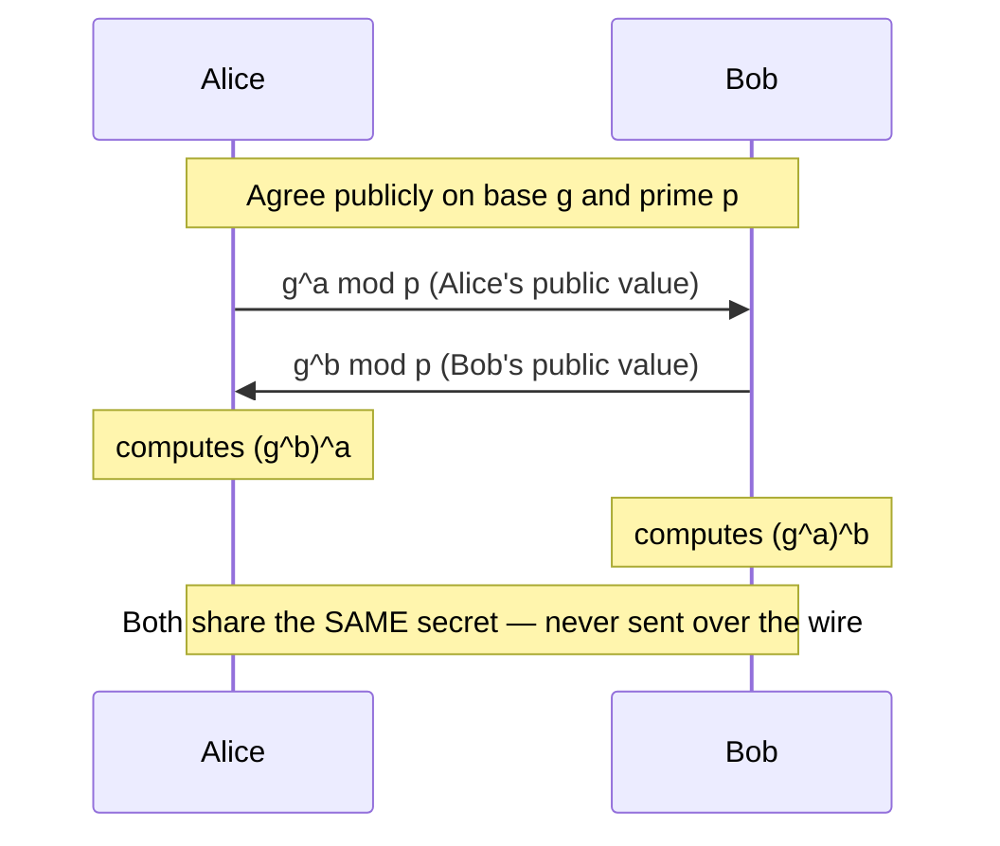

# Asymmetric Encryption - Detail

## Overview

Two mathematically related keys per user — **public** + **private**. Solves the pre-shared key problem but is slower than symmetric.

### Key Properties
- Per user: 2 keys (public + private)
- Total keys for n users: `2n`
- Slower, weaker per bit than symmetric
- Encrypt with one key → decrypt with the other

### Use Cases
- **Confidentiality:** encrypt with recipient's **public** key; only they decrypt with their **private** key
- **Authenticity + Non-repudiation** (digital signature): sign with sender's **private** key; anyone verifies with **public** key
- **All three** (C + A + NR): sign with your private, then encrypt with recipient's public (nested)

## Six Types You Should Know

### RSA (1977 — Rivest, Shamir, Adleman)
- Based on **prime factorization**
- Most commonly used asymmetric algorithm
- Mostly used to exchange symmetric keys (hybrid encryption)
- Was patented 1977-1997 (public domain now)
- Key sizes: 1024-4096 bits; considered secure

### Diffie-Hellman (1976)
- First publicly known asymmetric algorithm
- Based on discrete logarithms
- **Key exchange only** — does not encrypt data itself
- Allows two parties to agree on a shared secret over an insecure channel

### ECC - Elliptic Curve Cryptography
- Discrete log on elliptic curves
- **Much stronger per bit** — 256-bit ECC ≈ 3072-bit RSA
- **Lower power consumption** — popular on mobile, IoT, low-power devices
- Patented (pay to use) but widely deployed

### ElGamal
- Public-key system based on Diffie-Hellman
- Used in free GNU Privacy Guard and recent versions of PGP
- Asymmetric (unlike DH which is only key exchange)

### DSA - Digital Signature Algorithm
- Different algorithm from RSA but same security level
- Two-phase key generation:
  1. Choose parameters shared among system users
  2. Compute each user's public/private keys
- Used for signing, not general-purpose encryption

### Knapsack (Merkle-Hellman)
- One-way system; public key encrypts, private decrypts
- Provides **confidentiality only** (not non-repudiation or authenticity)
- **No longer secure** — don't use

## Prime Factorization vs. Discrete Log (one-way functions)

Both are **easy forward, hard backward**:
- `1373 × 8081 = 11,095,213` — easy to compute
- Given `11,095,213`, find the two prime factors — much harder

### Real-World Key Size
RSA-704 (704-bit) was broken. The two prime factors are each ~100+ digits long. You can see how much bigger 4096-bit keys would be.

## PKI (Public Key Infrastructure)

Infrastructure managing digital certificates. Covered in [Digital Signatures and PKI](Digital%20Signatures%20and%20PKI.md).

## Exam Tips

- 6 types: RSA, DSA, ElGamal, Knapsack, Diffie-Hellman, ECC
- Diffie-Hellman = **key exchange only**
- Knapsack = broken, do not use
- ECC = stronger per bit; lower power
- RSA = most common; based on prime factorization
- DSA = signatures only
- Encryption key selection: recipient's public (for confidentiality); your private (for signature)
- If it's NOT one of these 6, assume symmetric

## Diagrams

### Diffie-Hellman Key Exchange — Sequence

**Takeaway:** DH lets two parties derive a shared secret over an insecure channel without ever transmitting it.

## Related Topics

- [Cryptography](Cryptography.md)
- [Symmetric Encryption Detail](Symmetric%20Encryption%20Detail.md)
- [Digital Signatures and PKI](Digital%20Signatures%20and%20PKI.md)
- [Hashing Detail](Hashing%20Detail.md)
