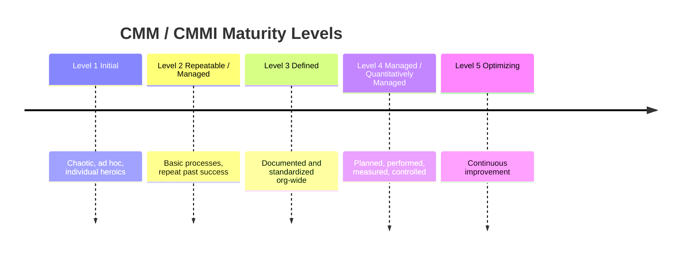

# CMM / CMMI Levels

## Overview

Capability Maturity Model (CMM) and its successor Capability Maturity Model Integration (CMMI) — five maturity levels measuring how disciplined an organization's processes are. CISSP tests precise level descriptions; the "planned, performed, measured, controlled" phrase is a classic distractor that maps to exactly one level.

## The Five Levels

### Level 1 — Initial
- **Chaotic, ad hoc**
- Processes are undocumented and unpredictable
- Success depends on individual heroics
- **Trigger phrase:** "chaotic" / "ad hoc" / "individual effort"

### Level 2 — Repeatable (CMM) / Managed (CMMI)
- **Basic processes established**
- Past successes can be repeated for similar projects
- Project-level discipline
- **Trigger phrase:** "basic processes" / "repeat past successes"
- **Note:** CMMI renamed this to "Managed" — be careful, "Managed" means something different in CMMI Level 4

### Level 3 — Defined
- **Processes documented and standardized** across the organization
- All projects use a tailored version of the standard process
- Organizational consistency, not just per-project
- **Trigger phrase:** "documented and standardized"

### Level 4 — Managed (CMM) / Quantitatively Managed (CMMI)
- **Planned, performed, measured, and controlled**
- Processes are measured using quantitative metrics
- Performance is statistically managed
- **Trigger phrase:** "planned, performed, measured, controlled" ← MEMORIZE THIS EXACT PHRASE
- **On the exam:** this exact phrase maps to Managed (Level 4) — don't let the CMM/CMMI naming swap talk you out of it

### Level 5 — Optimizing
- **Continuous improvement**
- Process improvements driven by quantitative feedback
- Innovation and technology insertion
- **Trigger phrase:** "continuous improvement" / "optimizing"

## Quick Trigger Map

| Question phrase | Level |
|---|---|
| "Chaotic, ad hoc" | 1 Initial |
| "Basic processes, can repeat past success" | 2 Repeatable / Managed (CMMI) |
| "Documented and standardized" | 3 Defined |
| **"Planned, performed, measured, and controlled"** | **4 Managed** |
| "Continuous improvement" | 5 Optimizing |

## CMM vs CMMI Naming Confusion

This is a real source of confusion in CISSP questions:

| Level | CMM (original) | CMMI |
|---|---|---|
| 1 | Initial | Initial |
| 2 | Repeatable | **Managed** |
| 3 | Defined | Defined |
| 4 | **Managed** | Quantitatively Managed |
| 5 | Optimizing | Optimizing |

**Trap:** "Managed" could be Level 2 (CMMI) or Level 4 (CMM). Use the description phrase, not just the label, to disambiguate. The phrase "planned, performed, measured, controlled" only maps to Level 4 (regardless of naming).

## Process-Maturity vs Risk-Maturity

**CMM / SW-CMM / CMMI are process-maturity models** — they rate how disciplined an organization's *processes* (originally software development) are.

Do not confuse with **RMM (Risk Maturity Model)**, which rates how mature an organization's *risk management* program is. RMM is a **Domain 1** topic — different family, even though both use "maturity levels."

## Related Maturity Models

- **SAMM** (OWASP Software Assurance Maturity Model) — security-specific
- **BSIMM** (Building Security In Maturity Model) — observational
- **OPM3** (Project Management Maturity Model) — project management
- **RMM** (Risk Maturity Model) — risk management (Domain 1), not process maturity

## Exam Tips

- Memorize the Level 4 trigger phrase exactly: "planned, performed, measured, and controlled"
- Distinguish from Level 3 (Defined = documented/standardized) — Level 4 adds *measurement* and *control*
- The CMM-to-CMMI naming change for Level 2 ("Managed") is a deliberate trap; don't pick based on label alone

## Diagrams

### Maturity Levels — Timeline

> Each level builds on the previous; Level 4 is the "measured and controlled" one.

**Takeaway:** "Planned, performed, measured, and controlled" = Level 4, regardless of the CMM/CMMI naming swap.

## Related Topics

- [Secure SDLC](../08-software-development-security/Secure%20SDLC.md)
- [Development Methodologies](../08-software-development-security/Development%20Methodologies.md)
- [CRAM-SHEET](../../practice/sheets/CRAM-SHEET.md)
