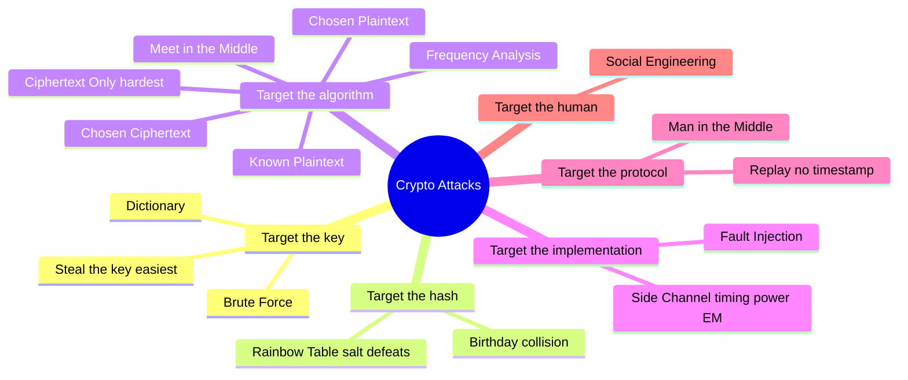

# Cryptographic Attacks

## Overview

Methods used to defeat or weaken cryptographic protections. The key mindset for the exam: attackers rarely break the math. Modern algorithms like AES are effectively unbreakable head-on, so real attacks go after the **implementation and the humans** — stealing keys, exploiting reused values, reading side channels, or tricking someone into handing over a password. Match each attack below to what it actually targets (the algorithm, the key, the protocol, or the person), and the answers follow.

## Key Concepts

### Attack Types
| Attack | Description |
|--------|-------------|
| **Brute Force** | Try every possible key (defeated by longer keys) |
| **Dictionary** | Try common passwords/words |
| **Rainbow Table** | Pre-computed hash lookup tables (defeated by salting) |
| **Birthday Attack** | Exploits hash collisions (probability two inputs have same hash) |
| **Known Plaintext** | Attacker has both plaintext and ciphertext |
| **Chosen Plaintext** | Attacker can encrypt chosen plaintexts |
| **Chosen Ciphertext** | Attacker can decrypt chosen ciphertexts |
| **Ciphertext Only** | Attacker only has ciphertext (hardest attack) |
| **Meet in the Middle** | Attacks double encryption from both ends |
| **Side Channel** | Exploits physical implementation (power, timing, electromagnetic) |
| **Frequency Analysis** | Analyzes letter frequency (classical ciphers) |
| **Replay Attack** | Re-sends captured authentication data |
| **Man-in-the-Middle** | Intercepts and potentially alters communication |

### Defenses
- **Salting** - random value added to input before hashing (defeats rainbow tables)
- **Key stretching** - makes brute force slower (PBKDF2, bcrypt, scrypt)
- **Long keys** - exponentially increases brute force difficulty
- **Nonces/timestamps, ephemeral session keys, challenge-response** - defeat **replay attacks**. A replay attack specifically targets algorithms/protocols that **lack temporal (time-based) protections** — the attacker captures a valid message (often an authentication request) and re-sends it later to open a new session.
- **Certificate pinning** - defeats MITM attacks

### Steal the Key
The easiest "attack" on strong crypto is not breaking the math — it's stealing the key. Attacker gets on the server that holds keys. Law enforcement uses warrants. Either way, if they have the key, they have the data.

### Key Stretching
Defense against brute force: add artificial delay to each password verification. If verification takes 1 second, brute force requiring millions of attempts becomes infeasible.

### Social Engineering (the ice cream example)
A pen-test firm parked an ice cream truck outside a target company. Sign offered free ice cream to anyone who proved they worked there — by entering their username and password. 90%+ of employees complied in under 30 minutes. **Awareness training that doesn't change behavior is worthless.**

### Kerberos-Specific Attacks

- **Pass-the-hash** — steal hashed password, authenticate via NTLM without the plaintext
- **Overpass-the-hash / pass-the-key** — same idea when NTLM is disabled; request a TGT using the user's hash
- **Pass-the-ticket** — steal the Kerberos ticket itself and use it to impersonate
- **Silver ticket** — forge a ticket-granting-service ticket for a compromised service account
- **Gold ticket** — forge any ticket in the domain using the Kerberos service account hash; password never changes so hash never changes
- **Kerberos brute-force** — Kerberos reveals whether usernames are valid; attacker scripts try passwords
- **ASREPRoasting** — works against accounts without pre-authentication enabled; attacker gets TGT encrypted with user's password and cracks offline
- **Kerberoasting** — attacker collects encrypted TGS tickets for service accounts and cracks offline

### Fault Injection
Active side-channel attack: physically stress a device (temperature, voltage spikes) to make it crash or leak information. Proper data center environmental controls (UPS, PDU, HVAC) defend against these.

## Exam Tips

- **Birthday attack** requires 2^(n/2) attempts for an n-bit hash
- **Salting** defeats rainbow tables but not brute force
- **Key stretching** slows brute force to impractical speeds
- **Meet-in-the-middle** is why double DES is not much stronger than single DES (why we use 3DES)
- Side-channel attacks target the **implementation**, not the algorithm
- Ciphertext-only is the **hardest** attack for the attacker
- Gold ticket > Silver ticket (domain-wide vs. one service)
- Most successful attacks find implementation flaws — not algorithm breaks

## Diagrams

### Attacks by Target — Mindmap

> Match each attack to what it actually goes after — rarely the math itself.

**Takeaway:** Most real attacks hit the implementation or the human, not the algorithm.

## Related Topics

- [Cryptography](Cryptography.md) - algorithms being attacked
- [Domain 4 - Communication and Network Security](../04-communication-and-network-security/00%20Domain%204%20-%20Communication%20and%20Network%20Security.md) - network-level attacks
- [Domain 5 - Identity and Access Management](../05-identity-and-access-management/00%20Domain%205%20-%20Identity%20and%20Access%20Management.md) - password attacks
