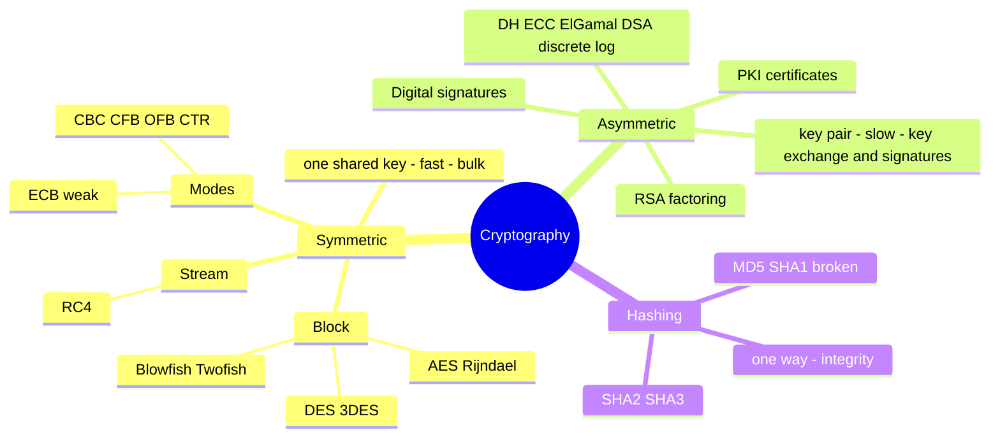

# Cryptography

## Overview

The science of protecting information through mathematical transformations. Essential for confidentiality, integrity, authentication, and non-repudiation.

### Term Distinctions (exam traps)
- **Cryptology** — science of securing communication (umbrella term)
- **Cryptography** — science of creating messages with hidden meaning
- **Cryptanalysis** — science of breaking encrypted communication
- **Cipher** — the algorithm itself (series of well-defined steps)
- **Plaintext / Cleartext** — readable input
- **Ciphertext** — encrypted output
- **Encryption** — plaintext → ciphertext
- **Decryption** — ciphertext → plaintext

### Modular Math (Clock Math)

Cryptography uses modular arithmetic — numbers wrap around a fixed modulus (like clock hours wrap at 12 or 24). In the English alphabet (mod 26), X (24) + E (5) = 29 → wraps to 3 → C. Simple example; real cryptography uses huge numbers.

## Key Concepts

### Cryptographic Goals
- **Confidentiality** - encryption prevents unauthorized reading
- **Integrity** - hashing detects tampering
- **Authentication** - proving identity
- **Non-repudiation** - proving an action occurred (cannot deny)

### Symmetric Encryption (Shared Key)
- Same key for encryption and decryption
- Fast, efficient for large data
- Key distribution is the main challenge

| Algorithm | Type | Key Size | Block Size | Notes |
|-----------|------|----------|------------|-------|
| **AES** | Block | 128/192/256 | 128 bits | Current standard |
| **3DES** | Block | 112/168 | 64 bits | Legacy, being phased out |
| **DES** | Block | 56 | 64 bits | Broken, do not use |
| **Blowfish** | Block | 32-448 | 64 bits | Replaced by Twofish |
| **Twofish** | Block | 128/192/256 | 128 bits | AES finalist |
| **RC4** | Stream | 40-2048 | N/A (stream) | Broken, avoid |
| **ChaCha20** | Stream | 256 | N/A (stream) | Modern stream cipher |

### Block Cipher Modes
| Mode | Description | Notes |
|------|-------------|-------|
| **ECB** | Each block independently | Insecure (patterns visible) |
| **CBC** | Each block XORed with previous | Requires IV; common |
| **CTR** | Turns block cipher into stream | Parallelizable |
| **GCM** | Counter with authentication | Provides AEAD; preferred |

### Asymmetric Encryption (Public/Private Key)
- Two mathematically related keys
- Public key encrypts; private key decrypts (for confidentiality)
- Private key signs; public key verifies (for authentication/non-repudiation)
- Slower than symmetric; typically used for key exchange and signatures

| Algorithm | Based On | Use |
|-----------|----------|-----|
| **RSA** | Integer factorization | Encryption, signatures, key exchange |
| **Diffie-Hellman** | Discrete logarithm | Key exchange only (not encryption) |
| **ECC** | Elliptic curves | Same as RSA but with smaller keys |
| **DSA** | Discrete logarithm | Digital signatures only |
| **ElGamal** | Discrete logarithm | Encryption and signatures |

### Hashing (One-Way Functions)
- Fixed-length output from variable-length input
- Cannot be reversed (one-way)
- Any change in input produces completely different output (avalanche effect)

| Algorithm | Output Size | Status |
|-----------|------------|--------|
| **MD5** | 128 bits | Broken, do not use |
| **SHA-1** | 160 bits | Deprecated |
| **SHA-256** | 256 bits | Current standard |
| **SHA-3** | Variable | Latest standard |

### Hybrid Cryptography
Real-world systems combine symmetric and asymmetric:
1. Generate a random **session key** (symmetric)
2. Encrypt the data with the session key (fast)
3. Encrypt the session key with recipient's **public key** (asymmetric)
4. Send both encrypted data and encrypted session key
5. Periodically re-key using asymmetric — frequency depends on implementation (could be per packet, per N minutes, or per N bytes)

### Asymmetric Use Cases
- **Confidentiality** (encrypt with recipient's **public** key; only they decrypt with their private)
- **Authenticity + Non-repudiation** (digital signature: sender encrypts hash with **private** key; anyone verifies with public key)
- **Confidentiality + Authenticity + Non-repudiation** (sign with your private, then encrypt with their public — nested)

### Math Underlying Asymmetric

Both are **one-way functions** — easy forward, hard backward:
- **Prime factorization** (RSA) — multiplying two large primes is easy; factoring the product is hard
- **Discrete logarithm** (Diffie-Hellman, ElGamal, DSA) — `5^12 = 244,140,625` is easy to compute; reversing is hard
- **Elliptic curves** (ECC) — discrete log on elliptic curves; much stronger per bit (256-bit ECC ≈ 3072-bit RSA)

### Digital Signatures
1. Hash the message
2. Encrypt the hash with sender's **private key**
3. Recipient decrypts with sender's **public key**
4. Recipient hashes the message independently and compares
- Provides: integrity, authentication, non-repudiation
- Does NOT provide confidentiality (unless also encrypted)

### PKI (Public Key Infrastructure)
- **CA** (Certificate Authority) - issues and signs certificates
- **RA** (Registration Authority) - verifies identity before issuing
- **CRL** (Certificate Revocation List) - list of revoked certificates
- **OCSP** (Online Certificate Status Protocol) - real-time certificate checking
- **X.509** - standard format for digital certificates

### Key Management
- Key generation must use strong random number generators
- Key distribution must be secure
- Key storage must be protected (HSM, TPM)
- Key rotation should be periodic (limits exposure / how much data one key protects)
- Key destruction must be complete
- **Crypto-shredding** — destroy the encryption KEY so the encrypted data becomes permanently unrecoverable; a fast way to "destroy" data at rest
- **Split knowledge** = the secret/key is divided among people so no one person knows it all; **dual control** = an action requires two people together. (Split knowledge protects the *secret*; dual control protects the *action*.)
- **Kerckhoffs' Principle** - security should depend on the key, not the algorithm
- **Work factor** — the time/effort/resources required to break a cryptosystem; higher work factor = stronger
- **Key clustering** — a weakness where two *different* keys produce the *same* ciphertext from the same plaintext

### Key Repositories and Escrow

- **Key Repository** — internal backup of your key pairs in a secure location; required dual-control access for retrieval (two security admins needed).
- **Key Escrow** — a third-party backup, often at the request of law enforcement. Lets them retrieve the key later if needed.

Without a repository, if you lose your private key, you lose access to every message ever sent to you with your public key.

### Hardest place to protect a key — in memory (data in use)

**EXAM Q:** *What is the most difficult place to protect an encryption KEY — on the local network / on disk / in memory / on the public network?* → **IN MEMORY.**

**Why:** to perform encryption or decryption, the key MUST exist in **plaintext in RAM** while the CPU uses it — you **can't encrypt the key while it's being used**. That exposes it to **memory dumps, cold-boot attacks, malware reading process memory, and swap/page files**. This is the **data-in-use** state, the hardest to protect.

**Why the others are protectable:**
- **On disk (at rest)** — encrypt the key itself (**key wrapping**), store in a **TPM / HSM / key vault**, plus access controls.
- **On local or public network (in transit)** — wrap the key in an **encrypted channel (TLS / IPsec)**; even a public network is a solved problem via encryption.

**Key insight:** for disk and network you protect the key by **encrypting it** (at rest / in transit); in memory the key must be **decrypted** to be usable, so it **can't be wrapped** the same way → hardest. Maps to states: **at rest (disk) + in transit (network) = protectable by encryption**; **in use (memory) = the hard one**. See [Data States and Handling](../02-asset-security/Data%20States%20and%20Handling.md) for the data-in-use state.

## Exam Tips

- **Symmetric** = same key, fast, key distribution problem
- **Asymmetric** = two keys, slow, solves key distribution
- **Hashing** = one-way, integrity, no key needed
- Digital signatures use the sender's **private key** (not public)
- Diffie-Hellman is for **key exchange only**, not encryption
- AES is the current symmetric standard; RSA/ECC for asymmetric
- Number of symmetric keys needed: n(n-1)/2. Asymmetric: 2n

## Diagrams

### Cryptography Taxonomy — Mindmap

**Takeaway:** Symmetric = one key (bulk) · Asymmetric = key pair (RSA=factoring, DH/ECC=discrete log) · Hashing = one-way integrity.

## Related Topics

- [Cryptographic Attacks](Cryptographic%20Attacks.md)
- [CIA Triad](../01-security-and-risk-management/CIA%20Triad.md) - cryptography supports all three
- [Domain 4 - Communication and Network Security](../04-communication-and-network-security/00%20Domain%204%20-%20Communication%20and%20Network%20Security.md) - TLS, VPN protocols
- [Data States and Handling](../02-asset-security/Data%20States%20and%20Handling.md) - encryption for data at rest/transit
