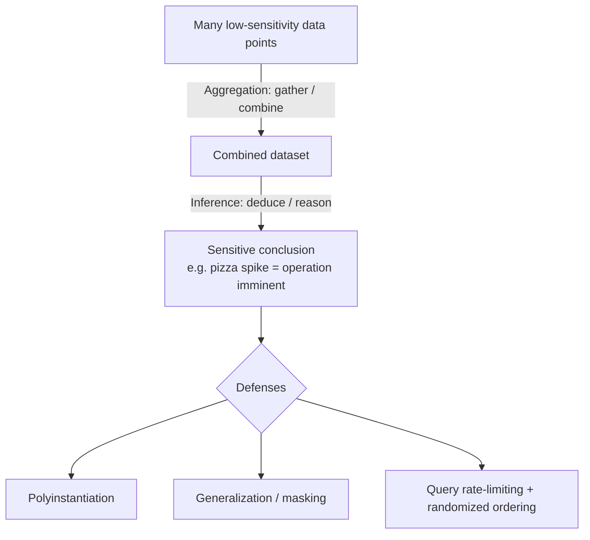

# Database Security Concepts

## Overview

Database-specific security concepts that show up as keywords in exam questions. Deeper implementation is in [Database Security](../08-software-development-security/Database%20Security.md) (Domain 8).

## Polyinstantiation

Multiple instances of the same data, displayed differently based on who is accessing.

Think of it as **sanctioned lying** to enforce confidentiality across clearance levels.

**Example:** An "Acquisitions" file might show:
- To someone with Top Secret + proper need-to-know: the real target company being acquired
- To someone with lower clearance: a different company, or "no acquisitions in progress"

Used heavily in multi-level secure databases (MAC environments).

## Aggregation

**Collecting data for statistical analysis** — on its own not inherently malicious. Attackers use it to piece together many low-sensitivity data points to learn something the individual points can't reveal.

## Inference

**Deducing facts** from evidence and reasoning — not explicit statements in the data.

> **Classic example:** Pizza deliveries to the White House spiked sharply just before Desert Shield/Storm. Pizza orders alone are meaningless — the pattern **infers** that something big was about to happen.

Aggregation and inference are related: aggregation gathers the data; inference draws the conclusion.

**Defense:** Polyinstantiation is one tool. Others: data minimization, generalization, masking, restricting query patterns, rate-limiting queries, and randomizing result ordering.

### De-identification — reversible or not?
- **Randomized masking** done correctly = **irreversible** → the only one truly GDPR-safe (no longer personal data).
- **Pseudonymization, encryption, tokenization** are all **REVERSIBLE** (a key/vault can re-identify) → still regulated personal data under GDPR.

## Data Mining

Using computers to find patterns in large datasets.

- Controversial for privacy reasons
- Google, Amazon, Facebook hold thousands of data points per user
- Combined with breach data (e.g., Equifax 145M SSNs, 200M US voter records), an attacker can build remarkably complete profiles of most adults

## Data Analytics

Different from data mining — here we **establish a baseline of normal operations** and proactively identify abuse (insider or outsider) as deviations.

- Like behavioral anti-malware: produces false positives, needs tuning
- Watch the baseline — if the original state had undetected fraud, fraud looks "normal"

## Exam Tips

- **Polyinstantiation** = multiple data versions by clearance (lying on purpose)
- **Aggregation** = gathering data for analysis; attacker tool
- **Inference** = deducing from evidence (pizza delivery test)
- **Data mining** = finding patterns in data
- **Data analytics** = baseline + detect deviation

## Diagrams

### Aggregation → Inference — Flowchart

> Aggregation gathers the data; inference draws the conclusion the individual points can't.

**Takeaway:** Aggregation = collection (attacker tool); inference = the deduction; polyinstantiation and query controls defend both.

## Related Topics

- [Database Security](../08-software-development-security/Database%20Security.md) — Domain 8 implementation details
- [Data Classification](../02-asset-security/Data%20Classification.md)
- [Security Models](Security%20Models.md) — MAC + polyinstantiation
