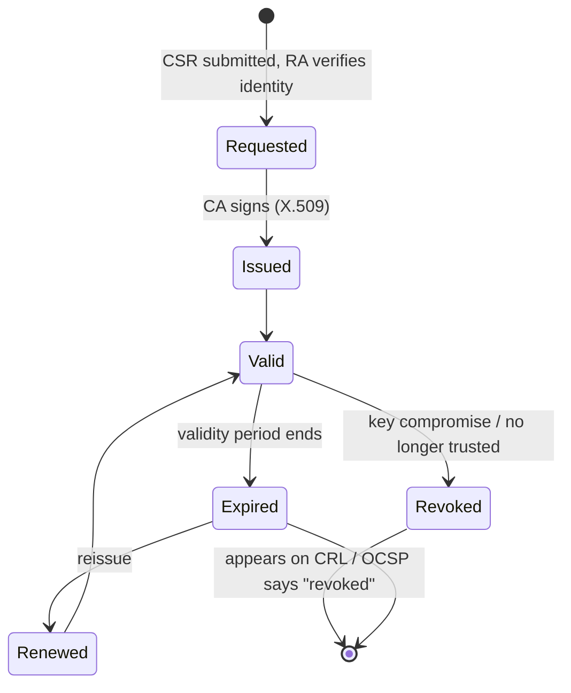
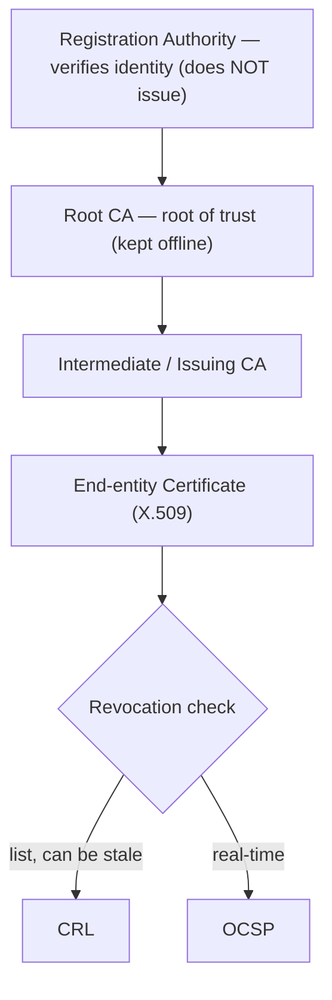
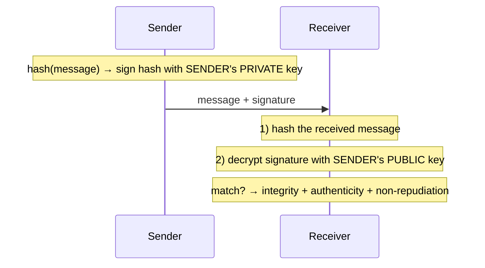
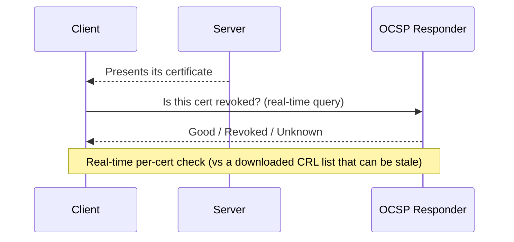

# Digital Signatures and PKI

## Overview

Digital signatures use asymmetric crypto + hashing to provide **integrity, authenticity, and non-repudiation** (plus optional confidentiality if nested with recipient's public key).

## Digital Signature Flow

Signing an email to Bob:
1. Hash the message (integrity baseline)
2. Encrypt the hash with **my private key** → digital signature
3. Send message + signature

Bob verifies:
1. Decrypt signature with **my public key** → recovered hash
2. Hash the received message independently
3. If the two hashes match → integrity + non-repudiation + authenticity confirmed

### Adding Confidentiality
After signing, also encrypt the whole thing with **Bob's public key**. Only Bob's private key can decrypt. Result: confidentiality + authenticity + non-repudiation + integrity.

## PKI - Public Key Infrastructure

Infrastructure for managing digital certificates. Uses symmetric + asymmetric + hashing.

### Components

| Component | Role |
|-----------|------|
| **CA** (Certification Authority) | Issues and revokes certificates. Public CA examples: GoDaddy, DigiCert, Let's Encrypt. Or internal CA for your org. |
| **RA / ORA** (Registration Authority / Organizational RA) | Authenticates the user or system before a certificate is issued |
| **Key repository** | Secure storage for key pairs (internal) — requires **dual control** for retrieval |
| **Key escrow** | Third-party backup, often for law enforcement access |
| **CRL** (Certificate Revocation List) | List of revoked certs — check before trusting |
| **OCSP** (Online Certificate Status Protocol) | Real-time certificate status check — faster than downloading full CRL |
| **X.509** | Standard format for digital certificates |

### Certificate Types
- **Server-side (SSL/TLS)** — assigned to a specific server, stored there
- **Client-side** — personal digital signature; assigned to and stored with the user

### Why Keep a Key Repository?
If you lose your private key, you lose access to every message ever encrypted to you. Dual control + secure storage protect the backup. When an employee leaves, keep their certificate (retired from active use) — you may need to decrypt their old email later (legal request, etc.).

## Clipper Chip (historical — rejected)

NSA-promoted chip for "securing" data and voice. Had a built-in backdoor for NSA. Public outcry killed the program. Also had security flaws in the Skipjack cipher, so other attackers could have exploited it too. A cautionary tale about government backdoors.

## Exam Tips

- Digital signature = sign with sender's **private key**, verify with sender's **public key**
- Digital signature provides **integrity + authenticity + non-repudiation**; NOT confidentiality by default
- **Non-repudiation requires ASYMMETRIC** (a private key only the signer holds) — e.g., **ECDSA** (Elliptic Curve Digital Signature Algorithm), RSA signatures, DSA. **HMAC does NOT provide non-repudiation** because it uses a *shared* secret key — either party could have produced it. MD5/SHA-1 are just hashes (no identity at all). "Inherent support for non-repudiation" → the **digital-signature algorithm** (ECDSA), not HMAC/hash.
- For all four, nest: sign with your private → encrypt with recipient's public
- CA issues certs; RA verifies identity first
- OCSP replaces CRL polling for real-time status
- Keep a key repository — losing your private key is catastrophic
- Dual control on key repository access

## Diagrams

### Digital Certificate Lifecycle — State Diagram

**Takeaway:** RA verifies → CA issues → valid until **expired** or **revoked**. Revocation status checked via **CRL** (list) or **OCSP** (real-time).

### PKI Chain of Trust

**Takeaway:** RA verifies → Root CA (offline) → Intermediate issues → end cert. Revocation via CRL or OCSP.

### Digital Signature — Sign & Verify Sequence

**Takeaway:** Sign with private key, verify with public key → integrity + authenticity + non-repudiation.

### OCSP Certificate Status Check — Sequence

**Takeaway:** OCSP = real-time per-certificate status; CRL = a downloaded list that can be stale.

## Related Topics

- [Cryptography](Cryptography.md)
- [Asymmetric Encryption Detail](Asymmetric%20Encryption%20Detail.md)
- [Hashing Detail](Hashing%20Detail.md)
- [MAC HMAC SSL and TLS](MAC%20HMAC%20SSL%20and%20TLS.md)
