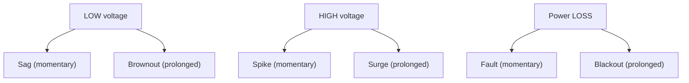

# Electricity and Power

## Overview

"Clean, uninterrupted" power is the goal — constant voltage, constant availability. Power problems hit both availability and integrity (voltage surges damage hardware and corrupt data).

## Power Fluctuation Terminology

| Term | Meaning |
|------|---------|
| **Blackout** | Prolonged total power loss |
| **Fault** | Short total power loss |
| **Brownout** | Prolonged low voltage |
| **Sag** | Short low voltage |
| **Surge** | Prolonged high voltage |
| **Spike** | Short high voltage |
| **Inrush** | Sudden current rise when equipment starts |

## Protecting Our Data Center Power

### UPS (Uninterruptible Power Supply)
- Large battery bank
- **Pass-through** when utility is normal — batteries just sit ready
- When power drops → UPS instantly takes over from batteries (no gap)
- Provides minutes of backup power (not hours)

### PDU (Power Distribution Unit)
- Cleans and distributes power to rack equipment
- Ensures correct voltage
- Rack-mounted (you'll see them as power strips in the rack, fed by larger PDUs)

### Generator
- Runs on fuel (diesel, natural gas); runs as long as fuel lasts
- **Should be automatic** — manual generators fail the "9-minute UPS + guy who lives 24 minutes away" test
- Kicks in when utility drops; UPS carries the gap between outage and generator startup
- When generator stabilizes, UPS stops drawing; batteries recharge from generator

### Typical Power Flow
```
Utility A → Transfer switch (with gen A) → UPS A → PDU A → Rack strip A → Server PSU A
Utility B → Transfer switch (with gen B) → UPS B → PDU B → Rack strip B → Server PSU B
```
Each server has two power supplies. One side supports the full load; the other is redundancy. Servers plug **half to side A, half to side B** — don't plug all into one side (that caused the 75% data center outage story).

## Sizing Power Redundancy to Location

Power reliability varies by location:
- California: ~1 blackout per year
- Puerto Rico: ~3 per week
→ Larger battery banks + larger generator fuel tanks + more of both for less reliable grids

## EMI (Electromagnetic Interference)

External force (or adjacent cable) disturbs an electrical circuit.

### Impact
- **Integrity** — corruption in data cables (crosstalk between adjacent cables)
- **Confidentiality** — attackers can clamp a sniffer onto a copper Ethernet cable
- **Availability** — poor design or malicious interference can take circuits down

### Defense: Use Fiber
Fiber uses light, not electricity:
- Not susceptible to EMI
- Much harder to sniff (requires splicing fiber)
- Can run alongside power cables (copper Ethernet cannot)

When asked "cheapest secure cable" — that's a trap. Cheapest is copper. Cheapest **and secure** is fiber.

### Other EMI Defenses
- Shielded twisted pair (STP) if stuck with copper
- Encrypt all traffic (defeats sniff value even on copper)
- Separate power and data cable trays

## Communication Circuit

A **communication circuit** is a **dedicated network link between two points** (e.g., a leased line or WAN link) — not just power, but the connectivity that keeps the site reachable.

- Primarily an **AVAILABILITY** concern and a common **single point of failure** — if the one circuit goes down (cut cable, provider outage), the site is isolated.
- Critical operations need **redundant circuits**, ideally from **different providers and over different physical paths** (avoid both circuits sharing the same conduit or carrier — that defeats the redundancy).
- Mirrors the power philosophy on this page: two independent paths so a single failure never takes the whole site down.

## Static Electricity

- Keep relative humidity 40-60% (too low → static; too high → corrosion)
- Ground all circuits
- **Anti-static wrist straps** when working on hardware (mandatory in practice)
- Anti-static shoes in some secure / sensitive environments

## Exam Tips

- UPS = short-term battery; generator = long-term fuel-burning
- Generator should be automatic
- Each server uses 2 power supplies on 2 independent power paths
- EMI defenses: fiber cables (best), STP cable, encryption, separate trays
- Fiber beats copper for security (always the answer when "security" is in the question)
- 40-60% humidity in data centers
- A single communication circuit is a single point of failure → use redundant circuits from different providers/paths

## Diagrams

### Power Anomalies — momentary vs prolonged



**Takeaway:** Low: sag/brownout · High: spike/surge · Loss: fault/blackout (momentary/prolonged in each pair).

## Related Topics

- [Physical Security](Physical%20Security.md)
- [Environmental Controls](Environmental%20Controls.md)
- [Emanations and Covert Channels](Emanations%20and%20Covert%20Channels.md)
- [Site Selection](Site%20Selection.md)
