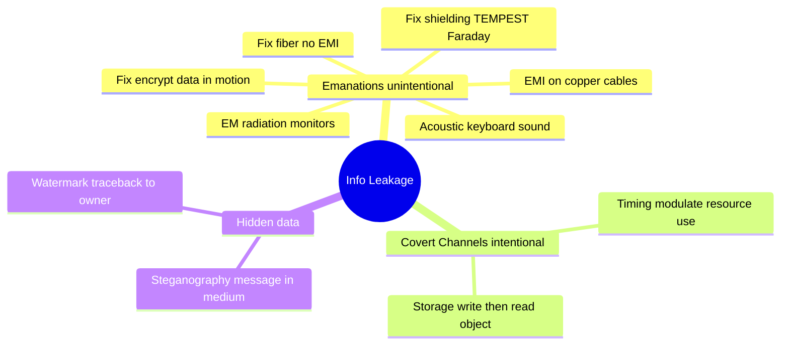

# Emanations and Covert Channels

## Overview

This note covers the ways information leaks that aren't the obvious "attacker cracks the encryption" path. Two ideas sit here: **emanations** (unintentional signals a device gives off — radiation, sound, EMI) and **covert channels** (a path deliberately repurposed to smuggle data past controls). Both matter because they bypass the controls you're watching — the data leaves without ever touching the front door you locked.

## Emanations

Unintentional information-bearing signals that, if intercepted and analyzed, can lead to compromise.

### Common Sources
- **Copper Ethernet cables (CAT5/6/7)** — a sniffer clamp can capture traffic via EMI. Countermeasures: encrypt all traffic; use fiber (no EMI).
- **Electromagnetic radiation** from CRTs, monitors, power cables
- **Acoustic** — keyboard sounds, printer sounds
- **Motion sensors in phones** — small movements during typing can reveal messages

### Countermeasures
- **Shielding** (heavy metals; impractical at scale)
- **Fiber-optic cabling** (light, not electricity → no EMI, not clamp-sniffable)
- **Encryption** for all data in motion (makes intercepted signals useless)
- **TEMPEST** program — US government standards for emanation containment; Faraday cages block EM signals

## Covert Channels

Intentional use of a communication path not designed for communication.

### Covert Timing Channel
Information conveyed through **modulating the use of system resources** so that timing variations carry data:
- If a wrong username returns in 100 ms but a correct username with wrong password returns in 500 ms, and both show "wrong credentials," the attacker now knows the username is valid.
- Process modulates CPU usage, disk I/O timing, network response latency
- Receiver observes timing variations and decodes the signal
- Defense: return timing should be constant; standardize response times

**Trigger phrase:** "Way for one process to communicate to another by **modulating the use of the system's resources**" → **Covert Timing Channel** (NOT Covert Storage, NOT Maintenance Hook, NOT TOC/TOU)

### Covert Storage Channel
Information hidden in object modifications (one process WRITES, another READS):
- File size conveys meaning (0 bytes = yes, >0 = no)
- Outbound ICMP packet patterns
- File attribute flags
- Unused fields in packet headers

Harder to detect because the communication doesn't look like communication.

### Quick distinction

| Mechanism | Trigger phrase |
|---|---|
| **Covert Timing Channel** | "modulating the **use** of system resources" / "timing differences" |
| **Covert Storage Channel** | "writing to a shared storage location" / "file attributes" |
| **Maintenance Hook** | "back door left in software by developers for debugging" |
| **TOC/TOU** (Time-Of-Check/Time-Of-Use) | "race condition between check and use" |

## Steganography

Hiding a message within another medium.
- Historical: invisible ink, hidden clues, coded paintings
- Digital: embed message in audio, image, or video by modifying pixel/sample values imperceptibly
- Example: entire chapter of *Tale of Two Cities* (7,700 characters) hidden in a JPEG with no visible difference; extractable by anyone with the matching steganography program

## Digital Watermarks

Visible or invisible markers embedded in files for provenance / anti-piracy:
- Paper money has visible watermarks
- Ebook bought on Amazon may have your name embedded in metadata or visibly on each page
- If the file shows up on a piracy site, the watermark identifies the original buyer
- Used heavily in music, video, and documents

## Exam Tips

- Emanations = unintentional leaks; use fiber + encryption
- **Covert storage channel** = info hidden via object modification (file size, attribute)
- **Covert timing channel** = info conveyed via timing
- Steganography = hiding one message inside another medium
- Watermarks enable traceback to original owner

## Diagrams

### Information Leakage Paths — Mindmap

> Three ways data leaves without touching the locked front door.

**Takeaway:** Emanations = accidental signals (use fiber + encryption); covert channels = a path repurposed on purpose (timing vs storage).

## Related Topics

- [Cryptography](Cryptography.md)
- [Physical Security](Physical%20Security.md) — TEMPEST
- [Intellectual Property](../01-security-and-risk-management/Intellectual%20Property.md) — watermarks enforce copyright
