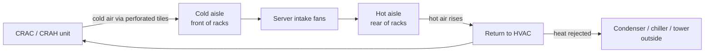

# Environmental Controls (HVAC, Cooling, Cabling)

## HVAC (Heating, Ventilation, and Air Conditioning)

**HVAC** is the environmental/physical control that maintains **temperature and humidity** in the data center to protect equipment **AVAILABILITY** (overheating crashes or destroys hardware).

**HVAC is also an attack surface.** Its control/management network and vendor remote access are often weak points. The **2013 Target breach** started through an **HVAC vendor's** network access — attackers pivoted from the vendor connection into the corporate network and then to point-of-sale systems. Lesson: segment OT/building systems and vendor access from sensitive networks.

### Cooling Mechanics (depth)
- Precision cooling uses **CRAC** (Computer Room Air Conditioner) and **CRAH** (Computer Room Air Handler) units, plus **in-row** units, paired with **hot-aisle/cold-aisle containment**.
- Cooling **moves heat — it does not destroy it.** Heat must be **rejected outside** via condensers / chillers / cooling towers.
- High-density racks increasingly use **liquid cooling** (direct-to-chip or immersion).
- Cooling can add roughly **30–50% on top of IT power**, measured by **PUE (Power Usage Effectiveness) = total facility power ÷ IT equipment power** (1.0 is ideal).

## HVAC Ranges

Traditional practice over-cooled data centers. Modern vendor-recommended ranges:

| | Fahrenheit | Celsius |
|--|-----------|---------|
| **Optimal** | 68-77 | 20-25 |
| **Allowable** (equipment works but degrades faster) | 59-90 | 15-32 |

Over-cooling wastes money AND raises humidity → more dehumidification cost.

## Humidity

- **Target: 40-60% relative humidity**
- Too low → static electricity → equipment damage
- Too high → corrosion → equipment damage
- HVAC units include humidifier + dehumidifier

## Positive Pressure

Data center pressure should be **slightly higher** than surrounding rooms:
- When a door opens, air blows **outward** (not in)
- Keeps dust and contaminants out
- Important for particle-density fire suppression (dust can trigger false positives)
- **Clean subfloors too** — a famous incident had clean data center floors but dusty subfloor spaces; when a tech worked under the floor, the released dust triggered FM-200 suppression

## Hot Aisle / Cold Aisle Design

Racks face the same way within each row; adjacent rows face opposite directions:
- **Cold aisle** (in front of racks) — perforated tiles in floor, cold air rises into server fronts
- **Hot aisle** (behind racks) — hot air exits servers, rises, returns to HVAC for cooling

Temperature difference between aisles can be dramatic (50°F cold vs. 105°F hot).

**Switches** in the rack usually face backward (ports face cold aisle for cabling, fans pull from back).

### Perforated Tile Placement
Perforated tiles should be **only in front of racks** (cold aisle). Over time, tiles get rearranged during maintenance — keep a map and realign regularly.

## Subfloor / Subceiling

- Often used to run cables and HVAC ducts
- **Water drains or water sensors** needed — HVAC dehumidifiers produce water; condensation builds
- Never mix water/drains with exposed electrical cabling in the subfloor
- If you can't trust the subfloor, use overhead cable trays instead
- **Copper Ethernet should not share cable trays with power** (EMI) → use fiber, which can

## Subflooring Dust Story
A data center where the above-floor was cleaned but the subfloor wasn't. A tech working below the floor kicked up so much dust that the particle-based fire detection triggered the FM-200 system — knocking people in the room to their knees, requiring a $30K refill. Fixed with a quarterly subfloor cleaning schedule.

## Exam Tips

- Optimal data center temp: ~68-77°F / 20-25°C
- Relative humidity: 40-60%
- Positive pressure keeps contaminants out
- Hot aisle / cold aisle is the standard modern layout
- Perforated tiles only in cold aisle
- Clean the subfloor too
- Overhead cable trays: fiber can share with power; copper Ethernet cannot

## Diagrams

### Hot Aisle / Cold Aisle Airflow — Flowchart

> Cooling moves heat in a loop; it does not destroy it — heat must be rejected outside.

**Takeaway:** Perforated tiles only in the cold aisle; cooling moves heat to outside rejection — measured by PUE (1.0 is ideal).

## Related Topics

- [Electricity and Power](Electricity%20and%20Power.md)
- [Fire Suppression](Fire%20Suppression.md)
- [Physical Security](Physical%20Security.md)
- [Site Selection](Site%20Selection.md)
